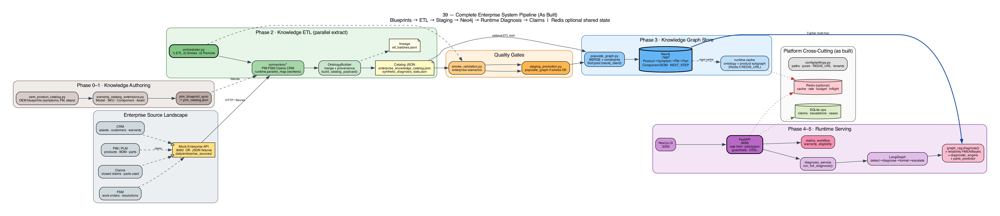
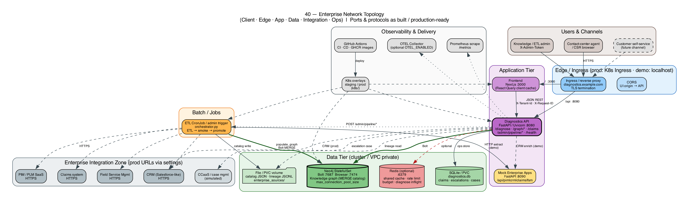
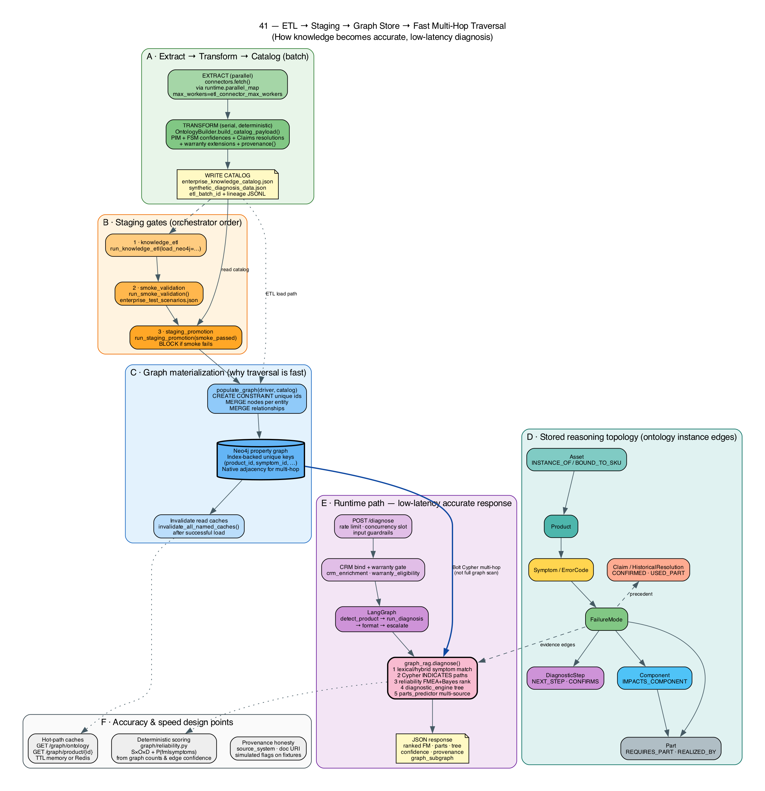
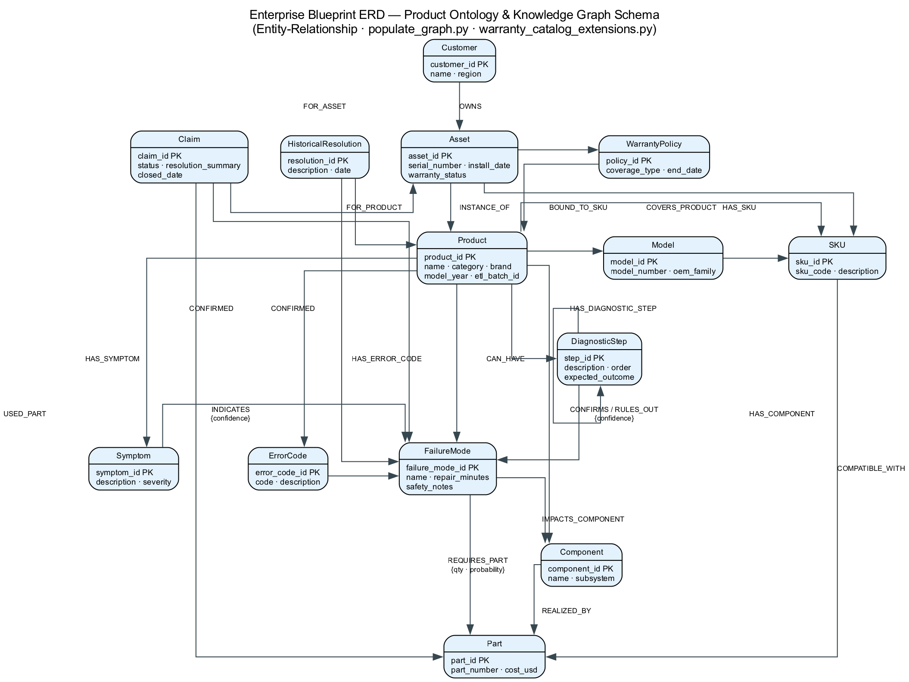
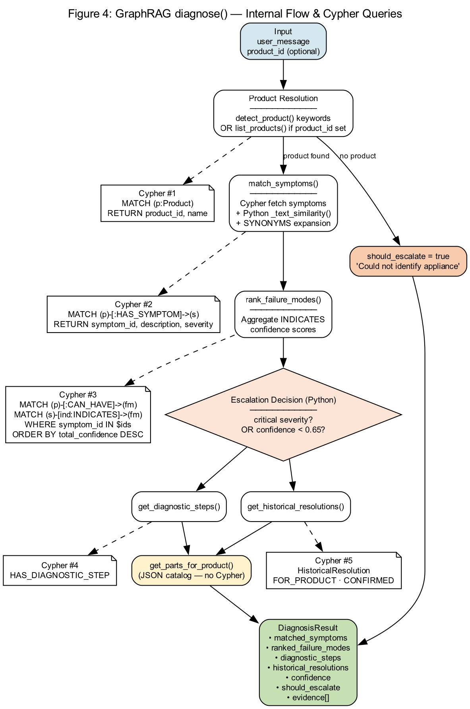

<div class="cover">

# Remote Diagnostics Graph

## Interview Mastery Guide

<p class="subtitle">Explain everything end-to-end — product, theory, code, architecture, tools</p>

<span class="badge">Beginner-friendly language</span>
<span class="badge">Senior-level depth</span>
<span class="badge">Academic theory</span>
<span class="badge">Developer & Architect Q&amp;A</span>

<p class="meta">
Enterprise warranty diagnosis · Knowledge graph · GraphRAG · FMEA · Bayesian ranking<br/>
ETL · Neo4j · LangGraph · LLMOps · Redis · Runtime scale<br/><br/>
<strong>Branch:</strong> feature/llmops-for-remote-diagnostics<br/>
<strong>Use this for:</strong> 45–60 min technical interviews · design deep-dives · academic panels
</p>

</div>

# How to use this guide

| Interviewer type | Read first | Practice |
|------------------|------------|----------|
| **Anyone (opening)** | §1 Elevator pitch + §2 What we built | 90-second story out loud |
| **Academic / research** | §5 Theory + Academic Q&A | Derive Bayes & RPN on whiteboard |
| **Senior developer** | §4 Tools + §6 Code spine + Dev Q&A | Walk one Cypher path + one Python file |
| **Senior architect** | §3 Architecture + §7 Topology + Arch Q&A | Draw boxes: ETL → Neo4j → API → UI |
| **Industry / domain** | §2 Domain chain + Industry Q&A | Asset → symptom → FM → part → claim |

<div class="pointer">
<strong>Golden rule:</strong> Always answer in this order — <em>(1) plain English meaning</em> → <em>(2) why it matters</em> → <em>(3) how our app does it</em> → <em>(4) tool/file name</em>. That pattern works for every persona.
</div>

---

# 1. The 90-second elevator pitch (memorize this)

> We built an **enterprise remote-diagnostics system** for warranty support.
> A customer or agent describes a problem (“washer won’t drain, E21” / “espresso machine not heating”).
> We resolve the **product/asset**, walk a **Neo4j knowledge graph** of symptoms → failure modes → parts, score candidates with **FMEA + Bayes**, return ranked diagnosis, troubleshooting steps, and predicted parts, then optionally open a **claim** or **escalate**.
> Knowledge is **not invented by an LLM at runtime** — it is **extracted multi-source** (PIM/FSM/Claims/CRM + structured/semi/unstructured), **mapped to a shared domain TBox**, **validated as ABox**, and **MERGEd into Neo4j**.
> A **new product is new instances (ABox)**, not a new OWL language per SKU. LLM (if enabled) only helps wording; **evidence is graph-native and deterministic**.

### One sentence for non-technical interviewers

“We help warranty agents find the right fix and part by searching a product knowledge graph instead of guessing from a chatbot.”

### One sentence for technical interviewers

“Deterministic GraphRAG over a warranty ontology in Neo4j (shared TBox, multi-source ABox ETL), FMEA/Bayesian ranking, dual staging/production promote, and LLMOps-ready API.”

---

# 2. What the application does (domain, not code)

## 2.1 The problem we solve

When a washing machine fails, support must answer:

1. **What product is this?** (model / serial / SKU)
2. **What is wrong?** (symptom / error code → failure mode)
3. **How do we confirm?** (diagnostic steps)
4. **Which part?** (BOM / requires part / past claims)
5. **Is it covered?** (warranty gate → claim)

Without a graph, people dig PDFs and tribal knowledge. We encode that knowledge as a **graph** so answers are **consistent, explainable, and fast**.

## 2.2 The operational chain (say this on a whiteboard)

```text
Asset / Serial
   → Product / Model / SKU
   → Symptom + ErrorCode
   → FailureMode (diagnosis)
   → DiagnosticStep (troubleshoot)
   → Component (BOM impact) → Part
   → Claim / HistoricalResolution (precedent)
```

| Business question | Graph answer |
|-------------------|--------------|
| What unit is this? | `Asset -INSTANCE_OF→ Product`, `BOUND_TO_SKU` |
| What could be wrong? | `Symptom -INDICATES→ FailureMode` |
| How sure are we? | Edge `confidence` + FMEA + Bayes posterior |
| What part to ship? | `REQUIRES_PART` + `IMPACTS_COMPONENT→REALIZED_BY` + claims |
| Covered under warranty? | Policy + asset status (eligibility service) |

## 2.3 What “success” looks like in a demo

1. User: “Won’t drain, code E21” + product `wm-001`
2. System matches symptoms / error code
3. Ranks **drain pump failure** high
4. Shows steps, parts, confidence, provenance
5. Optional: submit claim with graph evidence

## 2.4 TBox vs ABox (interview trap — get this right)

| Term | Plain English | Our app |
|------|---------------|---------|
| **TBox** | The *rule book*: what kinds of things exist | Shared classes: Product, Symptom, FailureMode, Part, … (`rdf_ontology_export`, `docs/ontology/`) |
| **ABox** | The *facts*: this product’s symptoms and links | Catalog + Neo4j instances for `wm-001`, `esp-001`, … |
| **New product onboard** | Add facts under the rule book | Multi-source pack → OntologyBuilder → validate → promote |
| **TBox extension** | New *kind* of entity | Rare; `scan_tbox_extension_candidates` — **not** auto from a pack |

**Soundbite:** “We do **not** generate a new ontology when we add an espresso machine. We generate **instances** of Symptom and FailureMode in the **pipeline** from sources, then MERGE them into Neo4j.”

**Doc:** `docs/22-TBox-ABox-Multi-Source-Onboard-Mechanism.md`

## 2.5 Multi-source NEW product (Admin story)

```text
Sources (PIM + FSM + Claims + CRM + structured/semi/unstructured)
  → Fetch (dry-run fleet NEW/UPDATE/in-sync)
  → Select product(s) only
  → Validate ABox against TBox shapes
  → Materialize selection → Smoke → Approve
  → Promote staging :7688 → production :7687
  → Diagnosis Chat on CRM asset (production graph only)
```

**Demo packs:** `hmd-001` (dehumidifier), `esp-001` (espresso). Manifests under `data/pipeline_sources/*_MULTI_SOURCE_MANIFEST.json`.

**Gotcha:** Text match 60–70% can still be a **STRONG** diagnosis if Bayesian posterior + INDICATES align (e.g. “machine is not heating” → espresso no-heat symptom).

## 2.6 Dual Neo4j + fleet vs batch

| Concept | Meaning |
|---------|---------|
| Staging bolt `:7688` | Safe MERGE preview |
| Production bolt `:7687` | Diagnosis Chat + Explorer truth |
| Pending UPDATE (fleet) | Any product still richer in catalog than production |
| This batch / selection | Only locked product_ids for materialize/promote |
| Reset for next plan | After all in sync + promote — clear session gates (not the graph) |

---

# 3. End-to-end architecture (as built)

## 3.1 Layer cake (remember 6 layers)

| Layer | Responsibility | Key modules |
|-------|----------------|-------------|
| **L6 Experience** | UI, dashboards | Next.js frontend |
| **L5 Orchestration** | Agent, claims, warranty | `diagnosis_service`, LangGraph, claims |
| **L4 Intelligence** | GraphRAG, FMEA/Bayes, trees, parts | `graph_rag`, `reliability`, `diagnostic_engine`, `parts_predictor` |
| **L3 Integration** | Enterprise systems | connectors, CRM enrichment, mock `:8090` |
| **L2 Knowledge store** | Neo4j | `populate_graph`, `neo4j_client` |
| **L1 Data platform** | Blueprints, ETL, fixtures | `oem_product_catalog`, orchestrator |

## 3.2 Complete pipeline (diagram 39)



**Story to narrate while pointing at the diagram:**

1. **Author** OEM knowledge (blueprints + warranty extensions)
2. **Extract** PIM/FSM/Claims/CRM in parallel
3. **Transform** with `OntologyBuilder` → catalog JSON + provenance
4. **Gate** with smoke validation
5. **Promote** → `populate_graph` MERGE into Neo4j
6. **Serve** UI → API → service → LangGraph → GraphRAG reads Neo4j
7. **Platform**: optional Redis (cache/rate/budget), SQLite ops store

## 3.3 Network topology (diagram 40)



| Component | Port | Role |
|-----------|------|------|
| Next.js UI | 3000 | Agent experience |
| FastAPI | 8080 | Diagnose, graph, claims, admin pipelines |
| Mock enterprise | 8090 | Simulated PIM/CRM/FSM/Claims |
| Neo4j **production** | 7687 Bolt | Diagnosis Chat + Explorer truth |
| Neo4j **staging** | 7688 Bolt | Promote-first MERGE target |
| Redis (optional) | 6379 | Shared multi-replica state |

## 3.4 ETL → graph → fast traversal (diagram 41)



<div class="pointer">
<strong>Interview soundbite:</strong> “We don’t scan the whole graph each request. We land on a product node, then walk short, pre-built paths — that’s why it’s accurate and fast.”
</div>

## 3.5 Ontology ERD (what entities exist)



## 3.6 Runtime diagnosis flow



---

# 4. Tools & technologies — what each means (simple)

| Tool | Plain English | Role in our app |
|------|---------------|-----------------|
| **Neo4j** | Database for relationships, not just rows | Stores products, symptoms, failure modes, parts as **nodes** and **edges** |
| **Cypher** | SQL-for-graphs | Query: “symptoms that indicate failure modes for this product” |
| **FastAPI** | Python web API framework | `POST /diagnose`, graph GETs, admin ETL |
| **LangGraph** | Workflow as a small graph of steps | detect product → diagnose → format → escalate |
| **GraphRAG** | Retrieval-Augmented Generation over a graph | Retrieve evidence from Neo4j, then format answer (LLM optional) |
| **Pydantic / settings** | Typed config | URLs, passwords, Redis, thresholds |
| **Redis** | Super-fast shared memory (optional) | Multi-pod cache, rate limit, budget, concurrency |
| **Docker / K8s** | Package & run services | Neo4j, API, UI, ETL CronJob |
| **OpenTelemetry / Prometheus** | Observability | Traces, metrics, `/metrics` |
| **OWL / RDF** | Semantic web formal ontology | Optional export of our schema for interchange (`rdf_ontology_export`) |
| **FMEA** | Reliability engineering worksheet | Severity × Occurrence × Detection ranking |
| **Bayes** | Probability update with evidence | Rank failure modes given observed symptoms |

### Neo4j vs relational DB (classic interview question)

| Relational | Graph (Neo4j) |
|------------|---------------|
| Tables + joins | Nodes + relationships |
| Multi-hop joins get expensive | Multi-hop walks are natural |
| Great for transactions | Great for connected knowledge |
| We still use SQLite for simple ops tables | Neo4j is the **diagnostic brain** |

### “Is this an LLM chatbot?”

**Honest answer:** Core diagnosis is **graph + math**. LLM gateway exists but is **off by default**. That is a **feature** (cost, determinism, auditability), not a bug.

---

# 5. Theory you must know (academic + industry)

## 5.1 Ontology vs knowledge graph vs taxonomy

| Term | Meaning | Our app |
|------|---------|---------|
| **Taxonomy** | Hierarchy of categories | Product categories (weak) |
| **Ontology** | Formal types + allowed relationships | Labels: Product, Symptom, FailureMode… |
| **Knowledge graph** | Ontology + real instances | `wm-001` has symptom E21 linked to drain pump FM |
| **Topology (domain)** | Structure of composition/paths | BOM Component structure + diagnostic tree |
| **Topology (infra)** | How systems are networked | Diagram 40 — not the domain model |

<div class="pointer">
<strong>Remember:</strong> Ontology = “dictionary of allowed concepts.” Knowledge graph = “filled-in encyclopedia.” Topology of product = “how parts are structured.”
</div>

## 5.2 FMEA / FMECA (MIL-STD / AIAG-VDA)

**FMEA** = Failure Mode and Effects Analysis.

For each failure mode estimate:

- **S Severity** — how bad if it happens
- **O Occurrence** — how often
- **D Detection** — how hard to detect early

**RPN** = S × O × D (classic). Industry also uses **Action Priority** (AIAG-VDA) because raw RPN can rank-reverse.

**In our code:** `graph/reliability.py` derives S/O/D-like signals from graph data (symptom severity, claim counts, diagnostic coverage), not hand-wavy magic numbers alone.

## 5.3 Bayesian diagnostic inference

Classic form:

\[
P(\text{failure mode} \mid \text{symptoms}) \propto P(\text{fm}) \times \prod_i P(s_i \mid \text{fm})
\]

- **Prior** \(P(fm)\): how common is this failure (claims/history)
- **Likelihood** \(P(s|fm)\): graph edge `INDICATES.confidence`
- **Posterior**: normalized ranking across candidates

**Pearl / AIMA language:** diagnosis as updating beliefs with evidence.

<div class="pointer">
<strong>Whiteboard tip:</strong> Draw two failure modes, two symptoms, assign confidences, multiply likelihoods × prior, normalize to 1. Interviewers love this.
</div>

## 5.4 Graph theory (light)

- **Node / vertex** = entity
- **Edge / relationship** = typed link (with properties)
- **Path** = walk used for evidence
- **Degree / neighborhood** = local product subgraph we cache

## 5.5 ETL / data engineering

**Extract → Transform → Load**

- **Extract** parallel (I/O bound) — `parallel_map` over connectors
- **Transform** serial (must be deterministic) — `OntologyBuilder`
- **Load** MERGE into Neo4j — idempotent upserts
- **Gates** smoke validation before promote

## 5.6 Caching, concurrency, partitioning (systems)

| Concept | Plain English | Our policy |
|---------|---------------|------------|
| **Cache** | Remember expensive reads | Ontology & product subgraphs; **not** free-text diagnosis by default |
| **Concurrency** | Do independent work together | Parallel connector extract; **serial** diagnosis ranking |
| **Partitioning** | Split keys/tenants | Logical keys (`tenant|product`); Redis when multi-replica |
| **Admission control** | Limit in-flight heavy requests | `max_concurrent_diagnoses` |
| **Rate limit** | Cap requests per client | Sliding window; Redis shared in multi-pod |

## 5.7 LLMOps (if they ask AI platform questions)

| Discipline | One-liner | Where |
|------------|-----------|-------|
| PromptOps | Version prompts | `prompts/` |
| EvalOps | Golden tests & gates | `evals/` |
| Guardrails | Input/output safety | `guardrails/` |
| FinOps | Cost budget circuit breaker | `finops/budget.py` |
| Gateway | Model routing/fallback | `gateway/` |
| Observability | Metrics/traces | `observability/` |

---

# 6. Code spine — how the pieces connect

## 6.1 Batch path (knowledge into Neo4j)

```text
orchestrator.run_all()
  ├─ knowledge_etl.run_knowledge_etl()
  │    ├─ parallel_map(connectors.fetch)   # runtime/
  │    ├─ OntologyBuilder.build_catalog_payload()
  │    ├─ write catalog JSON + lineage
  │    └─ optional populate_graph()
  ├─ smoke_validation.run_smoke_validation()
  └─ staging_promotion.run_staging_promotion()
       └─ populate_graph()  # MERGE + constraints
```

**Files to name aloud:**

- `graph/enterprise_pipeline/orchestrator.py`
- `graph/enterprise_pipeline/pipelines/knowledge_etl.py`
- `graph/enterprise_pipeline/transformers/ontology_builder.py`
- `graph/populate_graph.py`
- `graph/oem_product_catalog.py` / `warranty_catalog_extensions.py`

## 6.2 Online path (user message → answer)

```text
POST /diagnose  (api/main.py)
  → rate limit + concurrency slot
  → guard_request (input safety)
  → CRM enrich + warranty gate
  → diagnosis_service.run_full_diagnosis()
       → agents.diagnosis_graph.run_diagnosis()  # LangGraph
            → detect product
            → tool_diagnose → graph_rag.diagnose()
                 → match symptoms / error codes
                 → rank FM (reliability)
                 → diagnostic tree
                 → parts predictor
            → format response
            → escalate if needed
  → validate_output (PII/length)
  → JSON DiagnoseResponse
```

**Files to name aloud:**

- `api/main.py`
- `services/diagnosis_service.py`
- `agents/diagnosis_graph.py`
- `graph/graph_rag.py`
- `graph/reliability.py`
- `graph/diagnostic_engine.py`
- `graph/parts_predictor.py`

## 6.3 Mini Cypher mental model

```cypher
// “What failure modes do these symptoms indicate for product X?”
MATCH (p:Product {product_id: $pid})-[:HAS_SYMPTOM]->(s:Symptom)
WHERE s.symptom_id IN $symptom_ids
MATCH (s)-[r:INDICATES]->(fm:FailureMode)
RETURN fm, r.confidence
ORDER BY r.confidence DESC
```

```cypher
// “Which parts for this failure mode?”
MATCH (fm:FailureMode {failure_mode_id: $fm})-[r:REQUIRES_PART]->(part:Part)
RETURN part, r.probability, r.quantity
```

---

# 7. Ontology, topology, RDF — interview clarity

| Question | Short answer |
|----------|--------------|
| Did we build a separate topology system? | **No.** Product structure is Component/BOM **inside** the ontology. |
| What is BOT (Building Topology Ontology)? | W3C building spatial topology — **not** our domain. |
| What is ISO 14224? | Reliability data + equipment hierarchy — maps to our Component + FailureMode. |
| What is OWL/RDF export for? | Formal interchange / documentation (`python -m graph.rdf_ontology_export`). Runtime still Neo4j. |

---

# 8. Question bank by interviewer persona

Legend:
<span class="persona persona-academic">Academic</span>
<span class="persona persona-dev">Senior Dev</span>
<span class="persona persona-arch">Architect</span>
<span class="persona persona-industry">Industry</span>

---

## 8.1 Academic / theory-oriented questions

<div class="qa">
<div class="q"><span class="persona persona-academic">Academic</span> Q: Formalize diagnosis as probabilistic inference.</div>
<div class="a"><strong>A:</strong> Treat failure modes as hypotheses. Observed symptoms are evidence. Use naive Bayes: posterior ∝ prior × product of likelihoods P(sᵢ|fm). Normalize across candidates. Likelihoods come from INDICATES.confidence; priors from historical claim/resolution frequency. Implementation: <code>reliability.py</code> + GraphRAG ranking.</div>
</div>

<div class="qa">
<div class="q"><span class="persona persona-academic">Academic</span> Q: Why is RPN criticized? What did you do instead/in addition?</div>
<div class="a"><strong>A:</strong> Ordinal multiplication can cause rank reversals (Kmenta &amp; Ishii). AIAG-VDA emphasizes Action Priority. We expose RPN-like scores but rank primarily by Bayesian posterior for diagnosis ordering, grounded in graph counts.</div>
</div>

<div class="qa">
<div class="q"><span class="persona persona-academic">Academic</span> Q: Difference between ontology and knowledge graph?</div>
<div class="a"><strong>A:</strong> Ontology = TBox (classes/properties). KG = TBox + ABox (instances). Our OWL export is TBox(+sample ABox); Neo4j holds operational ABox for all products.</div>
</div>

<div class="qa">
<div class="q"><span class="persona persona-academic">Academic</span> Q: Is multi-hop graph retrieval theoretically better than vector RAG here?</div>
<div class="a"><strong>A:</strong> For structured causal/diagnostic chains, symbolic edges encode expert constraints vectors approximate. Hybrid can help language matching; final ranking stays on typed paths for explainability and audit.</div>
</div>

<div class="qa">
<div class="q"><span class="persona persona-academic">Academic</span> Q: How do you avoid LLM hallucination?</div>
<div class="a"><strong>A:</strong> Facts from Neo4j only; LLM optional for phrasing; provenance trail; evals/guardrails; default LLM off.</div>
</div>

<div class="qa">
<div class="q"><span class="persona persona-academic">Academic</span> Q: Map your model to PROV-O.</div>
<div class="a"><strong>A:</strong> Entities = graph nodes; activities = ETL batches / diagnose calls; agents = systems (PIM, FSM). Fields: source_system, source_record_id, document_uri, batch_id.</div>
</div>

---

## 8.2 Senior developer questions

<div class="qa">
<div class="q"><span class="persona persona-dev">Senior Dev</span> Q: Walk me through the code path of POST /diagnose.</div>
<div class="a"><strong>A:</strong> <code>api/main.diagnose</code> → admission + guardrails → CRM/warranty → <code>run_full_diagnosis</code> → LangGraph → <code>graph_rag.diagnose</code> Cypher + rank → format → response. Name files in order (section 6.2).</div>
</div>

<div class="qa">
<div class="q"><span class="persona persona-dev">Senior Dev</span> Q: How do you keep ETL idempotent?</div>
<div class="a"><strong>A:</strong> Neo4j <code>MERGE</code> on natural keys + uniqueness constraints. Re-running promote updates properties instead of duplicating nodes.</div>
</div>

<div class="qa">
<div class="q"><span class="persona persona-dev">Senior Dev</span> Q: Why parallel extract but serial transform?</div>
<div class="a"><strong>A:</strong> Extract is I/O-bound and independent. Transform merges confidence and must be deterministic/reproducible — races would corrupt rankings.</div>
</div>

<div class="qa">
<div class="q"><span class="persona persona-dev">Senior Dev</span> Q: How is Redis integrated without hard dependency?</div>
<div class="a"><strong>A:</strong> Empty <code>REDIS_URL</code> → memory backends. Same interfaces for cache, rate limit, budget, concurrency. Fail-open to memory on Redis errors for availability.</div>
</div>

<div class="qa">
<div class="q"><span class="persona persona-dev">Senior Dev</span> Q: Where would you put a breakpoint to debug a wrong part prediction?</div>
<div class="a"><strong>A:</strong> <code>parts_predictor.py</code> scoring paths; Neo4j <code>REQUIRES_PART</code> / BOM edges; claim precedent; then check if wrong FM was ranked upstream in <code>graph_rag</code>/<code>reliability</code>.</div>
</div>

<div class="qa">
<div class="q"><span class="persona persona-dev">Senior Dev</span> Q: How do you test without Neo4j?</div>
<div class="a"><strong>A:</strong> Unit tests for reliability pure functions; runtime cache/rate tests with mocks; API returns 503 if Neo4j down; e2e skips graph asserts when offline.</div>
</div>

<div class="qa">
<div class="q"><span class="persona persona-dev">Senior Dev</span> Q: Circular imports / layering — any lessons?</div>
<div class="a"><strong>A:</strong> Shared service layer (<code>diagnosis_service</code>) so API/UI don’t diverge; step queries concentrated in diagnostic_engine; settings as single config source.</div>
</div>

---

## 8.3 Senior architect questions

<div class="qa">
<div class="q"><span class="persona persona-arch">Architect</span> Q: Draw the system context and trust boundaries.</div>
<div class="a"><strong>A:</strong> Agents → Ingress → UI/API; API → Neo4j private; outbound to enterprise connectors; admin pipelines gated; Redis for shared state; no public Bolt. (Diagram 40)</div>
</div>

<div class="qa">
<div class="q"><span class="persona persona-arch">Architect</span> Q: Why Neo4j over Postgres recursive CTEs?</div>
<div class="a"><strong>A:</strong> Variable-length diagnostic/BOM paths, edge properties as first-class, tooling for graph viz/RAG patterns, clearer domain model for multi-hop evidence. Postgres fine for claims ledger; graph for reasoning.</div>
</div>

<div class="qa">
<div class="q"><span class="persona persona-arch">Architect</span> Q: Multi-tenant SaaS evolution?</div>
<div class="a"><strong>A:</strong> Today: logical partition keys + default tenant. Next: OIDC claims, tenant-scoped queries, Redis key prefixes, later Neo4j multi-DB/Fabric if isolation requires.</div>
</div>

<div class="qa">
<div class="q"><span class="persona persona-arch">Architect</span> Q: How do you promote knowledge safely?</div>
<div class="a"><strong>A:</strong> ETL → smoke scenarios → promote only if pass → MERGE with lineage batch id → invalidate caches. Staging gate is intentional.</div>
</div>

<div class="qa">
<div class="q"><span class="persona persona-arch">Architect</span> Q: SLOs and failure modes of the design?</div>
<div class="a"><strong>A:</strong> Latency dominated by Neo4j + optional CRM; mitigate pool size, caches, admission control. Correctness risk if catalog stale — lineage + re-ETL. Security residual: demo auth; production needs OIDC.</div>
</div>

<div class="qa">
<div class="q"><span class="persona persona-arch">Architect</span> Q: Where does LLM fit in the target architecture?</div>
<div class="a"><strong>A:</strong> Edge language tasks (normalize free text, rewrite answers) behind gateway with budget/evals; never sole source of failure-mode truth.</div>
</div>

<div class="qa">
<div class="q"><span class="persona persona-arch">Architect</span> Q: CAP / consistency for the knowledge graph?</div>
<div class="a"><strong>A:</strong> Batch-updated, strongly consistent per promote in single Neo4j. Prefer consistency of diagnostic knowledge over multi-region active-active without a design for conflict.</div>
</div>

---

## 8.4 Industry / domain senior questions

<div class="qa">
<div class="q"><span class="persona persona-industry">Industry</span> Q: How does this reduce mean time to diagnose / wrong parts?</div>
<div class="a"><strong>A:</strong> Ranked FM + linked parts from graph precedent reduces guesswork; BOM path explains subsystem; claims boost real-world parts.</div>
</div>

<div class="qa">
<div class="q"><span class="persona persona-industry">Industry</span> Q: Align to FMEA / ISO 14224?</div>
<div class="a"><strong>A:</strong> Failure modes + severity/occurrence/detection style signals; equipment hierarchy as Component/BOM; continuous improvement via closed claims feedback (roadmap).</div>
</div>

<div class="qa">
<div class="q"><span class="persona persona-industry">Industry</span> Q: What if the OEM has 10,000 SKUs?</div>
<div class="a"><strong>A:</strong> Blueprint generation + ETL partitions by product line; cache hot subgraphs; index by product_id; avoid global scans; optional async ETL workers.</div>
</div>

<div class="qa">
<div class="q"><span class="persona persona-industry">Industry</span> Q: Warranty abuse / fraud angle?</div>
<div class="a"><strong>A:</strong> Graph evidence + provenance for audits; eligibility gate; human escalation on low confidence; action guardrails for side effects.</div>
</div>

<div class="qa">
<div class="q"><span class="persona persona-industry">Industry</span> Q: Integration with Salesforce / SAP?</div>
<div class="a"><strong>A:</strong> Connector pattern already abstract (CRM/PIM/Claims/FSM). Replace mock HTTP with real APIs; keep OntologyBuilder as anti-corruption layer into canonical catalog.</div>
</div>

---

# 9. Scenario answers (practice out loud)

## Scenario A: “Explain the system to a CTO in 3 minutes”

1. Problem: warranty diagnosis inconsistent
2. Approach: product knowledge graph + deterministic ranking
3. Pipeline: enterprise systems → ETL → Neo4j → API
4. Trust: provenance, gates, optional human escalation
5. AI: LLM optional; evidence graph-first
6. Scale: Redis, pools, K8s shapes

## Scenario B: Whiteboard “wrong diagnosis” postmortem

1. Check product resolution (wrong product?)
2. Check symptom match quality
3. Inspect INDICATES edges / confidence
4. Inspect priors (sparse data?)
5. Check parts path if part wrong but FM right
6. Propose fix: data quality vs algorithm

## Scenario C: “Add multi-language manuals”

- Ingest → normalize symptoms to canonical IDs
- Keep FM/Part graph language-agnostic
- LLM may help mapping text → symptom_id with human review
- Eval set per language

---

# 10. Memory cards (print / flash)

### Card 1 — Pipeline

**Blueprints → Connectors → OntologyBuilder → Catalog JSON → Smoke → Promote → Neo4j → GraphRAG**

### Card 2 — Ranking

**Posterior ∝ Prior × ∏ P(symptom | FM)** then show steps/parts

### Card 3 — FMEA

**S × O × D → RPN**; also Action Priority; graph-derived signals

### Card 4 — Not topology-as-separate-product

**BOM Component structure = industrial product structure inside ontology**

### Card 5 — Files

| Need | File |
|------|------|
| HTTP entry | `api/main.py` |
| Business rules | `services/diagnosis_service.py` |
| Agent flow | `agents/diagnosis_graph.py` |
| Brain | `graph/graph_rag.py` |
| Math | `graph/reliability.py` |
| Load graph | `graph/populate_graph.py` |
| ETL | `.../knowledge_etl.py` + `orchestrator.py` |
| Runtime scale | `runtime/*` |

### Card 6 — Ports

**3000 UI · 8080 API · 8090 mock · 7687 Neo4j · 6379 Redis**

### Card 7 — Honesty

**Demo uses simulated fixtures when not connected to live SAP/SFDC — labeled provenance**

---

# 11. Questions you should ask them

Shows senior thinking:

1. What is the source of truth for BOM and failure modes today?
2. What SLA for diagnosis latency and accuracy?
3. Multi-brand multi-tenant or single OEM?
4. Must answers be fully explainable for regulators?
5. How are technicians’ closed jobs fed back today?

---

# 12. Indexes & constraints (What / Where / When / How / Why)

Full detail: `docs/19-Indexes-Constraints-and-Lookup-Performance.md` · multi-volume Vol 05 §7.

| | Neo4j | SQLite ops |
|--|-------|------------|
| **What** | UNIQUE on `product_id`, `symptom_id`, `failure_mode_id`, … (unique **indexes**) | PK + `idx_*_status` |
| **Where** | `populate_graph.create_constraints` | `utils/persistence.py` |
| **When** | Every graph load/promote (not each diagnose) | First DB open |
| **How** | `CREATE CONSTRAINT IF NOT EXISTS … IS UNIQUE` then `MERGE`/`MATCH {id}` | `CREATE INDEX … ON status` |
| **Why** | Fast id seek + no duplicate entities | Agent list filters |

**Interview line:** “Product lookup is an index seek on unique `product_id`; then we walk relationships. Symptom text is hybrid-scored in Python—no full-text index today.”

### Answer any topic with WWWH

| Letter | Question |
|--------|----------|
| **W**hat | What is this artifact in plain English? |
| **W**here | Which file/package/port? |
| **W**hen | Batch vs every request? First load vs online? |
| **H**ow | Mechanism (Cypher, formula, code path)? |
| **W**hy | Design trade-off? |

# 13. Red flags to avoid in answers

| Don’t say | Say instead |
|-----------|-------------|
| “The LLM figures out the failure mode” | “The graph ranks failure modes; LLM may phrase the answer” |
| “We built a separate topology product” | “Product structure is Component/BOM in the ontology” |
| “Redis is required” | “Redis is optional for multi-replica; memory works for demo” |
| “It’s just RAG on PDFs” | “Structured multi-hop graph with typed evidence edges” |
| “Always 99% accurate” | “Deterministic given data; confidence + escalation when ambiguous” |
| “We vector-index all symptoms” | “Unique id constraints + hybrid match after product resolve” |

---

# 13. 48-hour interview prep plan

| Time | Task |
|------|------|
| 2h | Memorize elevator pitch + pipeline card |
| 2h | Draw diagrams 39 & 41 from memory |
| 2h | Derive Bayes example on paper |
| 2h | Read `graph_rag.py` + `reliability.py` skim |
| 1h | Trace `POST /diagnose` in IDE |
| 1h | Practice academic Qs out loud |
| 1h | Practice architect Qs out loud |
| 1h | Mock interview with friend (20 min) |

---

# 14. Glossary (quick)

| Term | Meaning |
|------|---------|
| **Asset** | Installed unit with serial |
| **SKU** | Sellable revision of a model |
| **Symptom** | Observed problem description |
| **Error code** | Device-reported code (E21) |
| **Failure mode** | Diagnosed root fault type |
| **Component** | BOM subsystem |
| **Part** | Replaceable spare |
| **Provenance** | Where a fact came from |
| **MERGE** | Neo4j upsert by key |
| **GraphRAG** | Retrieve graph evidence to ground answers |
| **LangGraph** | Stateful multi-step agent workflow |
| **RPN** | Risk Priority Number S×O×D |
| **Admission control** | Limit concurrent heavy requests |

---

# 15. Closing master answer (if time is almost up)

> “End-to-end: we author product diagnostic knowledge, ETL it through quality gates into Neo4j as a typed ontology of symptoms, failure modes, steps, and parts. At runtime, FastAPI and LangGraph call GraphRAG, which walks short Cypher paths and ranks failure modes with FMEA-style signals and Bayesian posteriors, then predicts parts and can open claims. Determinism, provenance, and optional LLM phrasing keep it enterprise-safe. Scale-out uses connection pools, caches, and Redis-backed limits when we run multiple API replicas.”

---

*Generated for the Remote Diagnostics Graph project. Diagrams 04, 34, 39–41 referenced from `docs/graphviz/rendered/png/`. Deeper docs: 15 (ontology/RDF), 16 (runtime), 17 (landscape), PIPELINE-AND-MODULE-GUIDE.*
