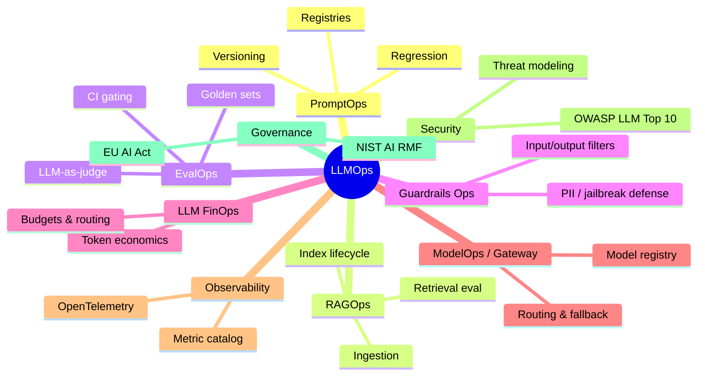
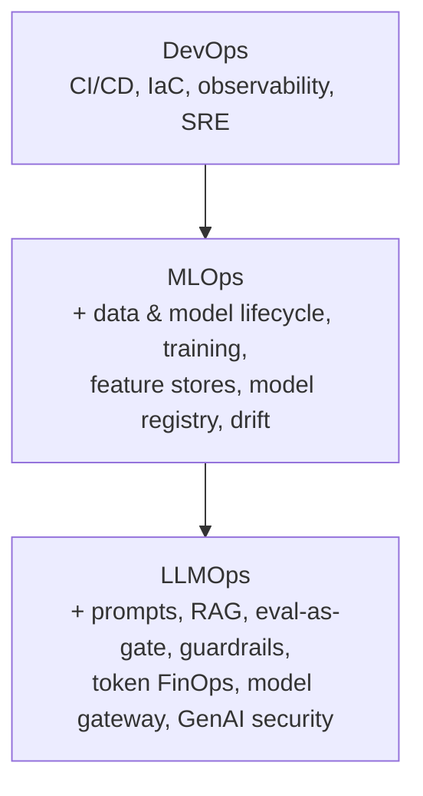
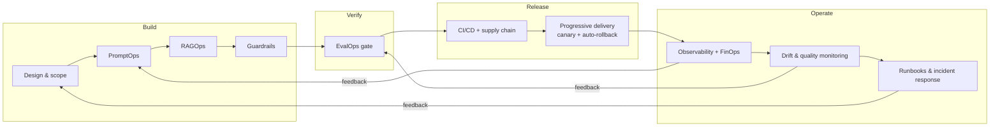

# 01 — Foundations: What LLMOps Is, Why It Matters, and How It Differs from MLOps

> **Part I — Foundations.** Read this first. It fixes the vocabulary used across every other chapter.

---

## 1.1 What is LLMOps?

**LLMOps (Large Language Model Operations)** is the discipline of engineering practices, tooling, and organizational controls used to **develop, deploy, operate, secure, and continuously improve applications built on large language models** — reliably, safely, and cost-effectively, at production scale.

A working definition for architects:

> LLMOps is the end-to-end lifecycle management of LLM-powered systems — spanning **prompts, retrieval, models, evaluation, guardrails, cost, observability, security, and governance** — so that non-deterministic model behavior is made **measurable, controllable, auditable, and releasable** like any other production software.

LLMOps is best understood as a **set of sub-disciplines** (each has its own chapter):

### What makes LLM systems operationally different

| Property | Traditional software | LLM systems |
|----------|---------------------|-------------|
| **Determinism** | Deterministic | Stochastic; identical input can yield different output |
| **Correctness** | Pass/fail on spec | Graded, subjective, context-dependent ("good enough") |
| **Primary artifacts** | Code + data | Code + **prompts** + **retrieval corpora** + **model weights/versions** + **eval sets** |
| **Failure modes** | Crashes, exceptions | Hallucination, prompt injection, data leakage, silent quality drift |
| **Cost model** | Mostly fixed compute | **Per-token, variable, and demand-driven** |
| **Change surface** | Your code | Your code **+ third-party model updates you do not control** |
| **Attack surface** | Inputs, dependencies | Inputs, dependencies **+ natural-language instructions as an injection vector** |

> **Practice.** Treat prompts, retrieval corpora, model versions, and evaluation datasets as **first-class, version-controlled artifacts** with the same rigor as source code. Most LLMOps incidents trace back to one of these four drifting without a release gate.

---

## 1.2 Why LLMOps matters

LLM prototypes are easy; **production LLM systems are hard**. The gap between a working demo and a dependable enterprise service is exactly what LLMOps closes.

### The business case

1. **Reliability under non-determinism.** Users and downstream systems need consistent, bounded behavior. Without EvalOps and guardrails, quality drifts silently and erodes trust.
2. **Cost control.** Token spend is variable and can grow super-linearly with adoption, retries, long contexts, and agentic loops. FinOps discipline is the difference between a viable and an unviable product.
3. **Security & safety.** LLMs introduce novel attack surfaces (prompt injection, insecure output handling, sensitive-information disclosure). These require dedicated controls — see [`10-security-architecture.md`](10-security-architecture.md).
4. **Regulatory exposure.** The EU AI Act, sector regulators, and emerging AI governance standards impose documentation, risk-management, transparency, and human-oversight obligations. Retrofitting compliance is expensive; building it in is cheap — see [`11-governance-and-compliance.md`](11-governance-and-compliance.md).
5. **Velocity with safety.** Progressive delivery (canary, automated rollback) lets teams ship model and prompt changes frequently *without* betting the whole user base on each change — see [`14-progressive-delivery.md`](14-progressive-delivery.md).
6. **Auditability.** Enterprises must answer "why did the system produce this output?" LLMOps provides tracing, provenance, and evidence trails.

### The cost of skipping LLMOps

| Skipped discipline | Typical failure |
|--------------------|-----------------|
| EvalOps | A "small" prompt tweak silently regresses accuracy for a whole user segment; discovered via customer complaints. |
| Guardrails Ops | Prompt injection exfiltrates data or triggers unauthorized tool calls. |
| FinOps | An agent retry loop 10×'s the monthly bill overnight. |
| Observability | An incident takes days to diagnose because there are no traces of prompt, retrieval, and model version. |
| Governance | A regulator requests risk documentation the team never produced. |
| Progressive delivery | A bad model version reaches 100% of users because there was no canary gate. |

---

## 1.3 LLMOps vs MLOps (and vs DevOps)

LLMOps **extends**, it does not replace, MLOps — which itself extends DevOps. Each layer inherits the practices below it and adds new concerns.

### Side-by-side comparison

| Dimension | **MLOps** | **LLMOps** |
|-----------|-----------|------------|
| **Model origin** | Usually you train/own the model | Often you *consume* a third-party foundation model via API |
| **Core iteration unit** | Retraining on new data | **Prompt + retrieval + model-version** changes; fine-tuning is optional |
| **Primary "code"** | Training pipelines, features | **Prompts, chains/graphs, retrieval config** |
| **Data role** | Training/validation datasets | **Retrieval corpora (RAG)** + eval sets; training data often not owned |
| **Evaluation** | Metrics on a fixed test set (accuracy, AUC, RMSE) | **Multi-dimensional & partly subjective** (faithfulness, relevance, safety, tone) — often **LLM-as-judge** |
| **Determinism** | Model is deterministic at inference | **Stochastic** outputs; requires sampling controls & tolerance bands |
| **Cost driver** | Training compute (spiky), serving compute | **Per-token inference** (continuous, usage-driven), context length |
| **Latency profile** | Milliseconds | **Seconds**; streaming, time-to-first-token matter |
| **Security focus** | Data poisoning, model theft | + **Prompt injection, insecure output handling, sensitive-info disclosure, excessive agency** |
| **Versioned artifacts** | Model, data, features | Model, **prompt**, **retrieval index**, **eval set**, guardrail policy |
| **Regulatory frame** | Model risk mgmt (e.g. SR 11-7 in finance) | + **GenAI-specific** (NIST GenAI Profile, EU AI Act GPAI obligations) |
| **Rollback unit** | Model artifact | Model **or** prompt **or** retrieval config **or** gateway route |

> **Note.** A key inversion vs. classic MLOps: in many LLM systems you **do not control the model weights** — the provider may update the model underneath you. This makes **continuous evaluation** and a **model gateway with pinned versions + fallback** essential rather than optional. See [`04-evalops.md`](04-evalops.md) and [`07-model-gateway-and-modelops.md`](07-model-gateway-and-modelops.md).

### What LLMOps inherits unchanged from MLOps/DevOps

- Version control, code review, trunk-based development.
- CI/CD, infrastructure as code, immutable artifacts, containerization.
- Observability (metrics, logs, traces), SLOs, error budgets.
- Progressive delivery and automated rollback.
- Secrets management, least privilege, supply-chain security.

### What LLMOps adds

- **Prompt lifecycle management** (PromptOps).
- **Retrieval lifecycle management** (RAGOps).
- **Continuous, multi-dimensional evaluation as a release gate** (EvalOps).
- **Runtime guardrails** for safety/security (Guardrails Ops).
- **Token-level cost management** (FinOps).
- **Model routing, fallback, and version pinning** (Gateway/ModelOps).
- **GenAI-specific security and governance** controls.

---

## 1.4 The LLMOps lifecycle

Every arrow in this loop is instrumented, gated, and governed by the chapters that follow.

---

## 1.5 Chapter checklist

- [ ] Team shares a common definition of LLMOps and its sub-disciplines.
- [ ] Prompts, retrieval corpora, model versions, and eval sets are version-controlled artifacts.
- [ ] The team has explicitly decided what LLMOps adds *on top of* existing MLOps/DevOps practice.
- [ ] Non-determinism is acknowledged in the definition of "done" (tolerance bands, not exact match).
- [ ] A lifecycle diagram exists for the project, mapping each stage to an owner.

---

## References

See [`19-sources-and-references.md`](19-sources-and-references.md) for full citations:
- Google Cloud & Microsoft Azure — MLOps/LLMOps reference practices.
- Chip Huyen — *Designing Machine Learning Systems* and *AI Engineering* (production LLM practice).
- NIST AI RMF 1.0 and the Generative AI Profile (NIST AI 600-1).
- OWASP Top 10 for LLM Applications.
- OpenTelemetry Generative-AI semantic conventions.
