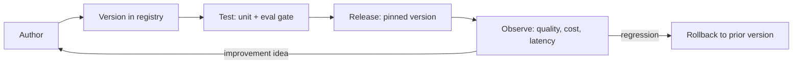

# 02 — PromptOps

> **Part II — The Ops Disciplines.** Treat prompts as versioned, tested, released software.

---

## 2.1 Definition

**PromptOps** is the practice of managing the full lifecycle of prompts — authoring, versioning, testing, releasing, monitoring, and rolling back — with the same engineering rigor applied to source code. A "prompt" here includes the system prompt, few-shot exemplars, tool/function definitions, output schema instructions, and the templating logic that assembles them at runtime.

> **Practice.** A prompt is a **release artifact**, not a string literal buried in application code. It has an ID, a version, an owner, tests, and a changelog.

---

## 2.2 Why PromptOps matters

- A one-line prompt edit can materially change accuracy, safety, cost, and latency — with **no code review signal** if prompts live inline.
- Prompts drift as models change; a prompt tuned for model `A` may regress on model `B`.
- Without versioning you cannot **reproduce** a past output or **roll back** a regression.
- Prompts frequently contain business logic and policy that **must be auditable** (governance).

---

## 2.3 The prompt lifecycle



---

## 2.4 Prompt registry & versioning

Store prompts as **structured files** (not inline strings), version them with the repo, and load them by ID + version at runtime.

**Directory layout:**

```text
prompts/
  claims_summarizer/
    v1.yaml
    v2.yaml
    CHANGELOG.md
  invoice_extractor/
    v1.yaml
  _schema.json          # JSON Schema all prompt files must satisfy
```

**A versioned prompt file (`prompts/claims_summarizer/v2.yaml`):**

```yaml
id: claims_summarizer
version: 2
owner: team-knowledge-assistant
model_hint: { family: general-purpose, min_context_tokens: 16000 }
inputs: [document_text, max_words]
system: |
  You are a precise assistant that summarizes documents for enterprise users.
  Rules:
  - Only use facts present in the provided document. Never invent details.
  - If the document lacks the answer, say "Not stated in the source."
  - Keep the summary under {{max_words}} words.
output_schema:
  type: object
  required: [summary, unsupported_claims]
  properties:
    summary: { type: string }
    unsupported_claims: { type: array, items: { type: string } }
changelog: |
  v2: Added explicit "Not stated in the source" fallback to reduce hallucination.
  v1: Initial version.
```

**Loader with pinned versions and a semantic-version hash for reproducibility:**

```python
# prompt_registry.py
import hashlib
from pathlib import Path
import yaml

PROMPT_ROOT = Path("prompts")

def load_prompt(prompt_id: str, version: int) -> dict:
    path = PROMPT_ROOT / prompt_id / f"v{version}.yaml"
    raw = path.read_text(encoding="utf-8")
    data = yaml.safe_load(raw)
    # Content hash pins the exact bytes used for a given run (put this in traces).
    data["_content_hash"] = hashlib.sha256(raw.encode()).hexdigest()[:12]
    return data

def render(prompt: dict, **kwargs) -> str:
    text = prompt["system"]
    for key, value in kwargs.items():
        text = text.replace("{{" + key + "}}", str(value))
    return text
```

> **Practice.** Emit the `prompt_id`, `version`, and `_content_hash` on every request as span attributes (see [`08-observability-and-opentelemetry.md`](08-observability-and-opentelemetry.md)). This is what lets you answer "which prompt produced this output?" months later.

---

## 2.5 Prompt testing

Two test tiers:

1. **Unit / contract tests** (fast, deterministic) — assert structure, not model quality: template renders, required placeholders resolved, output parses against schema, forbidden strings absent.
2. **Eval tests** (graded) — run the prompt against a golden dataset and gate on quality metrics. This is the bridge into [`04-evalops.md`](04-evalops.md).

**Unit/contract test example:**

```python
# test_prompts.py
import json, jsonschema, pytest
from prompt_registry import load_prompt, render

def test_renders_without_leftover_placeholders():
    p = load_prompt("claims_summarizer", 2)
    text = render(p, max_words=120)
    assert "{{" not in text, "Unresolved placeholder in rendered prompt"

def test_output_schema_is_valid_jsonschema():
    p = load_prompt("claims_summarizer", 2)
    jsonschema.Draft202012Validator.check_schema(p["output_schema"])

@pytest.mark.parametrize("banned", ["ignore previous", "as an AI"])
def test_no_banned_phrases(banned):
    p = load_prompt("claims_summarizer", 2)
    assert banned.lower() not in p["system"].lower()
```

---

## 2.6 Prompt A/B testing & regression

- **A/B / experiments:** route a fraction of traffic to a candidate prompt version and compare online quality, cost, and latency. Reuse the same machinery as canary delivery ([`14-progressive-delivery.md`](14-progressive-delivery.md)).
- **Regression detection:** every candidate must clear the offline eval gate *before* it earns online traffic.

| Change type | Minimum gate before release |
|-------------|-----------------------------|
| Typo / formatting | Unit tests + eval smoke (small golden subset) |
| Instruction / policy change | Full eval suite + safety suite |
| Output schema change | Full eval suite + downstream contract tests |
| Model-family switch | Full eval suite re-run for the new model |

---

## 2.7 Anti-patterns

> **Warning.**
> - **Inline prompt strings** scattered across code — impossible to review, diff, or roll back.
> - **Silent model coupling** — a prompt tuned to one model's quirks that breaks on any other; always pin the model and re-eval on switch.
> - **Mega-prompts** that mix policy, formatting, examples, and data with no structure — split into system/policy/exemplars/schema.
> - **No content hash in traces** — you cannot reproduce or audit outputs.
> - **Editing prompts directly in production** config without a version bump.

---

## 2.8 Checklist

- [ ] Prompts stored as structured, schema-validated files under version control.
- [ ] Each prompt has an ID, integer/semantic version, owner, and changelog.
- [ ] Runtime loads prompts by pinned version and emits `prompt_id` + `version` + `content_hash` in traces.
- [ ] Unit/contract tests run in CI on every prompt change.
- [ ] An eval gate blocks prompt changes that regress quality or safety.
- [ ] A documented rollback path reverts to the previous prompt version.
- [ ] Model switches trigger a full re-evaluation.

---

## References

See [`19-sources-and-references.md`](19-sources-and-references.md):
- OpenAI / Anthropic / Google prompt-engineering guides.
- Prompt-management tooling patterns (registries, versioning) from LangSmith, PromptLayer, Humanloop, MLflow Prompt Registry.
