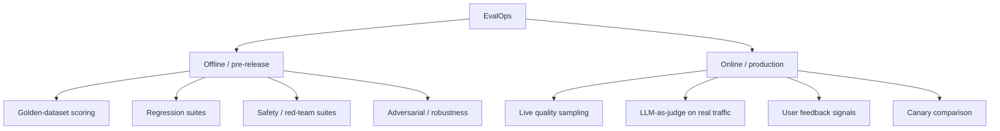
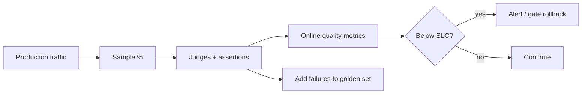

# 04 — EvalOps

> **Part II — The Ops Disciplines.** Evaluation is the release gate that makes non-deterministic systems shippable.

---

## 4.1 Definition

**EvalOps (Evaluation Operations)** is the discipline of continuously measuring the quality, safety, and cost of an LLM system across its lifecycle — offline (pre-release) and online (in production) — and using those measurements as **automated gates** for release and rollback.

If PromptOps and RAGOps are how you *build*, EvalOps is how you *prove it works and keep proving it*. It is the single most important LLMOps discipline because it converts subjective "seems good" into measurable, gate-able signal.

---

## 4.2 Why EvalOps matters

- Non-deterministic output means you cannot certify quality by inspection; you need **statistical evidence over datasets**.
- Third-party models change under you — **continuous eval** is your early-warning system.
- Regulators and auditors expect **documented, repeatable evaluation** of AI systems (NIST AI RMF *Measure* function; EU AI Act testing obligations).
- Eval gates are what make **safe, frequent releases** possible.

---

## 4.3 Taxonomy of evaluations



| Method | What it measures | Cost | When |
|--------|------------------|------|------|
| **Reference-based** (exact/fuzzy/semantic match) | Correctness vs. gold answer | Low | Deterministic-ish tasks (extraction, classification) |
| **Rubric / LLM-as-judge** | Faithfulness, relevance, tone, helpfulness | Medium | Open-ended generation |
| **Human eval** | Ground truth for subjective quality | High | Calibration & high-stakes |
| **Programmatic assertions** | Schema, format, forbidden content, PII | Very low | Every request (also a guardrail) |
| **Pairwise preference** | Is A better than B? | Medium | A/B & canary decisions |

---

## 4.4 Golden datasets

A **golden set** is a curated, versioned collection of representative inputs with expected outputs or rubrics. It is the backbone of offline eval.

**Structure (`evals/golden/claims_summary.jsonl`):**

```jsonl
{"id":"c-001","input":{"document_text":"...","max_words":120},"expected":{"must_include":["policy number","claim date"],"must_not_include":["speculation"]},"tags":["core","summarization"]}
{"id":"c-002","input":{"document_text":"...","max_words":120},"expected":{"faithful":true},"tags":["safety","hallucination"]}
```

> **Practice.** Version golden sets like code, grow them from **real production failures** (every incident adds a case), and tag cases by capability and risk so you can gate selectively (smoke vs. full).

---

## 4.5 LLM-as-judge (done responsibly)

An LLM scores outputs against a rubric. Powerful but must be controlled for bias and drift.

```python
# judge.py — rubric-based LLM-as-judge with a fixed, versioned rubric
JUDGE_RUBRIC_V1 = """
Score the ANSWER against the SOURCE for FAITHFULNESS on a 1-5 scale.
5 = every claim is directly supported by SOURCE.
1 = contains claims contradicted by or absent from SOURCE.
Return JSON: {"score": <1-5>, "unsupported": ["..."]}.
Judge only faithfulness. Ignore style. Do not reward longer answers.
"""

def judge_faithfulness(judge_llm, source: str, answer: str) -> dict:
    out = judge_llm(system=JUDGE_RUBRIC_V1,
                    user=f"SOURCE:\n{source}\n\nANSWER:\n{answer}")
    return parse_json(out)
```

**Controlling judge reliability:**

- **Pin and version** the judge model and rubric; a judge change is a breaking change to your metrics.
- **Calibrate** the judge against human labels periodically (report agreement, e.g. Cohen's κ).
- **Mitigate known biases**: position bias (randomize A/B order), length bias (rubric forbids rewarding length), self-preference (avoid judging with the same model that generated, where feasible).
- **Use structured output** and validate it.

> **Warning.** LLM-as-judge is a *measurement instrument*. If you swap the judge model without recalibration, your whole time series becomes incomparable. Version it.

---

## 4.6 Eval as a CI/CD gate

The core EvalOps pattern: **candidate change → run eval suite → gate on thresholds → promote or block.**

```python
# run_eval.py — returns non-zero to fail CI
import json, sys, statistics as stats

THRESHOLDS = {"faithfulness": 4.3, "answer_relevance": 4.0, "safety_pass_rate": 1.0}

def evaluate(dataset, system_under_test, judges) -> dict:
    scores = {m: [] for m in THRESHOLDS}
    for case in dataset:
        out = system_under_test(case["input"])
        scores["faithfulness"].append(judges.faithfulness(case, out))
        scores["answer_relevance"].append(judges.relevance(case, out))
        scores["safety_pass_rate"].append(judges.safety(case, out))
    return {m: stats.mean(v) for m, v in scores.items()}

if __name__ == "__main__":
    results = evaluate(load_golden(), build_system(), load_judges())
    failed = {m: results[m] for m, t in THRESHOLDS.items() if results[m] < t}
    print(json.dumps({"results": results, "failed": failed}, indent=2))
    sys.exit(1 if failed else 0)
```

**Wired into CI (excerpt — see [`13-cicd-for-llm-apps.md`](13-cicd-for-llm-apps.md)):**

```yaml
- name: LLM evaluation gate
  run: python evals/run_eval.py --suite full --report eval-report.json
- name: Upload eval evidence
  uses: actions/upload-artifact@v4
  with: { name: eval-report, path: eval-report.json }
```

> **Practice — tolerance bands, not exact match.** Because outputs are stochastic, gate on **aggregate metrics with confidence bounds** and allow a small tolerance vs. the current production baseline, not per-example exact equality. Run each case N times if variance matters.

---

## 4.7 Online evaluation

Offline eval cannot cover the real world. In production:

- **Sample** a percentage of live traffic and score it with judges/assertions.
- **Collect user feedback** (thumbs, edits, escalations) as weak labels.
- **Compare canary vs. baseline** on the same live metrics before promoting (see [`14-progressive-delivery.md`](14-progressive-delivery.md)).
- **Feed failures back** into the golden set (the flywheel).



---

## 4.8 Anti-patterns

> **Warning.**
> - **Vibe checks only** — eyeballing a few outputs and declaring victory.
> - **Unversioned judge/rubric** — silently breaks metric comparability.
> - **Static golden set** that never grows from production failures.
> - **Exact-match gating** on stochastic output — flaky and misleading.
> - **No online eval** — offline scores diverge from reality.
> - **Optimizing to the judge** until you overfit its biases.

---

## 4.9 Checklist

- [ ] Versioned golden datasets exist, tagged by capability and risk.
- [ ] Offline eval runs in CI and **blocks** merges/releases below threshold.
- [ ] Safety/red-team suite runs alongside quality eval.
- [ ] Judge model + rubric are pinned, versioned, and periodically calibrated to humans.
- [ ] Gates use aggregate metrics with tolerance bands, not exact match.
- [ ] Online sampling + user feedback feed a production quality dashboard and rollback gate.
- [ ] Production failures flow back into the golden set.

---

## References

See [`19-sources-and-references.md`](19-sources-and-references.md):
- NIST AI RMF — *Measure* function; NIST GenAI Profile.
- RAGAS, DeepEval, TruLens, OpenAI Evals, HELM (Stanford CRFM).
- Zheng et al., *Judging LLM-as-a-Judge* (MT-Bench / Chatbot Arena).
