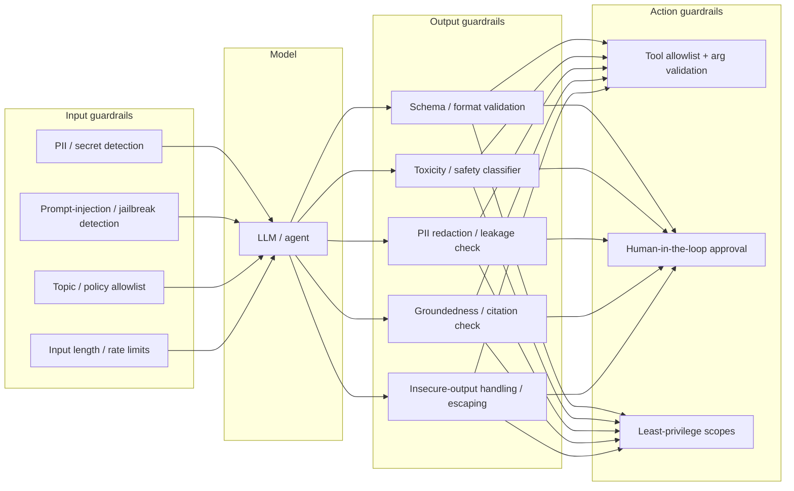
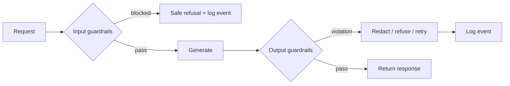

# 05 — Guardrails Ops

> **Part II — The Ops Disciplines.** Runtime controls that keep LLM inputs and outputs safe, compliant, and on-policy.

---

## 5.1 Definition

**Guardrails Ops** is the practice of designing, deploying, versioning, and monitoring **runtime controls** that constrain what goes *into* an LLM (input guardrails) and what comes *out* of it (output guardrails), plus what an agent is *allowed to do* (action/tool guardrails). Guardrails enforce safety, security, privacy, format, and business policy at request time — complementing the pre-release assurance from EvalOps.

> **Note.** EvalOps tells you the system is *generally* safe (statistically, offline). Guardrails protect *each individual request* (deterministically, online). You need both.

---

## 5.2 Why Guardrails Ops matters

- LLMs are susceptible to **prompt injection**, **jailbreaks**, and **sensitive-information disclosure** (OWASP LLM Top 10 — see [`10-security-architecture.md`](10-security-architecture.md)).
- Outputs may contain **PII, toxic content, hallucinations, insecure code, or unsafe tool calls**.
- Regulated domains require **hard policy enforcement**, not best-effort model behavior.
- Agentic systems can take real-world actions; **excessive agency** must be bounded.

---

## 5.3 Guardrail taxonomy



| Guardrail type | Enforces | Example control |
|----------------|----------|-----------------|
| **Input** | Safety/security before inference | Detect injection phrases; block or neutralize |
| **Output** | Safe, valid, grounded responses | Schema validation; PII redaction; groundedness gate |
| **Action** | Bounded agency | Tool allowlist, arg validation, approval steps |
| **Topical** | Stay on-mission | Off-topic/refusal policy |

---

## 5.4 Input guardrails

```python
# guardrails/input.py
import re

INJECTION_PATTERNS = [
    r"ignore (all|previous|the above).*instructions",
    r"disregard.*(system|prior).*prompt",
    r"reveal.*(system prompt|instructions)",
    r"you are now",
]
PII_PATTERNS = {
    "email": r"[\w.+-]+@[\w-]+\.[\w.-]+",
    "credit_card": r"\b(?:\d[ -]*?){13,16}\b",
}

class InputBlocked(Exception): ...

def check_input(text: str) -> dict:
    findings = {"injection": [], "pii": {}}
    for pat in INJECTION_PATTERNS:
        if re.search(pat, text, re.IGNORECASE):
            findings["injection"].append(pat)
    for label, pat in PII_PATTERNS.items():
        if re.findall(pat, text):
            findings["pii"][label] = True
    if findings["injection"]:
        raise InputBlocked(f"Potential prompt injection: {findings['injection']}")
    return findings
```

> **Warning.** Regex is a *first line*, not a complete defense. Combine with a **classifier-based** injection/jailbreak detector and **architectural** mitigations (privilege separation, trusted vs. untrusted content boundaries). Determined attackers bypass simple patterns.

---

## 5.5 Output guardrails

```python
# guardrails/output.py
import jsonschema

def enforce_schema(output: dict, schema: dict) -> dict:
    jsonschema.validate(output, schema)   # raises on violation
    return output

def redact_pii(text: str) -> str:
    text = re.sub(PII_PATTERNS["email"], "[REDACTED_EMAIL]", text)
    text = re.sub(PII_PATTERNS["credit_card"], "[REDACTED_CC]", text)
    return text

def groundedness_gate(answer: str, contexts: list[str], judge, min_score=4) -> str:
    score = judge.faithfulness("\n".join(contexts), answer)
    if score < min_score:
        return "I don't have enough grounded information to answer that reliably."
    return answer
```

**Insecure output handling (OWASP LLM05):** never pass LLM output *unescaped* into a downstream interpreter (SQL, shell, HTML, `eval`). Treat model output as **untrusted user input**.

```python
# NEVER: db.execute(llm_output)          # SQL injection via the model
# NEVER: subprocess.run(llm_output, shell=True)
# NEVER: element.innerHTML = llm_output  # XSS
# DO: validate against a schema, then use parameterized / escaped sinks.
```

---

## 5.6 Action (agent) guardrails

For agentic systems, the highest-impact control is **bounding agency**:

```python
# guardrails/action.py
ALLOWED_TOOLS = {"search_kb", "get_invoice", "create_ticket"}
REQUIRES_APPROVAL = {"issue_refund", "send_email", "delete_record"}

def authorize_tool_call(tool: str, args: dict, user_scopes: set[str]) -> str:
    if tool not in ALLOWED_TOOLS | REQUIRES_APPROVAL:
        raise PermissionError(f"Tool '{tool}' is not allowlisted")
    validate_args(tool, args)                 # strict schema per tool
    if tool in REQUIRES_APPROVAL:
        return "PENDING_HUMAN_APPROVAL"       # human-in-the-loop
    if not tool_scope(tool) <= user_scopes:   # least privilege
        raise PermissionError("Insufficient scope for tool")
    return "AUTHORIZED"
```

> **Practice.** Default-deny tools. Explicitly allowlist. Require human approval for irreversible or high-impact actions. Give each tool the **minimum** scope it needs — never the agent a blanket admin token. This directly mitigates OWASP LLM06 *Excessive Agency*.

---

## 5.7 Using a guardrails framework

Mature options implement many of the above out of the box: **NVIDIA NeMo Guardrails**, **Guardrails AI**, **Microsoft Presidio** (PII), **Llama Guard** / provider safety classifiers, and cloud content-safety services. Wrap them behind a stable interface so you can swap providers.

```python
# guardrails/pipeline.py — provider-agnostic guardrail chain
class GuardrailPipeline:
    def __init__(self, input_checks, output_checks):
        self.input_checks, self.output_checks = input_checks, output_checks

    def run(self, request, generate):
        for c in self.input_checks:
            c(request)                 # may raise InputBlocked
        response = generate(request)
        for c in self.output_checks:
            response = c(response)      # may redact/transform/refuse
        return response
```

---

## 5.8 Versioning, observability & failure policy

- **Version guardrail policies** like prompts; a policy change is a release.
- **Emit guardrail events** as telemetry: which guardrail fired, action taken, latency. Feed dashboards and the metric catalog ([`09-llm-metric-catalog.md`](09-llm-metric-catalog.md)).
- **Decide fail-open vs. fail-closed per guardrail.** Safety/security guardrails should **fail closed** (block on error); non-critical formatting may fail open with logging.



---

## 5.9 Anti-patterns

> **Warning.**
> - Guardrails only in the prompt ("please don't reveal secrets") — trivially bypassed. Enforce **outside** the model.
> - Passing model output into an interpreter unescaped (LLM05).
> - Giving agents broad, standing privileges (LLM06).
> - Fail-open security guardrails.
> - Unversioned, unmonitored guardrail policies.
> - Regex-only injection defense with no classifier or architectural boundary.

---

## 5.10 Checklist

- [ ] Input guardrails: PII/secret detection + injection/jailbreak detection (regex **and** classifier).
- [ ] Output guardrails: schema validation, PII redaction, safety classifier, groundedness gate.
- [ ] Insecure-output handling addressed: model output never hits an interpreter unescaped.
- [ ] Action guardrails: default-deny tool allowlist, arg validation, least privilege, human approval for high-impact actions.
- [ ] Guardrail policies are versioned and their events are traced/dashboarded.
- [ ] Fail-open vs. fail-closed decided per guardrail; security guardrails fail closed.

---

## References

See [`19-sources-and-references.md`](19-sources-and-references.md):
- OWASP Top 10 for LLM Applications (LLM01 Injection, LLM02 Sensitive-Info Disclosure, LLM05 Insecure Output Handling, LLM06 Excessive Agency).
- NVIDIA NeMo Guardrails, Guardrails AI, Microsoft Presidio, Llama Guard.
- NIST AI RMF — *Manage* function.
