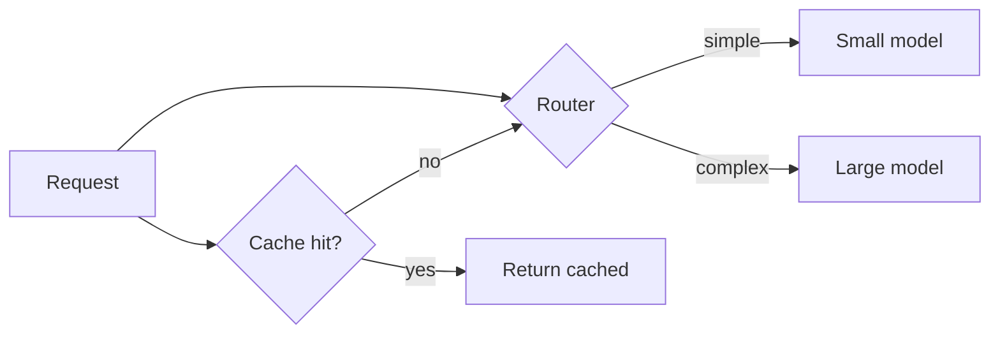
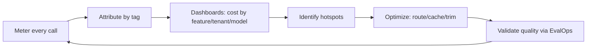

# 06 — LLM FinOps

> **Part II — The Ops Disciplines.** Making token economics visible, attributable, and controllable.

---

## 6.1 Definition

**LLM FinOps** applies FinOps principles — visibility, accountability, and optimization of cloud spend — to the specific economics of LLM systems, where cost is driven primarily by **tokens** (input + output), **model tier**, **context length**, **request volume**, and **agentic call-fan-out**. It answers: *What does each feature/team/customer cost? Is it worth it? How do we reduce cost without hurting quality?*

---

## 6.2 Why LLM FinOps matters

- Token cost is **variable and usage-driven** — unlike fixed compute, it grows with adoption and can spike unpredictably.
- **Agentic loops, retries, and long contexts** multiply cost non-linearly; a single misbehaving loop can 10× a bill overnight.
- Without attribution you cannot tell which feature, tenant, or prompt version is expensive.
- Cost, quality, and latency **trade off** — FinOps makes that trade-off an explicit, measured decision, not an accident.

---

## 6.3 The LLM cost model

$$\text{Cost}_{\text{request}} = T_{in}\cdot p_{in} + T_{out}\cdot p_{out} + C_{embed} + C_{rerank} + C_{tools}$$

where $T_{in}, T_{out}$ are input/output tokens and $p_{in}, p_{out}$ are per-token prices for the chosen model tier.

| Cost lever | Effect | Tactic |
|-----------|--------|--------|
| **Model tier** | Often the biggest lever | Route easy requests to smaller/cheaper models |
| **Input tokens** | Grows with context/RAG | Retrieve fewer/better chunks; compress; trim history |
| **Output tokens** | Grows with verbosity | Constrain max tokens; ask for concise/structured output |
| **Caching** | Avoids repeat spend | Prompt/response cache; provider prompt caching |
| **Retries & loops** | Silent multiplier | Cap retries and agent steps; budget per request |
| **Batching** | Amortizes overhead | Batch embeddings and offline jobs |

---

## 6.4 Cost attribution & observability

You cannot optimize what you cannot attribute. Tag every LLM call with cost dimensions and record token usage as telemetry (see [`08-observability-and-opentelemetry.md`](08-observability-and-opentelemetry.md)).

```python
# finops/meter.py — emit cost metrics per request with attribution tags
from opentelemetry import metrics

meter = metrics.get_meter("llm.finops")
tokens_in = meter.create_counter("gen_ai.usage.input_tokens")
tokens_out = meter.create_counter("gen_ai.usage.output_tokens")
cost_usd = meter.create_counter("gen_ai.cost.usd")

PRICE = {  # USD per 1K tokens — keep in config, not code
    "small":  {"in": 0.00015, "out": 0.0006},
    "large":  {"in": 0.003,   "out": 0.015},
}

def record_cost(model_tier, usage, attrs):
    p = PRICE[model_tier]
    cost = (usage["input"] / 1000) * p["in"] + (usage["output"] / 1000) * p["out"]
    dims = {"model_tier": model_tier, **attrs}  # tenant, feature, prompt_version, env
    tokens_in.add(usage["input"], dims)
    tokens_out.add(usage["output"], dims)
    cost_usd.add(cost, dims)
    return cost
```

> **Practice.** Standard attribution dimensions: `tenant`, `feature`, `route/model`, `prompt_id+version`, `environment`, `user_tier`. With these you can produce a per-feature/per-tenant cost report and a **cost-per-successful-outcome** metric — the number executives actually care about.

$$\text{Cost per resolved request} = \frac{\text{total LLM spend}}{\text{# successfully resolved requests}}$$

---

## 6.5 Budgets, quotas & circuit breakers

Enforce hard limits so a bug or abuse cannot cause runaway spend.

```python
# finops/budget.py — per-request and rolling budget enforcement
class BudgetExceeded(Exception): ...

class BudgetGuard:
    def __init__(self, per_request_usd, daily_tenant_usd, store):
        self.per_request = per_request_usd
        self.daily = daily_tenant_usd
        self.store = store  # e.g. Redis with atomic incr + TTL

    def check_request(self, estimated_usd, tenant):
        if estimated_usd > self.per_request:
            raise BudgetExceeded("Request exceeds per-request cap")
        spent = self.store.incrbyfloat(f"spend:{tenant}:{today()}", estimated_usd)
        self.store.expire(f"spend:{tenant}:{today()}", 172800)
        if spent > self.daily:
            raise BudgetExceeded(f"Tenant {tenant} exceeded daily budget")
```

- **Cap agent steps and retries** at the orchestration layer.
- **Alert at budget thresholds** (e.g. 50/80/100%) and **circuit-break** at 100% (degrade to a cheaper model or a safe refusal rather than unbounded spend).

---

## 6.6 Optimization tactics (with quality guardrails)



1. **Model routing / cascades.** Try a small model first; escalate to a large model only when a confidence/quality check fails. Measure the quality impact via EvalOps.
2. **Semantic & exact caching.** Cache responses for repeated/similar queries; use provider **prompt caching** for stable system prompts and long shared context.
3. **Context minimization.** Better retrieval and reranking → fewer input tokens. Summarize/trim conversation history.
4. **Output constraints.** Set `max_tokens`, request structured/concise output.
5. **Batch offline work.** Embeddings and bulk eval in batches.

> **Warning.** Every cost optimization is a **potential quality regression**. Route/cascade/cache changes **must pass the EvalOps gate** ([`04-evalops.md`](04-evalops.md)) before rollout. Cheaper-but-wrong is more expensive than the tokens you saved.

---

## 6.7 FinOps reporting & FinOps loop



Report at least: cost by feature, by tenant, by model tier; cost-per-successful-outcome; and week-over-week trend with anomaly alerts.

---

## 6.8 Anti-patterns

> **Warning.**
> - No token metering / no per-feature attribution — you fly blind.
> - Uncapped retries and agent loops.
> - Defaulting every request to the largest model.
> - Optimizing cost without an eval gate → silent quality loss.
> - Long, unpruned conversation histories resent on every turn.
> - No budget alerts or circuit breakers.

---

## 6.9 Checklist

- [ ] Every LLM call meters input/output tokens and computed cost with attribution tags.
- [ ] Dashboards show cost by feature, tenant, model, and cost-per-successful-outcome.
- [ ] Per-request and per-tenant budgets are enforced with alerts and a circuit breaker.
- [ ] Agent steps and retries are capped.
- [ ] Model routing/cascade and caching are in place and validated against the eval gate.
- [ ] Context and output token usage are actively minimized.

---

## References

See [`19-sources-and-references.md`](19-sources-and-references.md):
- FinOps Foundation — FinOps Framework.
- OpenTelemetry GenAI semantic conventions (`gen_ai.usage.*`).
- Provider pricing & prompt-caching documentation (treat as configuration).
