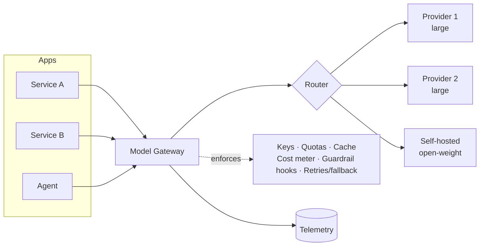
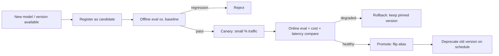
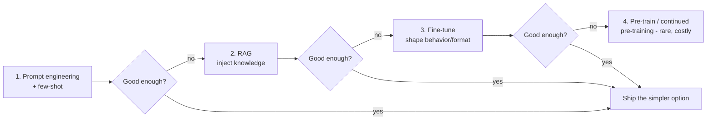
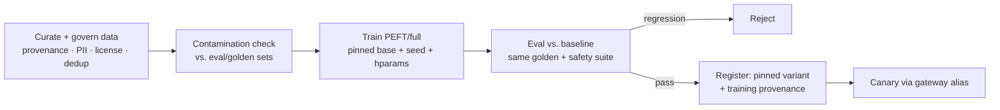

# 07 — Model Gateway & ModelOps

> **Part II — The Ops Disciplines.** The control plane for every model call: routing, fallback, versioning, and policy.

---

## 7.1 Definitions

**Model Gateway** (a.k.a. AI gateway / LLM proxy) is a **single control plane** that all LLM traffic flows through. It abstracts multiple model providers behind one interface and centrally enforces routing, fallback, rate limiting, caching, cost metering, key management, and guardrail/policy hooks.

**ModelOps** is the lifecycle management of the models themselves — registration, version pinning, evaluation-before-promotion, staged rollout, deprecation, and rollback — whether the models are third-party APIs, self-hosted open-weight models, or fine-tuned variants.

> **Note.** The gateway is the *enforcement point*; ModelOps is the *lifecycle process*. Together they let you change models safely without touching application code.

---

## 7.2 Why they matter

- **Provider independence.** Avoid hard-coupling to one vendor; switch or multi-source models without rewriting apps.
- **Resilience.** Providers have outages, rate limits, and latency spikes; the gateway provides fallback and load balancing.
- **Central policy.** One place to enforce keys, quotas, PII rules, and cost limits — instead of duplicating across every service.
- **Safe model change.** Foundation models are updated by providers; ModelOps pins versions and gates upgrades behind evaluation.

---

## 7.3 Reference architecture



The gateway is the natural home for cross-cutting LLMOps concerns: FinOps metering ([`06-llm-finops.md`](06-llm-finops.md)), guardrail hooks ([`05-guardrails-ops.md`](05-guardrails-ops.md)), and observability ([`08-observability-and-opentelemetry.md`](08-observability-and-opentelemetry.md)).

Common implementations: **LiteLLM**, **Portkey**, **Kong AI Gateway**, **Cloudflare AI Gateway**, cloud-native model routers, or an internal proxy. Wrap whichever you choose behind a stable internal contract.

---

## 7.4 Routing, fallback & load balancing

```python
# gateway/router.py — capability-based routing with ordered fallback
ROUTES = {
    "cheap_extraction": ["provider1:small", "selfhost:open-8b"],
    "complex_reasoning": ["provider1:large", "provider2:large"],  # fallback order
}

class AllProvidersFailed(Exception): ...

def call_with_fallback(route: str, request, invoke, is_healthy):
    last_err = None
    for target in ROUTES[route]:
        if not is_healthy(target):        # circuit breaker / health check
            continue
        try:
            return invoke(target, request)  # sets timeout + retry policy inside
        except (RateLimited, ProviderError, Timeout) as e:
            last_err = e                    # try next provider
            continue
    raise AllProvidersFailed(str(last_err))
```

**Routing strategies:**

| Strategy | Use when |
|----------|----------|
| **Capability-based** | Different tasks need different tiers (default) |
| **Cost-based cascade** | Try cheap first, escalate on low confidence ([`06-llm-finops.md`](06-llm-finops.md)) |
| **Latency-based** | Route to fastest healthy provider |
| **Weighted / canary** | Shift % traffic to a new model version ([`14-progressive-delivery.md`](14-progressive-delivery.md)) |

---

## 7.5 Model registry & version pinning (ModelOps)

Track every model in use as a versioned, governed entity.

```yaml
# models/registry.yaml
models:
  - alias: complex_reasoning            # apps reference the ALIAS, never a raw model id
    provider: provider1
    model_id: prov1-large-2026-05       # PINNED provider version, never "latest"
    status: production
    context_tokens: 200000
    eval_baseline: reports/eval-2026-06-01.json
    approved_by: ai-governance-board
    approved_on: 2026-06-02
  - alias: complex_reasoning
    model_id: prov1-large-2026-06       # candidate under evaluation
    status: canary
    eval_baseline: reports/eval-2026-06-20.json
```

> **Practice.** Applications call **aliases** (`complex_reasoning`), and the registry maps aliases to **pinned** provider model IDs. Never use `latest`. Upgrading a model = adding a candidate, evaluating it, canarying it, then flipping the alias — all without touching app code.

---

## 7.6 The model change lifecycle



This mirrors progressive delivery ([`14-progressive-delivery.md`](14-progressive-delivery.md)) but the artifact being rolled out is a **model version** rather than a container image. The rollback is a **gateway config change** (flip the alias back) — fast and code-free.

---

## 7.7 Fine-tuning & model customization (ModelOps)

A **fine-tuned or self-hosted open-weight model is just another registry entry** — but producing it is a governed pipeline in its own right. First, decide *whether* to customize at all.

### 7.7.1 The customization decision order

Escalate only when the cheaper lever is exhausted — each step adds cost, latency, and lifecycle burden:



> **Practice.** **Fine-tune for *form*, retrieve for *facts*.** Fine-tuning is the right tool for tone, format/schema adherence, task specialization, latency, and cost (a smaller tuned model matching a larger general one). It is the **wrong** tool for injecting fresh or frequently-changing knowledge — that is RAG's job. Baking facts into weights makes them stale, unciteable, and expensive to update.

| Technique | What it changes | Cost | When |
|-----------|-----------------|------|------|
| **Full fine-tuning** | All weights | High (GPU + storage per variant) | Large data, maximal control, self-hosted |
| **PEFT — LoRA / QLoRA** | Small adapter weights only | Low–medium | Default for most customization; many cheap adapters over one base |
| **Instruction / SFT** | Supervised behavior on task pairs | Medium | Teach a consistent task format/style |
| **Preference tuning — DPO / RLHF** | Aligns to human/AI preferences | High | High-stakes tone/safety alignment |

### 7.7.2 Fine-tuning as a governed, reproducible pipeline

A fine-tune is a **release artifact** with provenance, not a one-off notebook run. Version the base model, the dataset, and the hyperparameters; gate on eval; register the result.



> **Warning — data governance is the risk center.** Training data becomes model behavior. Enforce: lawful basis and **licensing** for every source (OWASP LLM03/LLM04), **PII minimization/redaction** before training, **deduplication**, and an **eval-contamination check** so golden/test cases never leak into training data (or your eval scores are meaningless). Record the exact dataset version and base-model version as **provenance** ([`13-cicd-for-llm-apps.md`](13-cicd-for-llm-apps.md), [`11-governance-and-compliance.md`](11-governance-and-compliance.md)).

```yaml
# models/finetunes/support_summarizer_v3.yaml — a fine-tune's provenance record
alias: support_summarizer
base_model: open-8b-instruct-2026-04     # PINNED base, never "latest"
method: lora                             # peft adapter
dataset:
  id: support-sft-2026-06
  version: 3
  content_hash: 9f2ac41b7e0d
  records: 18432
  pii_scrubbed: true
  license_reviewed: true
contamination_check: passed              # no eval/golden overlap
hyperparams: { epochs: 3, lr: 0.0002, seed: 42, rank: 16 }
eval_baseline: reports/eval-2026-06-22.json   # must clear the same gate as any model
status: canary
approved_by: ai-governance-board
```

> **Practice.** A tuned model **must clear the same EvalOps gate** ([`04-evalops.md`](04-evalops.md)) as any third-party model before promotion, then roll out via the same register → eval → canary → promote → deprecate lifecycle (§7.6). Its rollback is identical: **flip the gateway alias** back to the previous variant. Self-hosting also adds serving concerns (GPU capacity, batching, autoscaling) handled by the platform layer ([`12-platform-engineering-foundations.md`](12-platform-engineering-foundations.md)).

---

## 7.8 Gateway-enforced cross-cutting policy

The gateway is where you centralize:

- **Secrets/keys**: providers keys live in the gateway/secret manager, never in app code.
- **Rate limiting & quotas**: per tenant, per route.
- **Caching**: exact + semantic + provider prompt caching.
- **Cost metering**: emit `gen_ai.usage.*` and cost per call.
- **Guardrail hooks**: pre/post-call input and output guardrails.
- **Timeouts, retries, circuit breakers**: consistent resilience policy.
- **Redaction/logging policy**: what prompt/response content may be logged.

```python
# gateway/middleware.py — order of cross-cutting concerns
def handle(request):
    apply_rate_limit(request)                 # quotas
    run_input_guardrails(request)             # security/safety
    if hit := cache_lookup(request):          # cost
        return hit
    response = call_with_fallback(request.route, request, invoke, is_healthy)
    response = run_output_guardrails(response)
    record_cost(response.model_tier, response.usage, request.tags)  # FinOps
    cache_store(request, response)
    return response
```

---

## 7.9 Anti-patterns

> **Warning.**
> - Apps calling provider SDKs **directly**, scattering keys, retries, and policy everywhere.
> - Pinning to `latest` / floating model versions — silent behavior changes.
> - No fallback provider — a single vendor outage takes you down.
> - Promoting a new model without eval + canary.
> - Rollback that requires a code deploy instead of a config flip.
> - Logging full prompts/responses with PII and no redaction policy.
> - Fine-tuning to inject knowledge that changes often (use RAG); or training on unlicensed/PII data or on your own eval set (contamination).

---

## 7.10 Checklist

- [ ] All LLM traffic flows through a single gateway/control plane.
- [ ] Apps reference model **aliases**; the registry maps aliases to **pinned** provider versions.
- [ ] Ordered fallback + health checks + circuit breakers across providers.
- [ ] Model upgrades follow register → eval → canary → promote → deprecate.
- [ ] Rollback is a gateway config flip, not a code deploy.
- [ ] Keys, quotas, caching, cost metering, and guardrail hooks are enforced at the gateway.
- [ ] Customization follows the decision order (prompt → RAG → fine-tune); fine-tunes carry data/base provenance, pass a contamination check, and clear the eval gate before canary.

---

## References

See [`19-sources-and-references.md`](19-sources-and-references.md):
- LiteLLM, Portkey, Kong AI Gateway, Cloudflare AI Gateway — gateway patterns.
- MLflow Model Registry, model-registry patterns for ModelOps.
- Provider model-versioning and deprecation policies.
- Hu et al., *LoRA: Low-Rank Adaptation of Large Language Models* (2021); QLoRA (Dettmers et al., 2023); Rafailov et al., *Direct Preference Optimization* (2023).
- Hugging Face PEFT / TRL fine-tuning documentation.
