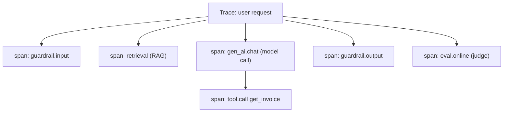
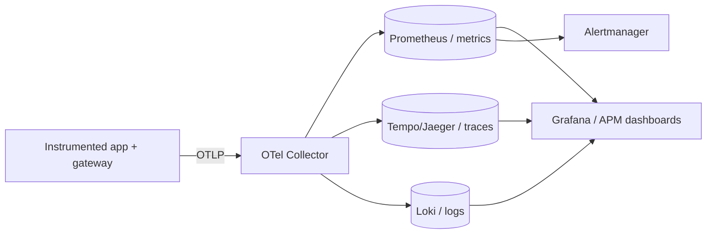

# 08 — Observability & OpenTelemetry

> **Part III — Observability & Metrics.** You cannot operate what you cannot see. Instrument every LLM interaction with open standards.

---

## 8.1 Definition

**LLM observability** is the ability to understand the internal state and behavior of an LLM system from its external outputs — **traces, metrics, and logs** — enriched with LLM-specific context (prompt, model, tokens, retrieval, evaluation, guardrail events). It answers *what happened, why, how well, and at what cost* for any request, in real time and retrospectively.

**OpenTelemetry (OTel)** is the CNCF vendor-neutral standard for generating and collecting telemetry. Its **Generative-AI semantic conventions** define standard attribute names (`gen_ai.*`) so LLM telemetry is portable across tools.

> **Practice.** Standardize on OpenTelemetry with the GenAI semantic conventions. It future-proofs your telemetry and avoids lock-in to any single LLM-observability vendor.

---

## 8.2 Why LLM observability is different

Classic three pillars (metrics, logs, traces) still apply, but LLM systems add unique needs:

| Need | Why it's LLM-specific |
|------|----------------------|
| **Prompt/response capture** | Debugging requires seeing the exact prompt (with version/hash) and output |
| **Token & cost attributes** | Cost is per-token and must be traced (FinOps) |
| **Retrieval visibility** | RAG answers require seeing which chunks were retrieved |
| **Quality/eval signal** | Correctness is graded, not pass/fail; must be attached to spans |
| **Guardrail events** | Which guardrail fired, and what it did |
| **Agent step traces** | Multi-step chains/tools need nested spans to debug |

---

## 8.3 The GenAI trace model

Model each LLM interaction as a **span tree**. A single user request produces a trace; each model call, retrieval, tool call, and guardrail is a child span.



**Key `gen_ai.*` span attributes (OTel GenAI semconv):**

| Attribute | Example | Purpose |
|-----------|---------|---------|
| `gen_ai.system` | `provider1` | Which provider/system |
| `gen_ai.request.model` | `prov1-large-2026-05` | Pinned model version |
| `gen_ai.request.temperature` | `0.2` | Sampling params |
| `gen_ai.usage.input_tokens` | `1240` | Prompt tokens (cost) |
| `gen_ai.usage.output_tokens` | `320` | Completion tokens (cost) |
| `gen_ai.response.finish_reasons` | `["stop"]` | Why generation ended |
| `gen_ai.operation.name` | `chat` | Operation type |

---

## 8.4 Instrumentation example

```python
# observability/tracing.py
from opentelemetry import trace
from opentelemetry.trace import Status, StatusCode

tracer = trace.get_tracer("llm.app")

def traced_chat(gateway, request, prompt_meta):
    with tracer.start_as_current_span("gen_ai.chat") as span:
        # GenAI semantic-convention attributes
        span.set_attribute("gen_ai.system", request.provider)
        span.set_attribute("gen_ai.request.model", request.model_id)
        span.set_attribute("gen_ai.request.temperature", request.temperature)
        # LLMOps-specific context (custom attributes)
        span.set_attribute("llm.prompt.id", prompt_meta["id"])
        span.set_attribute("llm.prompt.version", prompt_meta["version"])
        span.set_attribute("llm.prompt.content_hash", prompt_meta["_content_hash"])
        span.set_attribute("app.tenant", request.tenant)
        span.set_attribute("app.feature", request.feature)
        try:
            resp = gateway.call(request)
            span.set_attribute("gen_ai.usage.input_tokens", resp.usage["input"])
            span.set_attribute("gen_ai.usage.output_tokens", resp.usage["output"])
            span.set_attribute("gen_ai.response.finish_reasons", resp.finish_reasons)
            span.set_status(Status(StatusCode.OK))
            return resp
        except Exception as e:
            span.record_exception(e)
            span.set_status(Status(StatusCode.ERROR, str(e)))
            raise
```

> **Warning — privacy.** Prompts and responses may contain PII. Apply a **redaction/sampling policy** before capturing content, honor data-residency, and make content capture configurable per environment. Never log secrets. Align with the governance chapter ([`11-governance-and-compliance.md`](11-governance-and-compliance.md)).

---

## 8.5 Collector & pipeline

Export via the **OTel Collector** so backends are swappable (Prometheus/Grafana, Jaeger/Tempo, or a commercial APM / LLM-observability platform such as Langfuse, Arize Phoenix, or an OTel-native APM).

```yaml
# otel-collector.yaml
receivers:
  otlp:
    protocols:
      grpc: { endpoint: 0.0.0.0:4317 }
      http: { endpoint: 0.0.0.0:4318 }
processors:
  batch: {}
  attributes/redact:                       # scrub sensitive content attributes
    actions:
      - key: gen_ai.prompt
        action: delete
      - key: gen_ai.completion
        action: delete
  resourcedetection: { detectors: [env, system] }
exporters:
  prometheus: { endpoint: 0.0.0.0:8889 }   # metrics
  otlp/traces: { endpoint: tempo:4317, tls: { insecure: true } }
service:
  pipelines:
    traces:
      receivers: [otlp]
      processors: [attributes/redact, batch]
      exporters: [otlp/traces]
    metrics:
      receivers: [otlp]
      processors: [batch]
      exporters: [prometheus]
```



---

## 8.6 What to instrument (coverage checklist)

- **Every model call**: model version, params, tokens, latency, finish reason, cost.
- **Retrieval**: query, top-k ids, scores, latency, context size (ids/hashes, not raw PII).
- **Prompt provenance**: id, version, content hash.
- **Guardrail events**: which fired, action, latency.
- **Agent steps/tools**: nested spans with args (redacted) and outcomes.
- **Online eval**: attach judge scores to the trace.
- **Business context**: tenant, feature, user tier, request id (correlation).

---

## 8.7 SLOs, dashboards & alerting

Define SLOs and error budgets for LLM services just like any service, plus quality/cost SLOs:

| SLO | Example target |
|-----|----------------|
| Availability | 99.9% successful responses |
| Latency (p95) / TTFT | p95 < 3s; time-to-first-token < 800ms |
| Quality (online) | faithfulness ≥ 4.3 rolling |
| Safety | 100% blocked policy violations |
| Cost | cost-per-resolved-request within budget |

Feed these into the metric catalog ([`09-llm-metric-catalog.md`](09-llm-metric-catalog.md)), drift monitoring, and canary gates.

---

## 8.8 Anti-patterns

> **Warning.**
> - Logging prints instead of structured traces — impossible to correlate.
> - No prompt version/hash on spans — cannot reproduce outputs.
> - Capturing raw prompts/responses with PII and no redaction.
> - Vendor-locked SDK-only telemetry with no OTel export path.
> - Metrics without attribution tags — cannot slice by tenant/feature.
> - Alerting only on infra health, ignoring quality/cost/safety.

---

## 8.9 Checklist

- [ ] OpenTelemetry with GenAI semantic conventions is the telemetry standard.
- [ ] Every model call, retrieval, guardrail, and agent step is a span with `gen_ai.*` + LLMOps attributes.
- [ ] Prompt id/version/hash and cost attributes are on every relevant span.
- [ ] Content capture has a redaction/sampling/privacy policy per environment.
- [ ] Telemetry flows through an OTel Collector to swappable backends.
- [ ] SLOs for availability, latency, quality, safety, and cost with alerts.

---

## References

See [`19-sources-and-references.md`](19-sources-and-references.md):
- OpenTelemetry Generative-AI semantic conventions.
- CNCF OpenTelemetry project.
- Langfuse, Arize Phoenix — OTel-compatible LLM observability.
- Google SRE Book — SLOs and error budgets.
