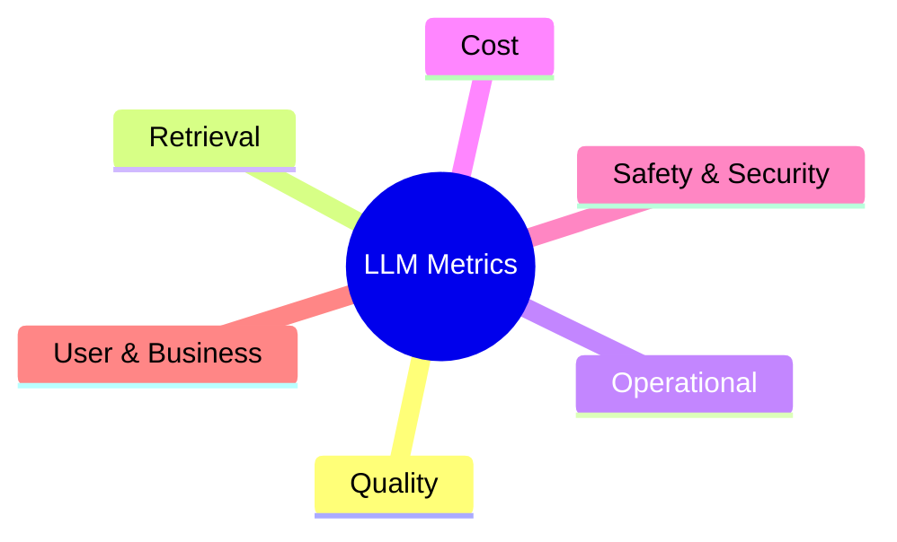
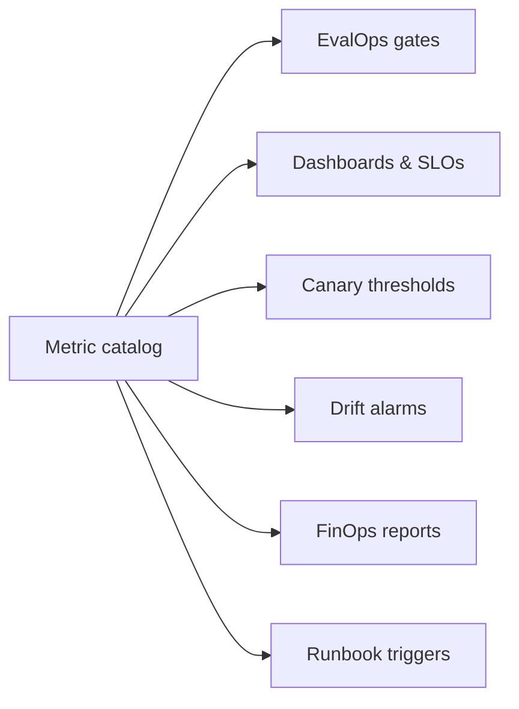

# 09 — LLM Metric Catalog

> **Part III — Observability & Metrics.** A canonical, reusable catalog of metrics for any LLM system — with definitions, formulas, and how each is used as a gate.

---

## 9.1 How to use this catalog

Every metric below is defined once and referenced everywhere (eval gates, dashboards, canary thresholds, drift alarms). Adopt the naming, pick the subset relevant to your system, and wire them into [`08-observability-and-opentelemetry.md`](08-observability-and-opentelemetry.md).

Metrics are grouped into six families:

Notation: $N$ = number of samples in the window.

---

## 9.2 Quality metrics

| Metric | Definition / formula | Direction | Typical use |
|--------|----------------------|-----------|-------------|
| **Faithfulness / Groundedness** | fraction of answer claims supported by provided context | ↑ | RAG eval gate, online SLO |
| **Answer relevance** | how well the answer addresses the question (rubric/judge 1–5) | ↑ | Eval gate |
| **Correctness / accuracy** | agreement with reference answer (exact/semantic/judge) | ↑ | Extraction/classification tasks |
| **Completeness** | fraction of required elements present | ↑ | Structured tasks |
| **Coherence / fluency** | rubric score for readability & logic | ↑ | Generation quality |
| **Hallucination rate** | fraction of responses containing unsupported claims | ↓ | Safety SLO |
| **Refusal rate** | fraction of valid requests wrongly refused | ↓ | Over-blocking check |
| **Format/schema validity** | fraction of outputs passing schema validation | ↑ | Structured output gate |

$$\text{Hallucination rate} = \frac{1}{N}\sum_{i=1}^{N}\mathbb{1}[\text{response}_i\text{ contains an unsupported claim}]$$

---

## 9.3 Retrieval metrics (RAG)

| Metric | Definition / formula | Direction |
|--------|----------------------|-----------|
| **Context recall** | fraction of ground-truth-relevant chunks retrieved | ↑ |
| **Context precision** | fraction of retrieved chunks that are relevant | ↑ |
| **Recall@k / Precision@k** | recall/precision within top-$k$ | ↑ |
| **MRR** | $\frac{1}{N}\sum_i \frac{1}{\text{rank}_i}$ (rank of first relevant) | ↑ |
| **nDCG@k** | rank-weighted relevance gain | ↑ |
| **Citation correctness** | fraction of citations pointing to supporting chunk | ↑ |
| **Chunk utilization** | fraction of retrieved context actually used | ↑ |

$$\text{MRR} = \frac{1}{N}\sum_{i=1}^{N}\frac{1}{\text{rank}_i} \qquad \text{Precision@k} = \frac{|\text{relevant} \cap \text{top-}k|}{k}$$

---

## 9.4 Operational metrics

| Metric | Definition | Direction | Notes |
|--------|-----------|-----------|-------|
| **Latency p50/p95/p99** | end-to-end response time | ↓ | Tail latency matters most |
| **Time to first token (TTFT)** | latency until first streamed token | ↓ | UX for streaming |
| **Tokens per second** | output throughput | ↑ | Perceived speed |
| **Availability / success rate** | successful ÷ total requests | ↑ | Core SLO |
| **Error rate** | provider/timeout/guardrail errors ÷ total | ↓ | Break down by cause |
| **Fallback rate** | requests served by a fallback provider | ↓ | Gateway health |
| **Cache hit rate** | cache hits ÷ total | ↑ | Cost & latency |
| **Retry rate** | retried ÷ total | ↓ | Cost & instability signal |
| **Queue/concurrency saturation** | in-flight ÷ capacity | ↓ | Capacity planning |

---

## 9.5 Cost metrics (FinOps)

| Metric | Definition / formula | Direction |
|--------|----------------------|-----------|
| **Input/output tokens per request** | mean tokens in/out | ↓ |
| **Cost per request** | $T_{in}p_{in}+T_{out}p_{out}+\dots$ | ↓ |
| **Cost per resolved request** | total spend ÷ successful outcomes | ↓ |
| **Cost by tenant / feature / model** | attributed spend | monitor |
| **Budget utilization** | spend ÷ budget | ↓ |
| **Savings from routing/caching** | baseline − actual | ↑ |

See [`06-llm-finops.md`](06-llm-finops.md) for definitions and enforcement.

---

## 9.6 Safety & security metrics

| Metric | Definition | Direction |
|--------|-----------|-----------|
| **Guardrail block rate** | requests blocked by input/output guardrails | monitor |
| **Prompt-injection detection rate** | detected injection attempts (of known set) | ↑ |
| **PII leakage rate** | outputs containing unredacted PII | ↓ (target 0) |
| **Toxic/unsafe output rate** | outputs flagged by safety classifier | ↓ |
| **Jailbreak success rate** | red-team prompts that bypass controls | ↓ (target 0) |
| **Unauthorized tool-call attempts** | agent calls blocked by allowlist | monitor |
| **Policy violation rate** | domain-policy breaches | ↓ |

These map directly to the OWASP LLM Top 10 controls in [`10-security-architecture.md`](10-security-architecture.md).

---

## 9.7 User & business metrics

| Metric | Definition | Direction |
|--------|-----------|-----------|
| **Thumbs-up / satisfaction rate** | positive feedback ÷ rated | ↑ |
| **Task success / resolution rate** | tasks completed without escalation | ↑ |
| **Deflection / containment rate** | resolved without human handoff | ↑ |
| **Edit distance** | how much users edit generated output | ↓ |
| **Escalation rate** | handed to a human | context-dependent |
| **Adoption / active usage** | usage over time | ↑ |

---

## 9.8 Metric wiring: one signal, many consumers

> **Practice.** Define each metric **once** with an explicit formula, window, and owner. Reuse the same definition for the offline eval gate, the online SLO, and the canary threshold so numbers are comparable everywhere.

---

## 9.9 A minimal starter set

If you adopt nothing else, track these ten:

1. Faithfulness/groundedness (quality)
2. Answer relevance or task success (quality)
3. Context recall (retrieval)
4. Latency p95 + TTFT (operational)
5. Success/error rate (operational)
6. Cost per resolved request (cost)
7. Hallucination rate (safety)
8. PII leakage rate (security — target 0)
9. Guardrail block rate (security)
10. User satisfaction / thumbs-up (business)

---

## 9.10 Checklist

- [ ] Each adopted metric has a documented formula, window, direction, and owner.
- [ ] Metrics are emitted with attribution tags (tenant, feature, model, prompt version).
- [ ] The same metric definition feeds eval gates, SLOs, canary thresholds, and drift alarms.
- [ ] Quality, retrieval, operational, cost, safety, and business families are all represented.
- [ ] Targets/thresholds are set relative to a measured production baseline.

---

## References

See [`19-sources-and-references.md`](19-sources-and-references.md):
- RAGAS / DeepEval / TruLens metric definitions.
- OpenTelemetry GenAI metrics semantic conventions.
- Google SRE — SLIs/SLOs; Stanford HELM evaluation dimensions.
