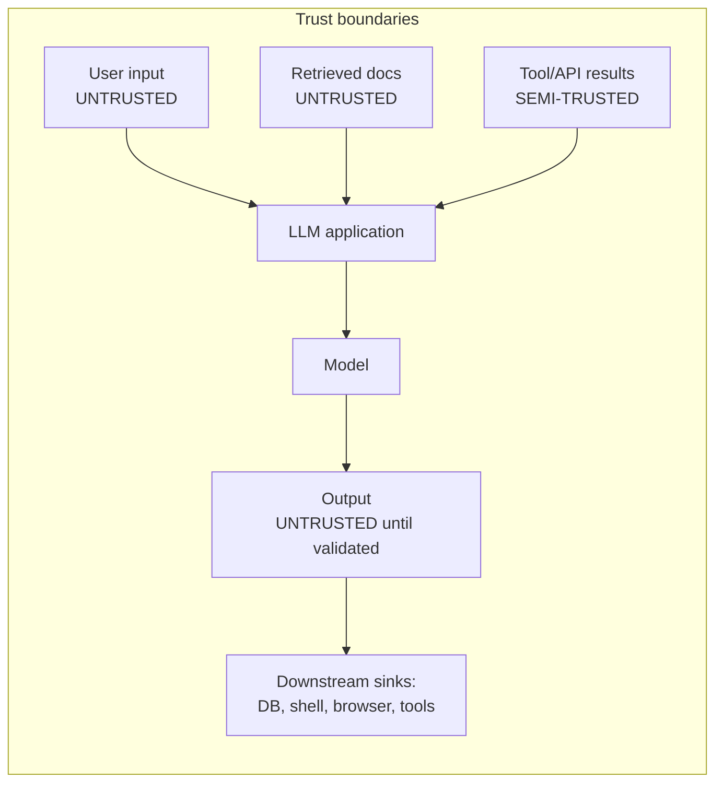
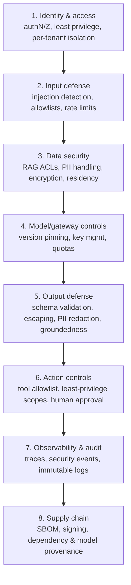
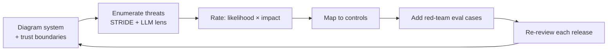

# 10 — Security Architecture for LLMOps

> **Part IV — Security.** Security architecture, OWASP LLM Top 10 mappings, and threat modeling for LLM applications.

---

## 10.1 Why LLM security is different

LLM applications inherit all classic application-security concerns and add new ones because **natural language is now an execution surface**. An attacker can influence system behavior with words — in the user prompt *or* in retrieved/third-party content. Standard AppSec (authN/Z, input validation, secrets management, supply-chain security) is necessary but **not sufficient**.



> **Core principle.** Treat **every** natural-language input (user *and* retrieved content) as untrusted, and treat **model output** as untrusted until validated. Enforce security *outside* the model — the model is a control *subject*, not a control *point*.

---

## 10.2 Defense-in-depth reference architecture



Each layer maps to controls detailed in Guardrails Ops ([`05-guardrails-ops.md`](05-guardrails-ops.md)), Gateway/ModelOps ([`07-model-gateway-and-modelops.md`](07-model-gateway-and-modelops.md)), Observability ([`08-observability-and-opentelemetry.md`](08-observability-and-opentelemetry.md)), and Supply chain ([`13-cicd-for-llm-apps.md`](13-cicd-for-llm-apps.md)).

---

## 10.3 OWASP Top 10 for LLM Applications — mappings

The OWASP Top 10 for LLM Applications is the authoritative baseline for LLM risks. The table maps each risk to concrete controls in this handbook.

| ID | Risk | Primary controls | Chapter |
|----|------|------------------|---------|
| **LLM01** | **Prompt Injection** (direct & indirect) | Trust boundaries; treat retrieved content as untrusted; injection detection (regex + classifier); privilege separation; output validation; human approval for sensitive actions | [05](05-guardrails-ops.md), [03](03-ragops.md) |
| **LLM02** | **Sensitive Information Disclosure** | Output PII redaction; RAG ACL filtering; data minimization; log redaction; DLP | [05](05-guardrails-ops.md), [03](03-ragops.md), [08](08-observability-and-opentelemetry.md) |
| **LLM03** | **Supply Chain** (models, data, plugins) | Model provenance & pinning; SBOM; dependency signing/scanning; vetted plugins | [07](07-model-gateway-and-modelops.md), [13](13-cicd-for-llm-apps.md) |
| **LLM04** | **Data & Model Poisoning** | Trusted ingestion; source validation; corpus integrity (content hashes); training-data governance | [03](03-ragops.md), [11](11-governance-and-compliance.md) |
| **LLM05** | **Improper Output Handling** | Never pass output unescaped to interpreters; schema validation; context-aware encoding | [05](05-guardrails-ops.md) |
| **LLM06** | **Excessive Agency** | Tool allowlist; least-privilege scopes; arg validation; human-in-the-loop; step caps | [05](05-guardrails-ops.md) |
| **LLM07** | **System Prompt Leakage** | Never store secrets in prompts; assume prompt is discoverable; enforce authZ outside the prompt | [02](02-promptops.md), [05](05-guardrails-ops.md) |
| **LLM08** | **Vector & Embedding Weaknesses** | RAG access control; tenant isolation in vector store; poisoning defense; embedding integrity | [03](03-ragops.md) |
| **LLM09** | **Misinformation** (incl. overreliance) | Groundedness gates; citations; confidence signaling; human oversight; disclaimers | [04](04-evalops.md), [05](05-guardrails-ops.md), [11](11-governance-and-compliance.md) |
| **LLM10** | **Unbounded Consumption** (DoS, cost) | Rate limits; budgets & circuit breakers; step/retry caps; input size limits | [06](06-llm-finops.md), [07](07-model-gateway-and-modelops.md) |

> **Note.** LLM01 (Prompt Injection) has **no complete fix** today. Defense is layered: minimize what injection can achieve (least privilege, output validation, human approval) rather than trying to perfectly detect it.

---

## 10.4 Deep dive: prompt injection (LLM01)

**Direct injection:** the user tells the model to ignore its instructions.
**Indirect injection:** a *retrieved or fetched document* contains adversarial instructions the model then follows — the more dangerous variant for RAG/agent systems.

Layered mitigations (no single one is sufficient):

1. **Privilege separation** — the model has no standing authority; sensitive actions require out-of-band authorization.
2. **Trusted/untrusted content boundaries** — clearly delimit and label retrieved content; never let it change system instructions.
3. **Detection** — regex + classifier for known injection/jailbreak patterns.
4. **Output validation** — constrain and validate output; block dangerous tool calls.
5. **Human-in-the-loop** — require approval for irreversible/high-impact actions.
6. **Least-privilege tools** — even if injected, the agent cannot exceed granted scopes.

```python
# The architectural mitigation that matters most: the model cannot self-authorize.
def execute_action(proposed_action, user_context):
    # The model PROPOSES; the system AUTHORIZES against the human's real permissions.
    if proposed_action.tool in HIGH_IMPACT:
        return require_human_approval(proposed_action)
    if not authorized(user_context.scopes, proposed_action):
        raise PermissionError("Action exceeds user's authority")   # not the model's
    return run(proposed_action)
```

---

## 10.5 Threat modeling for LLM applications

Use a structured method (STRIDE) adapted to LLM-specific assets and flows. Do it early, revisit each release.

**Step 1 — Model the system & trust boundaries** (data-flow diagram: users, app, gateway, model, vector store, tools, downstream sinks).

**Step 2 — Enumerate threats with STRIDE + LLM lens:**

| STRIDE | Classic | LLM-specific example | Control |
|--------|---------|----------------------|---------|
| **Spoofing** | Fake identity | Impersonated tenant reaching another tenant's index | Strong authN, per-tenant isolation (LLM08) |
| **Tampering** | Modify data | Poisoned document injected into RAG corpus | Trusted ingestion, content hashes (LLM04) |
| **Repudiation** | Deny action | No audit of who triggered an agent action | Immutable audit logs, tracing (LLM/obs) |
| **Information disclosure** | Data leak | Model reveals another user's data or system prompt | ACL retrieval, output redaction (LLM02/07) |
| **Denial of service** | Exhaust resources | Prompt that forces huge output / infinite agent loop | Rate limits, budgets, step caps (LLM10) |
| **Elevation of privilege** | Gain rights | Injection makes agent call an admin tool | Least-privilege tools, human approval (LLM06/01) |

**Step 3 — Rate & prioritize** (likelihood × impact); **Step 4 — Map each to a control** in this handbook; **Step 5 — Add red-team eval cases** for the top threats (feed [`04-evalops.md`](04-evalops.md)).



---

## 10.6 Secrets, identity & tenancy

- **Secrets** (provider keys, DB creds) in a secret manager; injected at runtime; never in code, prompts, or logs.
- **Least privilege** for the app's own identity and for every tool the agent can call.
- **Per-tenant isolation** end-to-end: separate/filtered vector namespaces, row-level ACLs, and tenant-tagged telemetry.
- **Red-team & pen-test** the LLM surface specifically (injection, jailbreak, data exfiltration), not just the web layer.

---

## 10.7 Anti-patterns

> **Warning.**
> - Trusting retrieved content as if it were system instructions.
> - Enforcing authorization *in the prompt* instead of in code.
> - Giving the agent a powerful standing credential.
> - Passing model output to SQL/shell/HTML unescaped (LLM05).
> - Storing secrets or authorization logic in the system prompt (LLM07).
> - No tenant isolation in the vector store (LLM08).
> - No rate limits / budgets → cost-based DoS (LLM10).

---

## 10.8 Checklist

- [ ] Data-flow diagram with explicit trust boundaries exists and is reviewed each release.
- [ ] STRIDE + LLM threat model completed; top threats mapped to controls and red-team cases.
- [ ] All 10 OWASP LLM risks have an owner and a mapped control.
- [ ] Retrieved content and model output are both treated as untrusted.
- [ ] Authorization is enforced in code, never in the prompt; agents run least-privilege.
- [ ] Per-tenant isolation across store, ACLs, and telemetry.
- [ ] Secrets in a manager; injection detection (regex + classifier); output escaping/validation.
- [ ] Rate limits, budgets, and step caps prevent unbounded consumption.

---

## References

See [`19-sources-and-references.md`](19-sources-and-references.md):
- OWASP Top 10 for LLM Applications (2025) and OWASP GenAI Security Project.
- MITRE ATLAS — adversarial ML threat knowledge base.
- Microsoft STRIDE threat-modeling methodology; OWASP Threat Modeling.
- NIST AI RMF — *Map/Manage*; NIST SP 800-53 control families.
