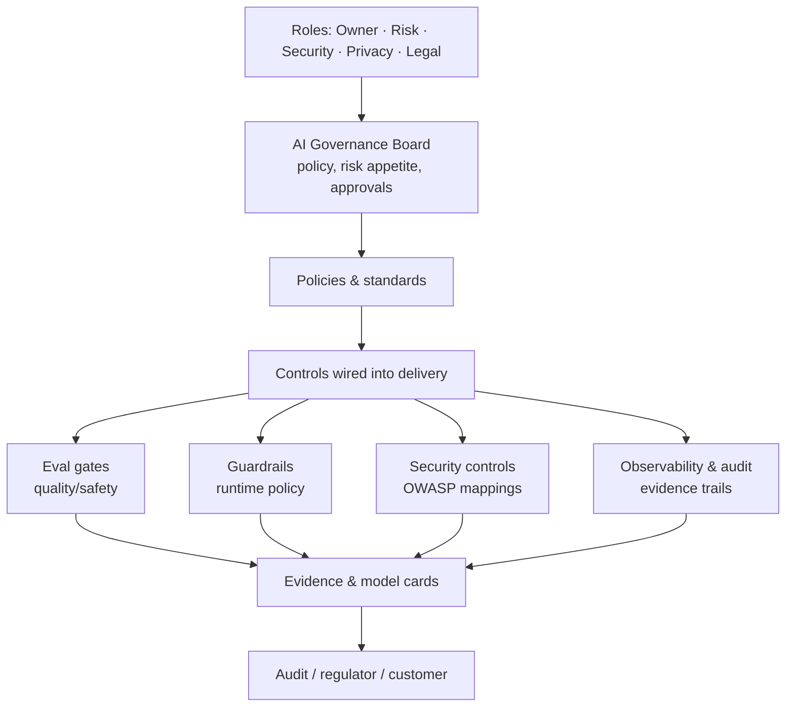
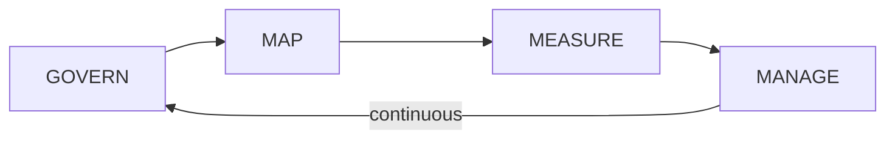
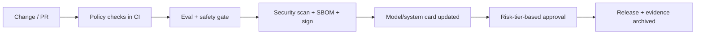

# 11 — Governance & Compliance

> **Part V — Governance.** Governance model, NIST AI RMF alignment, and EU AI Act readiness.

---

## 11.1 Definition

**AI governance** is the system of policies, roles, processes, and evidence that ensures LLM systems are developed and operated **responsibly, lawfully, and accountably** — managing risk to people, the organization, and society. **Compliance** is demonstrable conformance to applicable laws, regulations, and standards. LLMOps operationalizes governance: it turns policy into gates, controls, and audit trails embedded in the delivery pipeline.

> **Practice.** Governance is not a document you write once; it is a set of **controls wired into CI/CD, eval gates, guardrails, and observability** that produce evidence automatically.

---

## 11.2 Why governance matters

- **Legal exposure** — the EU AI Act and sector regulators impose binding obligations with significant penalties.
- **Trust & accountability** — enterprises must explain and stand behind AI decisions.
- **Risk management** — bias, safety, privacy, and reliability risks require systematic treatment.
- **Auditability** — regulators, customers, and boards demand evidence, not assurances.

---

## 11.3 Governance operating model

**Minimum roles:** system owner (accountable), AI risk lead, security lead, privacy/DPO, legal/compliance, and an approval authority (board or committee) for high-risk use cases.

**Core artifacts to maintain per system:**

- **Use-case risk registration** (purpose, users, impact, risk tier).
- **Model card / system card** (capabilities, limitations, eval results, intended & prohibited uses).
- **Data provenance & DPIA** (data sources, lawful basis, PII handling).
- **Risk assessment & treatment** (identified risks, controls, residual risk).
- **Evaluation & red-team evidence** (from EvalOps).
- **Human-oversight design** (where and how humans intervene).
- **Incident & change log** (audit trail).

---

## 11.4 NIST AI RMF alignment

The **NIST AI Risk Management Framework (AI RMF 1.0)** and its **Generative AI Profile (NIST AI 600-1)** are voluntary, widely-adopted, and map cleanly onto LLMOps disciplines. The framework has four functions:

| NIST AI RMF function | Intent | LLMOps realization | Chapters |
|----------------------|--------|--------------------|----------|
| **GOVERN** | Culture, roles, policies, accountability | Governance board, policies, ownership, risk registration | This chapter |
| **MAP** | Context, intended use, risk identification | Use-case registration, threat modeling, impact assessment | [10](10-security-architecture.md), this chapter |
| **MEASURE** | Analyze, benchmark, monitor risks | EvalOps gates, metric catalog, safety/red-team suites, drift monitoring | [04](04-evalops.md), [09](09-llm-metric-catalog.md), [15](15-operations-runbook.md) |
| **MANAGE** | Prioritize, respond, recover | Guardrails, canary + rollback, budgets, runbooks, incident response | [05](05-guardrails-ops.md), [14](14-progressive-delivery.md), [15](15-operations-runbook.md) |

The **GenAI Profile** enumerates GenAI-specific risks (confabulation/hallucination, dangerous content, data privacy, information integrity, CBRN, and more) and suggested actions — use it as a checklist to ensure your controls cover each risk category.

> **Practice.** Maintain a **control-mapping matrix**: each NIST function/subcategory → the specific gate, guardrail, or artifact in your pipeline that satisfies it. This is your audit-ready evidence index.

---

## 11.5 EU AI Act readiness

The **EU Artificial Intelligence Act** is a binding, risk-tiered regulation with extraterritorial reach (applies if your system is used in the EU). Obligations phase in over time — verify current deadlines against the official text.

**Risk tiers:**

| Tier | Examples | Obligation level |
|------|----------|------------------|
| **Prohibited** | Social scoring, manipulative or exploitative uses | Banned |
| **High-risk** | AI in employment, credit, healthcare, critical infrastructure, etc. | Extensive: risk mgmt, data governance, documentation, logging, human oversight, accuracy/robustness/cybersecurity, conformity assessment |
| **Limited risk** | Chatbots, generative content | Transparency: disclose AI interaction; label AI-generated/deepfake content |
| **Minimal risk** | Most other uses | Voluntary codes of conduct |

**General-Purpose AI (GPAI) / foundation models** carry additional provider obligations (technical documentation, training-data summaries, copyright policy; systemic-risk models face stronger requirements). If you *deploy* a GPAI model, you are a **deployer** with your own obligations; ensure your provider supplies the required documentation.

**Deployer/high-risk readiness checklist (map to your controls):**

- [ ] Determine your **role** (provider / deployer / distributor) and **risk tier** per use case.
- [ ] **Risk-management system** across the lifecycle → NIST MAP/MEASURE/MANAGE.
- [ ] **Data governance** (relevant, representative, bias-checked data) → [03](03-ragops.md), this chapter.
- [ ] **Technical documentation & model/system cards** → this chapter.
- [ ] **Record-keeping / automatic logging** of events → [08](08-observability-and-opentelemetry.md).
- [ ] **Transparency**: inform users they interact with AI; label AI-generated content → [05](05-guardrails-ops.md).
- [ ] **Human oversight** designed in → guardrails + runbooks.
- [ ] **Accuracy, robustness, cybersecurity** → EvalOps + security architecture.
- [ ] Confirm **GPAI provider documentation** is available for the models you use.

> **Warning — not legal advice.** Regulatory classification and deadlines are fact-specific and evolving. Engage qualified legal/compliance counsel; use this section to prepare, not to conclude.

---

## 11.6 Other frameworks to align with

| Framework / standard | Relevance |
|----------------------|-----------|
| **ISO/IEC 42001** | AI management system (certifiable) — governance backbone |
| **ISO/IEC 23894** | AI risk management guidance |
| **ISO/IEC 27001 / SOC 2** | Information security management (underpins AI security) |
| **Sector rules** (e.g. SR 11-7 model risk, HIPAA, GDPR) | Domain-specific obligations |

---

## 11.7 Wiring governance into delivery (governance-as-code)

- Block releases missing an updated model/system card for material changes.
- Require documented approval for high-risk use cases before promotion.
- Archive eval reports, SBOMs, signatures, and threat models as immutable **evidence** ([`13-cicd-for-llm-apps.md`](13-cicd-for-llm-apps.md)).

---

## 11.8 Checklist

- [ ] Governance roles and an approval authority are defined.
- [ ] Each use case is risk-registered and tiered (incl. EU AI Act tier).
- [ ] A NIST AI RMF control-mapping matrix links every function to concrete controls/evidence.
- [ ] Model/system cards, DPIA, and risk assessments are maintained and updated on material change.
- [ ] Transparency (AI disclosure, content labeling) and human oversight are implemented.
- [ ] Automatic logging/record-keeping supports audit.
- [ ] Evidence (eval, SBOM, signatures, threat model) is archived per release.
- [ ] Legal/compliance counsel engaged for regulatory classification.

---

## References

See [`19-sources-and-references.md`](19-sources-and-references.md):
- NIST AI RMF 1.0 and Generative AI Profile (NIST AI 600-1).
- EU Artificial Intelligence Act (Regulation (EU) 2024/1689) — official text.
- ISO/IEC 42001, 23894, 27001.
- OECD AI Principles.
