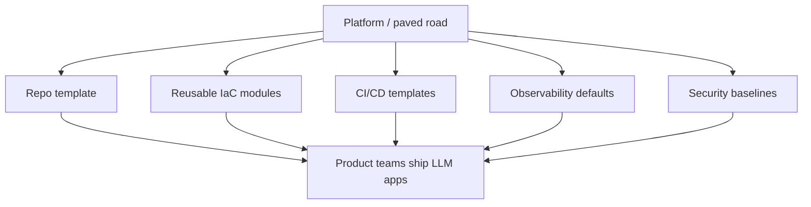
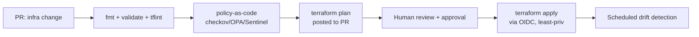
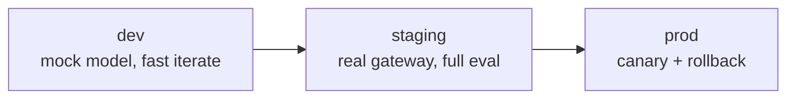

# 12 — DevOps & Platform Engineering Foundations

> **Part VI — Platform & DevOps.** The engineering substrate every LLM system stands on: repo structure, local development, containerization, and infrastructure as code.

---

## 12.1 Why foundations first

LLMOps is an *extension* of DevOps and platform engineering, not a replacement (see [`01-foundations.md`](01-foundations.md)). If your foundations are weak — no reproducible builds, no IaC, no environments — the LLM-specific practices have nothing solid to stand on. This chapter establishes the substrate; later chapters (CI/CD, progressive delivery, operations) build on it.

**Platform engineering** provides an internal, self-service platform (golden paths, reusable modules, paved-road templates) so product teams ship LLM apps without reinventing infrastructure, security, and delivery each time.



---

## 12.2 Repository structure

A clear, conventional layout for an LLM application. It separates **app code**, **LLM artifacts** (prompts, evals), **infra**, and **delivery**.

```text
my-llm-app/
├── README.md
├── pyproject.toml / package.json        # deps, tooling config
├── .env.example                         # documented env vars (NO secrets)
├── src/                                 # application code
│   ├── app/                             # API / service layer
│   ├── gateway/                         # model gateway client + routing
│   ├── rag/                             # ingestion, retrieval
│   ├── guardrails/                      # input/output/action guardrails
│   └── observability/                   # tracing/metrics setup
├── prompts/                             # versioned prompt registry (PromptOps)
│   └── <prompt_id>/vN.yaml
├── evals/                               # EvalOps
│   ├── golden/*.jsonl                   # golden datasets
│   ├── run_eval.py                      # gate script
│   └── judges/                          # judge rubrics (versioned)
├── models/
│   └── registry.yaml                    # model aliases → pinned versions
├── infra/                               # infrastructure as code
│   ├── terraform/                       # cloud infra
│   └── modules/                         # reusable TF modules
├── deploy/                              # delivery
│   ├── helm/                            # Helm chart
│   ├── rollouts/                        # Argo Rollouts / Flagger manifests
│   └── k8s/                             # base manifests / kustomize
├── docker/
│   ├── Dockerfile                       # multi-stage, non-root
│   └── docker-compose.yaml              # local stack
├── tests/                               # unit/integration/contract tests
├── docs/                                # ADRs, runbooks, model cards
└── .github/workflows/                   # CI/CD pipelines
```

> **Practice.** Keep **prompts, evals, and the model registry in the app repo** so a single PR can change code + prompt + eval together and be reviewed and gated as one unit. This is what makes prompt/model changes traceable and rollback-able.

---

## 12.3 Local development setup

Goal: a **one-command, reproducible** local environment that mirrors production shape, works offline where possible, and never requires real secrets checked into the repo.

**Principles:**

- **Reproducible tooling** — pin language and dependency versions; use lockfiles.
- **Config via environment** (12-factor); document every var in `.env.example`.
- **Mock the model provider** for fast, deterministic, cost-free local iteration; switch to a real gateway via config.
- **Local stack via Compose** — app + vector store + observability, close to prod topology.

```yaml
# docker/docker-compose.yaml — local dev stack
services:
  app:
    build: { context: .., dockerfile: docker/Dockerfile, target: dev }
    env_file: [../.env]
    environment:
      MODEL_GATEWAY_URL: http://mock-llm:8080   # deterministic local model
      OTEL_EXPORTER_OTLP_ENDPOINT: http://otel-collector:4317
    ports: ["8000:8000"]
    depends_on: [vectordb, otel-collector, mock-llm]
  mock-llm:
    image: your-org/mock-llm:latest              # canned/deterministic responses
    ports: ["8080:8080"]
  vectordb:
    image: qdrant/qdrant:latest                  # or pgvector, etc.
    ports: ["6333:6333"]
  otel-collector:
    image: otel/opentelemetry-collector-contrib:latest
    command: ["--config=/etc/otel.yaml"]
    volumes: ["./otel-collector.yaml:/etc/otel.yaml"]
    ports: ["4317:4317", "8889:8889"]
```

```bash
# Makefile-style paved-road commands
make bootstrap   # install pinned deps + pre-commit hooks
make up          # docker compose up local stack
make test        # unit + contract tests
make eval-smoke  # fast eval gate against a golden subset
make lint        # format + lint + type-check + secret scan
```

> **Warning.** Never commit real API keys. Use `.env` (git-ignored) locally, a secret manager in shared environments, and pre-commit **secret scanning** to prevent accidental leaks.

---

## 12.4 Containerization

Package the app as an **immutable, minimal, non-root** container. This is the artifact that flows through CI/CD and progressive delivery unchanged across environments.

```dockerfile
# docker/Dockerfile — multi-stage, non-root, minimal
# ---- build stage ----
FROM python:3.12-slim AS build
WORKDIR /app
ENV PIP_NO_CACHE_DIR=1 PYTHONDONTWRITEBYTECODE=1
COPY pyproject.toml uv.lock ./
RUN pip install --no-cache-dir uv && uv sync --frozen --no-dev
COPY src/ ./src/
COPY prompts/ ./prompts/
COPY models/ ./models/

# ---- runtime stage ----
FROM python:3.12-slim AS runtime
# Non-root user (security)
RUN groupadd -r app && useradd -r -g app app
WORKDIR /app
COPY --from=build --chown=app:app /app /app
ENV PATH="/app/.venv/bin:$PATH" \
    PYTHONUNBUFFERED=1 \
    PORT=8000
USER app
EXPOSE 8000
# Healthcheck for orchestrators (readiness)
HEALTHCHECK --interval=30s --timeout=3s --retries=3 \
  CMD python -c "import urllib.request,sys; sys.exit(0 if urllib.request.urlopen('http://localhost:8000/healthz').status==200 else 1)"
ENTRYPOINT ["python", "-m", "src.app"]
```

**Container best practices:**

| Practice | Why |
|----------|-----|
| Multi-stage build | Small runtime image, no build tools shipped |
| Non-root user | Least privilege (defense in depth) |
| Pinned base image (by digest in prod) | Reproducibility & supply-chain integrity |
| Minimal/distroless base | Smaller attack surface |
| Healthcheck + `/healthz` `/readyz` | Orchestrator liveness/readiness |
| No secrets baked in | Inject at runtime |
| `.dockerignore` | Keep build context lean & avoid leaking files |

Images are **scanned, SBOM'd, and signed** in CI — see [`13-cicd-for-llm-apps.md`](13-cicd-for-llm-apps.md).

---

## 12.5 Infrastructure as Code (Terraform)

All infrastructure — clusters, networking, vector DB, secret stores, IAM, observability backends — is defined as **version-controlled code**, reviewed via PR, and applied through automation. Never click-ops production.

**Enterprise Terraform practices:**

| Practice | Detail |
|----------|--------|
| **Remote state + locking** | State in a backend (e.g. S3+DynamoDB, GCS, Terraform Cloud) with locking; never local state for shared infra |
| **State isolation** | Separate state per environment (dev/stage/prod) and per blast-radius boundary |
| **Reusable modules** | Encapsulate patterns (network, cluster, vector store) as versioned modules |
| **Environment via workspaces/dirs** | `envs/dev`, `envs/prod` compose modules with different inputs |
| **Policy as code** | OPA/Sentinel/`tflint`/`checkov` to enforce guardrails (tagging, encryption, no public buckets) |
| **Plan in CI, apply gated** | `plan` on PR for review; `apply` requires approval; drift detection scheduled |
| **No secrets in state/code** | Reference secret managers; mark sensitive; encrypt state |
| **Least-privilege CI identity** | OIDC federation, short-lived creds — no long-lived cloud keys |

```hcl
# infra/terraform/envs/prod/main.tf
terraform {
  required_version = ">= 1.7"
  backend "s3" {
    bucket         = "acme-tfstate-prod"
    key            = "llm-app/terraform.tfstate"
    region         = "eu-west-1"
    dynamodb_table = "tf-locks"        # state locking
    encrypt        = true
  }
}

module "network" {
  source = "../../modules/network"     # versioned, reusable
  env    = "prod"
  cidr   = "10.20.0.0/16"
}

module "vector_store" {
  source            = "../../modules/vector-store"
  env               = "prod"
  network_id        = module.network.id
  encryption_at_rest = true
  multi_az          = true
}

module "llm_cluster" {
  source          = "../../modules/k8s-cluster"
  env             = "prod"
  network_id      = module.network.id
  node_min        = 3
  node_max        = 12
  enable_autoscaling = true
}
```

```hcl
# infra/terraform/modules/vector-store/variables.tf — module contract
variable "env"                { type = string }
variable "network_id"         { type = string }
variable "encryption_at_rest" { type = bool, default = true }
variable "multi_az"           { type = bool, default = false }
```



> **Practice — Terraform enterprise pattern.** *Remote locked state + isolated state per environment + versioned reusable modules + policy-as-code + plan-on-PR/apply-on-approval + OIDC short-lived CI credentials.* This combination gives you reviewable, auditable, least-privilege infrastructure with drift detection.

---

## 12.6 Environments & promotion

Maintain at least **dev → staging → prod** with identical shape (same IaC modules, different sizes/inputs). Artifacts (container images, Helm charts) are built **once** and **promoted** unchanged through environments — never rebuilt per environment.



---

## 12.7 Anti-patterns

> **Warning.**
> - Prompts/evals in a different repo (or none) — changes can't be reviewed/gated together.
> - Root containers, secrets baked into images, floating `:latest` base tags.
> - Manual "click-ops" infrastructure with no IaC.
> - Local Terraform state for shared infra; secrets in state.
> - Long-lived cloud keys in CI instead of OIDC.
> - Rebuilding artifacts per environment instead of promoting one build.

---

## 12.8 Checklist

- [ ] Repo follows a conventional layout with prompts, evals, and model registry co-located with code.
- [ ] One-command reproducible local dev with a mock model and prod-shaped stack.
- [ ] Secret scanning in pre-commit/CI; no secrets in repo, images, or state.
- [ ] Multi-stage, non-root, minimal, healthchecked container image.
- [ ] All infra is Terraform with remote locked state, isolated per environment.
- [ ] Reusable versioned modules + policy-as-code + plan-on-PR/apply-on-approval + OIDC.
- [ ] dev→staging→prod environments of identical shape; build-once/promote artifacts.

---

## References

See [`19-sources-and-references.md`](19-sources-and-references.md):
- The Twelve-Factor App.
- HashiCorp Terraform best practices; Terraform module registry patterns.
- Docker & OCI image best practices; distroless images.
- Team Topologies; *Platform Engineering* practices (CNCF).
