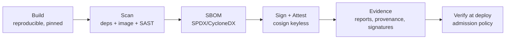

# 13 — CI/CD for LLM Applications

> **Part VII — CI/CD & Supply Chain.** Continuous integration, GitHub Actions delivery, hardening, and a secure supply chain: build → scan → SBOM → sign → evidence.

---

## 13.1 What's different about CI/CD for LLM apps

Standard CI/CD (build, test, deploy) still applies, but LLM apps add gates and artifacts:

| Addition | Why |
|----------|-----|
| **Eval gate** | Quality is graded, not compile/pass — block regressions ([`04-evalops.md`](04-evalops.md)) |
| **Prompt & retrieval tests** | Prompts and RAG config are release artifacts ([`02`](02-promptops.md), [`03`](03-ragops.md)) |
| **Safety/red-team suite** | Security is a release concern ([`10-security-architecture.md`](10-security-architecture.md)) |
| **Model-version gating** | Model upgrades canaried, not auto-adopted ([`07-model-gateway-and-modelops.md`](07-model-gateway-and-modelops.md)) |
| **Evidence artifacts** | Eval reports, SBOM, signatures for governance ([`11-governance-and-compliance.md`](11-governance-and-compliance.md)) |

---

## 13.2 CI pipeline steps

The canonical CI sequence for an LLM app, fastest/cheapest checks first (fail fast):

```mermaid
flowchart LR
    A[1. Lint + format + type-check] --> B[2. Secret scan]
    B --> C[3. Unit + contract tests]
    C --> D[4. Prompt tests]
    D --> E[5. Dependency + SAST scan]
    E --> F[6. Build container]
    F --> G[7. Image scan]
    G --> H[8. Generate SBOM]
    H --> I[9. Sign image + attest]
    I --> J[10. Eval + safety gate]
    J --> K[11. Publish artifact + evidence]
```



| Step | Tooling (examples) | Gate? |
|------|--------------------|-------|
| Lint/format/type | ruff/black/mypy, eslint/tsc | ✅ |
| Secret scan | gitleaks, trufflehog | ✅ |
| Unit/contract | pytest, jest | ✅ |
| Prompt tests | custom (schema/placeholder) | ✅ |
| Dependency/SAST | Trivy, Grype, Semgrep, CodeQL | ✅ (high/critical) |
| Build | Docker Buildx | ✅ |
| Image scan | Trivy/Grype | ✅ |
| SBOM | Syft (SPDX/CycloneDX) | evidence |
| Sign/attest | Cosign (keyless/OIDC) | ✅ |
| Eval + safety | run_eval.py, red-team suite | ✅ |
| Publish | registry + evidence store | — |

> **Practice.** Order checks by cost: static/unit checks (seconds) before container build (minutes) before eval (can be minutes–longer). Fail fast to keep feedback tight and CI cheap.

---

## 13.3 GitHub Actions — CI workflow

```yaml
# .github/workflows/ci.yaml
name: ci
on:
  pull_request:
  push: { branches: [main] }

permissions:
  contents: read            # least privilege by default

concurrency:
  group: ci-${{ github.ref }}
  cancel-in-progress: true

jobs:
  static:
    runs-on: ubuntu-latest
    steps:
      - uses: actions/checkout@v4      # pin to SHA in high-security orgs
      - uses: actions/setup-python@v5
        with: { python-version: "3.12" }
      - run: pip install uv && uv sync --frozen
      - run: uv run ruff check . && uv run mypy src
      - name: Secret scan
        uses: gitleaks/gitleaks-action@v2
      - name: SAST
        uses: github/codeql-action/analyze@v3

  test:
    needs: static
    runs-on: ubuntu-latest
    steps:
      - uses: actions/checkout@v4
      - uses: actions/setup-python@v5
        with: { python-version: "3.12" }
      - run: pip install uv && uv sync --frozen
      - run: uv run pytest tests/ evals/ -q          # unit + contract + prompt tests

  eval-gate:
    needs: test
    runs-on: ubuntu-latest
    steps:
      - uses: actions/checkout@v4
      - uses: actions/setup-python@v5
        with: { python-version: "3.12" }
      - run: pip install uv && uv sync --frozen
      - name: Offline eval + safety suite
        env:
          MODEL_GATEWAY_URL: ${{ secrets.EVAL_GATEWAY_URL }}
        run: uv run python evals/run_eval.py --suite full --report eval-report.json
      - name: Upload eval evidence
        uses: actions/upload-artifact@v4
        with: { name: eval-report, path: eval-report.json }
```

---

## 13.4 GitHub Actions — CD workflow (build, scan, SBOM, sign, attest)

```yaml
# .github/workflows/cd.yaml
name: cd
on:
  push: { tags: ["v*"] }

permissions:
  contents: read
  packages: write          # push image
  id-token: write          # OIDC for keyless signing + cloud auth

jobs:
  release:
    runs-on: ubuntu-latest
    env:
      IMAGE: ghcr.io/${{ github.repository }}
    steps:
      - uses: actions/checkout@v4

      # --- BUILD ---
      - uses: docker/setup-buildx-action@v3
      - uses: docker/login-action@v3
        with:
          registry: ghcr.io
          username: ${{ github.actor }}
          password: ${{ secrets.GITHUB_TOKEN }}
      - name: Build & push (by digest)
        id: build
        uses: docker/build-push-action@v6
        with:
          context: .
          file: docker/Dockerfile
          push: true
          tags: ${{ env.IMAGE }}:${{ github.ref_name }}
          provenance: true          # SLSA build provenance attestation

      # --- SCAN ---
      - name: Scan image (fail on HIGH/CRITICAL)
        uses: aquasecurity/trivy-action@0.24.0
        with:
          image-ref: ${{ env.IMAGE }}:${{ github.ref_name }}
          severity: HIGH,CRITICAL
          exit-code: "1"

      # --- SBOM ---
      - name: Generate SBOM (CycloneDX)
        uses: anchore/sbom-action@v0
        with:
          image: ${{ env.IMAGE }}:${{ github.ref_name }}
          format: cyclonedx-json
          output-file: sbom.cdx.json

      # --- SIGN + ATTEST (keyless, OIDC) ---
      - name: Install cosign
        uses: sigstore/cosign-installer@v3
      - name: Sign image (keyless)
        env: { COSIGN_EXPERIMENTAL: "1" }
        run: cosign sign --yes ${{ env.IMAGE }}@${{ steps.build.outputs.digest }}
      - name: Attest SBOM
        run: |
          cosign attest --yes --type cyclonedx \
            --predicate sbom.cdx.json \
            ${{ env.IMAGE }}@${{ steps.build.outputs.digest }}

      # --- EVIDENCE ---
      - name: Archive evidence
        uses: actions/upload-artifact@v4
        with:
          name: release-evidence
          path: |
            sbom.cdx.json
```

> **Note.** `id-token: write` enables **keyless** signing (Sigstore/Fulcio) and **OIDC** cloud authentication — no long-lived signing keys or cloud credentials stored as secrets.

---

## 13.5 The secure supply chain: build → scan → SBOM → sign → evidence



| Stage | Purpose | Standard/tool |
|-------|---------|---------------|
| **Build** | Reproducible, pinned, provenance-tracked | SLSA build provenance |
| **Scan** | Find known vulns & code issues | Trivy/Grype, CodeQL/Semgrep |
| **SBOM** | Inventory every component | SPDX / CycloneDX (Syft) |
| **Sign** | Prove integrity & origin | Cosign / Sigstore (keyless) |
| **Attest** | Bind SBOM/provenance to the artifact | in-toto / cosign attestations |
| **Evidence** | Audit & governance trail | archived reports + eval reports |
| **Verify** | Only signed, policy-passing images deploy | Kyverno/OPA Gatekeeper admission |

**Admission-time verification (only run signed images):**

```yaml
# deploy/policy/verify-images.yaml — Kyverno cluster policy
apiVersion: kyverno.io/v1
kind: ClusterPolicy
metadata: { name: verify-image-signatures }
spec:
  validationFailureAction: Enforce
  rules:
    - name: require-signature
      match: { any: [{ resources: { kinds: [Pod] } }] }
      verifyImages:
        - imageReferences: ["ghcr.io/acme/*"]
          attestors:
            - entries:
                - keyless:
                    issuer: "https://token.actions.githubusercontent.com"
                    subject: "https://github.com/acme/*"
```

**LLM-specific supply-chain additions (OWASP LLM03):** track **model provenance** (which model version, from where, with what license) and **data provenance** (RAG corpus sources) as first-class supply-chain elements alongside code dependencies. The model registry ([`07-model-gateway-and-modelops.md`](07-model-gateway-and-modelops.md)) is where model provenance lives.

---

## 13.6 GitHub Actions hardening

The pipeline is itself an attack surface. Harden it:

| Hardening | How |
|-----------|-----|
| **Least-privilege `GITHUB_TOKEN`** | Set `permissions:` explicitly at workflow/job level; default read-only |
| **Pin actions to full SHA** | `uses: actions/checkout@<40-char-sha>` (not `@v4`) to prevent tag-move supply-chain attacks |
| **OIDC, no long-lived secrets** | `id-token: write` + cloud OIDC federation; avoid stored cloud keys |
| **Restrict `pull_request_target`** | Avoid running untrusted fork code with secrets; prefer `pull_request` |
| **Environment protection rules** | Required reviewers + wait timers on prod deploy environments |
| **Restrict who can approve** | CODEOWNERS + branch protection; require reviews |
| **Egress control / runner hardening** | Harden-runner (audit/block egress) on self-hosted runners |
| **Secret hygiene** | Scoped secrets per environment; never echo secrets; mask outputs |
| **Immutable releases** | Deploy by image **digest**, not mutable tag |
| **Dependency pinning** | Lockfiles; Dependabot/Renovate; pin transitive where feasible |

```yaml
# Hardened job header pattern
permissions:
  contents: read
  id-token: write
jobs:
  deploy:
    environment: production        # protection rules apply (reviewers/wait)
    runs-on: ubuntu-latest
    steps:
      - uses: step-security/harden-runner@v2
        with: { egress-policy: audit }
      - uses: actions/checkout@a1b2c3d4...   # pinned to SHA
```

> **Warning.** The two most common CI supply-chain footguns: (1) actions referenced by **mutable tags** (attacker moves the tag) — pin to SHA; (2) **over-privileged `GITHUB_TOKEN`** — always set `permissions:` explicitly.

---

## 13.7 Progressive delivery hand-off

CI/CD produces a **signed, scanned, eval-passed, SBOM'd image by digest**. Deployment of that artifact — canary, automated analysis, rollback — is covered in [`14-progressive-delivery.md`](14-progressive-delivery.md). CI/CD *decides the artifact is releasable*; progressive delivery *decides how much traffic it earns*.

---

## 13.8 Anti-patterns

> **Warning.**
> - No eval/safety gate — quality regressions ship freely.
> - Actions pinned to tags, not SHAs.
> - Over-broad `GITHUB_TOKEN` permissions.
> - Long-lived cloud/signing keys as secrets instead of OIDC/keyless.
> - No image signing or admission verification — unsigned images run.
> - Deploying by mutable tag instead of digest.
> - Ignoring model/data provenance in supply chain.

---

## 13.9 Checklist

- [ ] CI runs lint → secret scan → tests → prompt tests → dependency/SAST → build → image scan → SBOM → sign/attest → eval+safety gate, failing fast.
- [ ] Eval and safety suites **block** release below threshold.
- [ ] Images are scanned; HIGH/CRITICAL fail the build.
- [ ] SBOM (SPDX/CycloneDX) generated and attested.
- [ ] Images signed keyless (cosign/OIDC); admission policy verifies signatures.
- [ ] Evidence (eval reports, SBOM, provenance, signatures) archived per release.
- [ ] Actions pinned to SHA; `permissions:` least-privilege; OIDC (no long-lived keys).
- [ ] Prod deploy environment has protection rules; deploy by digest.
- [ ] Model and data provenance tracked as supply-chain elements.

---

## References

See [`19-sources-and-references.md`](19-sources-and-references.md):
- SLSA (Supply-chain Levels for Software Artifacts).
- Sigstore / Cosign; in-toto attestations.
- CycloneDX / SPDX SBOM standards.
- GitHub Actions security hardening guide; StepSecurity Harden-Runner.
- OWASP LLM03 Supply Chain; CNCF Software Supply Chain Best Practices.
