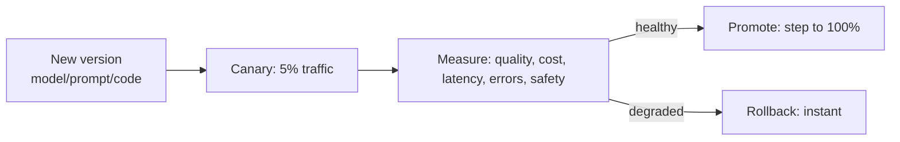
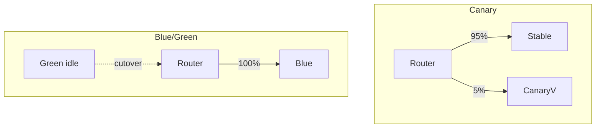
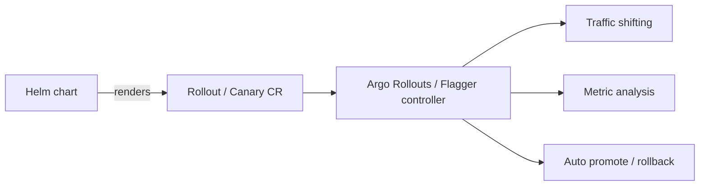
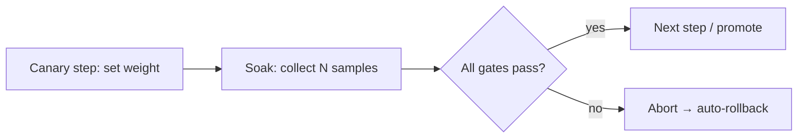
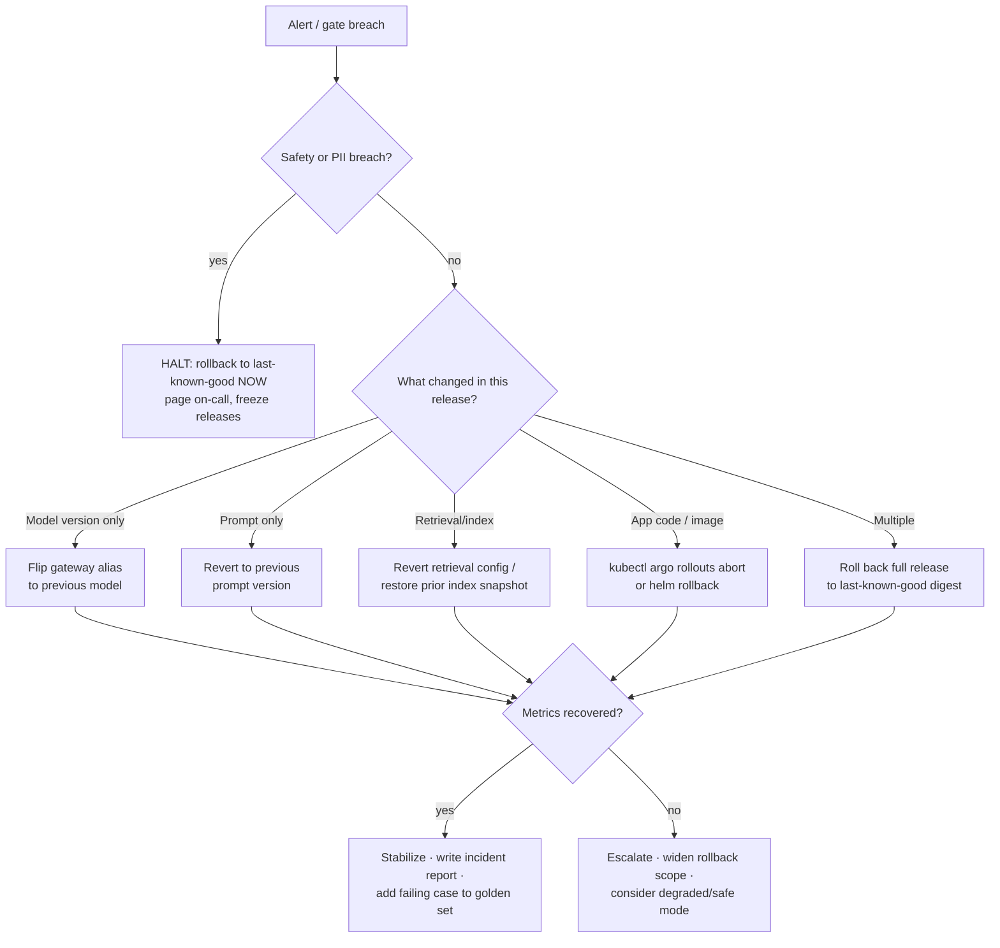

# 14 — Progressive Delivery

> **Part VIII — Progressive Delivery.** Deployment pattern comparison, Helm, Kubernetes rollouts and their limits, Argo Rollouts, Flagger, canary gates, and the LLMOps rollback decision tree.

---

## 14.1 Why progressive delivery is essential for LLM apps

LLM changes (new model version, prompt, retrieval config) can regress **quality, safety, or cost** in ways unit tests never catch — and the regression may only appear on **real traffic**. Progressive delivery releases a change to a **small slice of traffic first**, measures LLM-specific metrics, and **auto-promotes or auto-rolls-back** based on evidence. It is the operational counterpart to EvalOps: offline eval gates the artifact, progressive delivery gates the traffic.



---

## 14.2 Deployment pattern comparison

| Pattern | How it works | Blast radius | Rollback | Cost | Best for LLM apps |
|---------|-------------|--------------|----------|------|-------------------|
| **Recreate** | Stop old, start new | Total (downtime) | Redeploy | Low | Never for prod |
| **Rolling update** | Replace pods gradually | Medium (all users see mix) | Roll back deployment (slow) | Low | Baseline; weak for quality risk |
| **Blue/Green** | Two full envs, switch 100% at once | All-or-nothing on cutover | Instant (switch back) | High (2×) | Fast rollback; but no gradual quality signal |
| **Canary** | Small % → measure → increase | Small, controlled | Instant (shift traffic back) | Low–medium | **Recommended** — gradual, measurable |
| **Shadow / mirror** | Copy traffic to new version, no user impact | Zero (responses discarded) | N/A | Medium (2× inference) | Pre-canary validation on real traffic |
| **A/B experiment** | Route by cohort, compare | Cohort-sized | Route change | Low | Prompt/model quality experiments |

> **Practice.** For LLM systems, default to **canary with automated analysis** (Argo Rollouts or Flagger), optionally preceded by **shadow** testing for high-risk model swaps. Blue/green gives fast rollback but no gradual quality signal — canary gives both.



---

## 14.3 Helm release management

**Helm** packages Kubernetes manifests into versioned, parameterized **charts** and manages their lifecycle as **releases** (install/upgrade/rollback with revision history).

```text
deploy/helm/llm-app/
├── Chart.yaml            # chart + appVersion
├── values.yaml          # defaults
├── values-prod.yaml     # prod overrides
└── templates/
    ├── deployment.yaml
    ├── service.yaml
    ├── hpa.yaml
    └── rollout.yaml      # Argo Rollout (see 14.5)
```

```yaml
# deploy/helm/llm-app/values.yaml
image:
  repository: ghcr.io/acme/llm-app
  digest: ""              # set at deploy time — deploy by DIGEST, not tag
replicaCount: 3
modelAlias: complex_reasoning     # resolved by the gateway/registry
env: prod
resources:
  requests: { cpu: "500m", memory: "1Gi" }
  limits:   { cpu: "2",    memory: "4Gi" }
```

```bash
# Release lifecycle — pin the digest for immutability
helm upgrade --install llm-app deploy/helm/llm-app \
  -f deploy/helm/llm-app/values-prod.yaml \
  --set image.digest=sha256:abc123... \
  --namespace prod --atomic --timeout 5m

helm history llm-app -n prod          # revision history
helm rollback llm-app 7 -n prod       # roll back to a known-good revision
```

### Helm canary clarification

> **Warning — Helm does not perform canary analysis by itself.** A common misconception is that Helm "does canaries." Helm is a **templating and release-management** tool; it renders manifests and tracks revisions. It has **no traffic-splitting, no metric analysis, and no automated rollback based on live metrics.**

There are two legitimate "Helm canary" meanings — don't confuse them:

1. **Naive Helm canary (not real canary):** deploy a second Helm release with fewer replicas alongside the stable one so a *proportion* of pods run the new version. This splits traffic only by **replica ratio**, has **no metric-driven gating**, and **no automated rollback**. It is coarse and unsafe for quality-sensitive LLM changes.
2. **Helm + a progressive-delivery controller (correct pattern):** Helm packages an **Argo `Rollout`** or a **Flagger `Canary`** resource; the *controller* does the real traffic shifting, metric analysis, and automated rollback. Helm's job is packaging/versioning; the controller's job is the canary.



> **Practice.** Use Helm to **package and version** the app and its `Rollout`/`Canary` resource. Delegate the actual canary (traffic + analysis + rollback) to **Argo Rollouts** or **Flagger**.

---

## 14.4 Kubernetes rollout operations & their limitations

The native `Deployment` object performs a **rolling update**: it gradually replaces old ReplicaSet pods with new ones, respecting `maxSurge`/`maxUnavailable`, and can be paused/rolled back.

```yaml
# Native Deployment rolling-update strategy
spec:
  strategy:
    type: RollingUpdate
    rollingUpdate:
      maxSurge: 25%
      maxUnavailable: 0
```

```bash
kubectl rollout status deployment/llm-app -n prod
kubectl rollout pause  deployment/llm-app -n prod
kubectl rollout undo   deployment/llm-app -n prod       # revert to previous ReplicaSet
kubectl rollout history deployment/llm-app -n prod
```

### Limitations of native Kubernetes rollouts (why you need more)

| Limitation | Impact for LLM apps |
|------------|---------------------|
| **No metric-based gating** | Rollout proceeds even if the new version degrades quality/cost — it only knows pod health/readiness, not answer faithfulness |
| **No fine-grained traffic control** | Traffic split is by **replica ratio**, not precise percentages; can't do "5% then 20% then 50%" cleanly without a service mesh |
| **No automated rollback on business metrics** | `undo` is **manual**; nothing auto-reverts on rising hallucination/cost |
| **Readiness ≠ correctness** | A pod can be "ready" and still produce bad answers |
| **No analysis/soak steps** | No built-in pause-and-measure between increments |
| **No built-in A/B or mirroring** | Requires extra tooling |

> **Note.** Native rollouts are fine for stateless infra changes where readiness == correct. For LLM changes, where "healthy pod" tells you nothing about answer quality, you need a **progressive-delivery controller** that gates on **your metrics**. That's Argo Rollouts or Flagger.

---

## 14.5 Argo Rollouts

**Argo Rollouts** replaces the `Deployment` with a `Rollout` CRD that adds **canary and blue/green strategies with metric-based analysis, automated promotion, and automated rollback**. It integrates with ingress/service meshes for precise traffic shaping and with metric providers (Prometheus, etc.) for `AnalysisTemplates`.

```yaml
# deploy/rollouts/rollout.yaml — Argo Rollouts canary with analysis
apiVersion: argoproj.io/v1alpha1
kind: Rollout
metadata:
  name: llm-app
  namespace: prod
spec:
  replicas: 6
  selector:
    matchLabels: { app: llm-app }
  template:
    metadata:
      labels: { app: llm-app }
    spec:
      containers:
        - name: llm-app
          image: ghcr.io/acme/llm-app@sha256:abc123...   # deploy by digest
          ports: [{ containerPort: 8000 }]
          readinessProbe:
            httpGet: { path: /readyz, port: 8000 }
  strategy:
    canary:
      canaryService: llm-app-canary
      stableService: llm-app-stable
      trafficRouting:
        # Precise % traffic shifting via the mesh/ingress (e.g. Istio, SMI, NGINX)
        nginx:
          stableIngress: llm-app
      analysis:                       # analysis runs alongside steps
        templates:
          - templateName: llm-quality-gate
        startingStep: 1               # begin analysis from the first canary step
        args:
          - name: canary-service
            value: llm-app-canary
      steps:
        - setWeight: 5
        - pause: { duration: 10m }     # soak + measure
        - setWeight: 20
        - pause: { duration: 10m }
        - setWeight: 50
        - pause: { duration: 10m }
        - setWeight: 100               # full promotion if analysis stayed healthy
```

```yaml
# deploy/rollouts/analysis-template.yaml — metric-based gate (auto-rollback on failure)
apiVersion: argoproj.io/v1alpha1
kind: AnalysisTemplate
metadata:
  name: llm-quality-gate
  namespace: prod
spec:
  args:
    - name: canary-service
  metrics:
    - name: error-rate
      interval: 1m
      count: 8
      failureLimit: 1                 # rollback after 1 breach
      successCondition: result < 0.02
      provider:
        prometheus:
          address: http://prometheus.monitoring:9090
          query: |
            sum(rate(http_requests_total{service="{{args.canary-service}}",code=~"5.."}[2m]))
            / sum(rate(http_requests_total{service="{{args.canary-service}}"}[2m]))
    - name: faithfulness           # LLM-SPECIFIC quality gate
      interval: 2m
      count: 5
      failureLimit: 1
      successCondition: result >= 4.3
      provider:
        prometheus:
          address: http://prometheus.monitoring:9090
          query: |
            avg_over_time(llm_faithfulness_score{service="{{args.canary-service}}"}[5m])
    - name: cost-per-request       # LLM-SPECIFIC cost gate
      interval: 2m
      count: 5
      failureLimit: 1
      successCondition: result <= 0.05
      provider:
        prometheus:
          address: http://prometheus.monitoring:9090
          query: |
            avg_over_time(llm_cost_usd_per_request{service="{{args.canary-service}}"}[5m])
```

```bash
kubectl argo rollouts get rollout llm-app -n prod --watch
kubectl argo rollouts promote llm-app -n prod        # manual promote (if paused)
kubectl argo rollouts abort   llm-app -n prod        # abort → auto-rollback to stable
```

> **Practice.** Gate the canary on **LLM-specific metrics** (faithfulness, hallucination, cost-per-request) *in addition to* infra metrics (error rate, latency). This is exactly what native rollouts cannot do — and exactly what makes LLM canaries meaningful.

---

## 14.6 Flagger

**Flagger** (a CNCF progressive-delivery operator) automates canary/blue-green/A-B by wrapping your existing `Deployment` in a `Canary` custom resource. It drives a service mesh or ingress for traffic shifting and runs **metric checks + webhooks** (e.g. load tests, custom eval webhooks) at each step, promoting or rolling back automatically.

```yaml
# deploy/rollouts/flagger-canary.yaml
apiVersion: flagger.app/v1beta1
kind: Canary
metadata:
  name: llm-app
  namespace: prod
spec:
  targetRef:
    apiVersion: apps/v1
    kind: Deployment
    name: llm-app
  service:
    port: 8000
    targetPort: 8000
  analysis:
    interval: 1m               # step interval
    threshold: 5               # max failed checks before rollback
    maxWeight: 50              # cap canary weight before full promote
    stepWeight: 10             # +10% traffic per successful interval
    metrics:
      - name: request-success-rate
        thresholdRange: { min: 99 }      # % successful
        interval: 1m
      - name: request-duration
        thresholdRange: { max: 3000 }    # p95 ms
        interval: 1m
      - name: faithfulness               # custom LLM metric via Prometheus
        templateRef: { name: faithfulness, namespace: prod }
        thresholdRange: { min: 4.3 }
        interval: 2m
    webhooks:
      - name: eval-smoke                 # run an online eval probe against the canary
        type: rollout
        url: http://eval-runner.prod/smoke
        timeout: 60s
        metadata:
          suite: canary-smoke
      - name: load-test
        type: rollout
        url: http://flagger-loadtester.prod/
        metadata:
          cmd: "hey -z 1m -q 5 -c 2 http://llm-app-canary.prod:8000/healthz"
```

```yaml
# deploy/rollouts/flagger-metric-template.yaml — custom LLM metric
apiVersion: flagger.app/v1beta1
kind: MetricTemplate
metadata: { name: faithfulness, namespace: prod }
spec:
  provider:
    type: prometheus
    address: http://prometheus.monitoring:9090
  query: |
    avg_over_time(llm_faithfulness_score{app="{{ target }}",namespace="{{ namespace }}"}[{{ interval }}])
```

### Argo Rollouts vs. Flagger (quick guide)

| | **Argo Rollouts** | **Flagger** |
|---|---|---|
| Model | Replaces `Deployment` with `Rollout` CRD | Wraps existing `Deployment` with `Canary` CRD |
| Fits with | Argo CD / GitOps ecosystems | Flux / mesh-centric ecosystems |
| Analysis | `AnalysisTemplate` (metrics) | Built-in metric checks + webhooks |
| Manual control | Rich CLI (promote/abort/pause) | More fully automated |
| Choose when | You want fine-grained control & Argo CD | You want turnkey automation & a mesh |

---

## 14.7 Canary gates & thresholds

Gates are the **pass/fail conditions** evaluated at each canary step. For LLM apps, combine three tiers:

| Tier | Metric | Example threshold | Source |
|------|--------|-------------------|--------|
| **Infra** | Error rate | < 2% | [09](09-llm-metric-catalog.md) |
| **Infra** | Latency p95 / TTFT | < 3s / < 800ms | [09](09-llm-metric-catalog.md) |
| **Quality** | Faithfulness / groundedness | ≥ 4.3 | [04](04-evalops.md) |
| **Quality** | Hallucination rate | ≤ 2% | [04](04-evalops.md) |
| **Safety** | PII leakage / policy violations | = 0 | [05](05-guardrails-ops.md) |
| **Cost** | Cost per request | ≤ baseline × 1.15 | [06](06-llm-finops.md) |
| **Business** | Thumbs-up / task success | ≥ baseline − tolerance | [09](09-llm-metric-catalog.md) |

**Threshold design principles:**

- **Relative to baseline** — compare canary vs. the current stable version on the *same live traffic*, not against absolute numbers.
- **Statistical significance** — require enough samples per step (`count`/`interval`) before deciding; low-traffic services need longer soaks.
- **Tolerance bands** — allow small, expected variance (non-determinism) to avoid flapping.
- **Halt on any hard-gate breach** — safety/PII gates are zero-tolerance and trigger immediate rollback.



---

## 14.8 LLMOps rollback decision tree

When a canary (or production) shows trouble, decide **what** to roll back — because an LLM system has multiple independently-versioned artifacts (code, prompt, model, retrieval config). Rolling back the wrong one wastes time.



**Rollback mechanics by artifact:**

| Artifact | Rollback action | Speed |
|----------|-----------------|-------|
| Model version | Flip alias in gateway/registry ([07](07-model-gateway-and-modelops.md)) | Seconds (config) |
| Prompt | Revert to previous prompt version ([02](02-promptops.md)) | Seconds (config) |
| Retrieval/index | Revert config / restore index snapshot ([03](03-ragops.md)) | Minutes |
| App image | `argo rollouts abort` / `helm rollback` | Seconds–minutes |

> **Practice.** Prefer **config-level rollback** (flip a model alias or prompt version) over redeploying — it's faster and lower-risk. This is why the model gateway and prompt registry are foundational: they make the two most common LLM regressions instantly reversible without a code deploy.

> **Practice — last-known-good.** Always retain the last-known-good digest, model alias target, and prompt version so any rollback path resolves to a verified state. Automate rollback via the canary controller (`failureLimit`/`threshold`) so it happens without waiting for a human at 3 a.m.

---

## 14.9 Anti-patterns

> **Warning.**
> - Believing Helm alone "does canary" — it packages; the controller canaries.
> - Native rolling update for quality-sensitive LLM changes (no metric gate).
> - Canary gates only on infra metrics, ignoring quality/cost/safety.
> - Absolute thresholds instead of baseline-relative comparison.
> - Manual-only rollback with no automated abort on gate breach.
> - Rolling back code when only the model or prompt changed (slow, wrong lever).
> - Deploying by mutable tag so rollback targets are ambiguous.

---

## 14.10 Checklist

- [ ] Default deployment pattern is canary with automated analysis (Argo Rollouts or Flagger).
- [ ] Helm packages the app **and** the Rollout/Canary CR; the controller does traffic + analysis + rollback.
- [ ] Canary gates include infra **and** LLM-specific metrics (quality, safety, cost), baseline-relative.
- [ ] Automated rollback fires on gate breach without human intervention.
- [ ] Deploy by image **digest**; last-known-good digest/alias/prompt retained.
- [ ] A documented rollback decision tree distinguishes model vs. prompt vs. retrieval vs. code.
- [ ] Config-level rollback (alias/prompt flip) available for the two most common regressions.

---

## References

See [`19-sources-and-references.md`](19-sources-and-references.md):
- Argo Rollouts (CNCF) — canary/blue-green + analysis.
- Flagger (CNCF/Flux) — progressive delivery operator.
- Helm — the Kubernetes package manager.
- Kubernetes Deployments — rolling updates.
- Google/Weaveworks — progressive delivery patterns.
