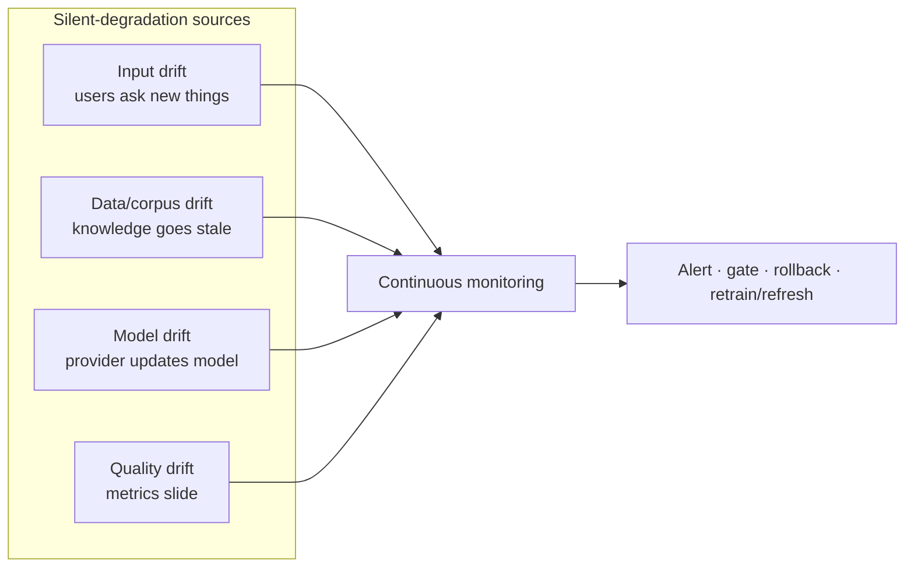
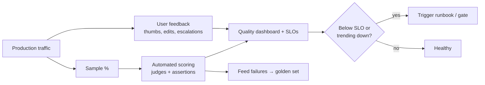
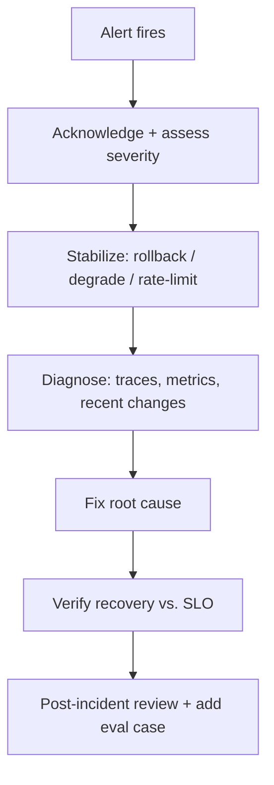

# 15 — Operations: Drift, AI Quality Monitoring & Production Runbook

> **Part IX — Operations.** Keeping an LLM system healthy in production: detecting drift, monitoring quality continuously, and responding to incidents with runbooks.

---

## 15.1 Why day-2 operations are different for LLM systems

An LLM system that passed every release gate can still **degrade in production without any deploy** — because the world, the data, and even the model can change underneath you. Day-2 LLMOps is about continuously detecting and responding to that silent degradation.



---

## 15.2 Types of drift

| Drift type | Definition | Signal | Response |
|------------|-----------|--------|----------|
| **Input / prompt drift** | Distribution of user inputs shifts (new topics, languages, intents) | Embedding-distribution shift; rising out-of-scope/refusal | Update prompts/RAG; add eval cases; extend coverage |
| **Data / corpus drift ("schedule drift")** | Knowledge base grows stale relative to source-of-truth | Freshness SLI breach; rising "not found"/wrong answers | Re-index; fix ingestion schedule; tombstone stale docs |
| **Model drift** | Provider silently updates the underlying model | Metric shift with no code/prompt change; version change in registry | Pin version; re-eval; canary the new version ([07](07-model-gateway-and-modelops.md)) |
| **Quality drift** | Aggregate quality metrics decline over time | Faithfulness/satisfaction trend down | Investigate root cause; rollback or refresh |
| **Concept drift** | The correct answer for the same input changes over time | Ground-truth changes; feedback disagreement | Update golden set; refresh knowledge |

### "Schedule drift" — the RAG freshness failure mode

The most common day-2 LLM incident is **stale retrieval**: an ingestion job fell behind, silently broke, or its schedule no longer matches how fast the source changes. The system keeps answering confidently from outdated context.

**Detect it with a freshness SLI and an ingestion-health check:**

$$\text{Freshness lag} = \text{now} - \max(\text{source updated\_at that is indexed})$$

```yaml
# monitoring/freshness-alert.yaml — Prometheus alert rule
groups:
  - name: rag-freshness
    rules:
      - alert: RagIndexStale
        expr: (time() - rag_index_max_source_timestamp_seconds) > 86400  # > 24h
        for: 30m
        labels: { severity: high }
        annotations:
          summary: "RAG index freshness lag exceeds SLA"
          runbook: "docs/runbooks/rag-stale.md"
      - alert: IngestionJobMissed
        expr: time() - rag_last_successful_ingestion_seconds > 7200      # > 2h since last success
        for: 15m
        labels: { severity: high }
        annotations:
          summary: "Ingestion pipeline has not completed on schedule"
```

> **Practice.** Treat ingestion like any critical batch job: monitor **last successful run**, **records processed**, **error count**, and **freshness lag**. A missed schedule should page, not surface as a customer complaint about a wrong answer.

---

## 15.3 Continuous AI quality monitoring

Offline eval gates the release; **online monitoring** watches production reality. Combine automated scoring with human/user feedback.



**What to monitor continuously (from the metric catalog, [09](09-llm-metric-catalog.md)):**

- **Quality:** faithfulness/groundedness, hallucination rate, task success, refusal rate.
- **Retrieval:** context recall proxy, "not found" rate, freshness lag.
- **Operational:** success/error rate, latency p95/TTFT, fallback rate.
- **Cost:** cost per resolved request, budget utilization, token trends.
- **Safety:** PII leakage (target 0), guardrail block rate, policy violations.
- **User:** satisfaction, escalation, edit distance.

**Monitoring techniques:**

- **Rolling-window SLOs** with trend/anomaly detection (not just static thresholds).
- **Sampling + LLM-as-judge** on live traffic (versioned judge — [04](04-evalops.md)).
- **Feedback loop**: every escalation/thumbs-down becomes a candidate golden-set case.
- **Segment monitoring**: watch per-tenant/per-intent so a regression in one segment isn't hidden by the aggregate.

> **Warning.** Aggregate metrics hide segment regressions. A model change can improve the average while badly hurting one customer or one intent. Always monitor key segments separately.

---

## 15.4 Production runbook

A **runbook** is a documented, tested procedure for a specific operational scenario, so any on-call engineer can respond consistently under pressure. Keep runbooks in-repo (`docs/runbooks/`), link them from alerts, and rehearse them.

### 15.4.1 Standard incident response flow



### 15.4.2 Severity levels

| Sev | Definition | Examples | Response |
|-----|-----------|----------|----------|
| **SEV1** | Safety/security/legal or full outage | PII leak, prompt-injection exfiltration, service down | Page immediately; rollback/halt; incident commander |
| **SEV2** | Major quality/cost degradation | Faithfulness crash, cost spike, provider outage w/o fallback | Page; rollback; investigate |
| **SEV3** | Minor/partial degradation | One segment regressed; elevated latency | Business-hours; ticket |

### 15.4.3 Runbook library (scenario → action)

| Scenario | First action | Reference |
|----------|-------------|-----------|
| **Quality regression after release** | Abort canary / rollback the changed artifact (model/prompt/code) via decision tree | [14.8](14-progressive-delivery.md) |
| **Suspected prompt injection / data exfiltration** | SEV1: block affected path, rotate exposed secrets, preserve logs, engage security | [10](10-security-architecture.md) |
| **Cost spike / runaway spend** | Enforce/lower budget cap, cap agent steps, engage circuit breaker, find hotspot by attribution | [06](06-llm-finops.md) |
| **Provider outage / rate limiting** | Fail over to backup provider via gateway; degrade to smaller model | [07](07-model-gateway-and-modelops.md) |
| **RAG stale / schedule drift** | Trigger re-index, fix ingestion job, verify freshness SLI recovers | [15.2](#152-types-of-drift) |
| **Silent model change by provider** | Pin previous version in registry, re-eval, canary the new version | [07](07-model-gateway-and-modelops.md) |
| **PII in output** | SEV1: enable/verify redaction guardrail, rollback if introduced by change, notify privacy/DPO | [05](05-guardrails-ops.md), [11](11-governance-and-compliance.md) |
| **Hallucination surge** | Tighten groundedness gate, check retrieval quality/freshness, rollback if change-induced | [03](03-ragops.md), [05](05-guardrails-ops.md) |

### 15.4.4 Example runbook (template)

```markdown
# Runbook: RAG index stale (schedule drift)
Severity: SEV2 · Owner: platform-team · Last tested: 2026-06-15

## Symptoms
- Alert `RagIndexStale` or `IngestionJobMissed` firing
- Rising "not found" / wrong-but-confident answers; freshness lag > SLA

## Immediate stabilization
1. Confirm ingestion job status (last success, error logs).
2. If source is critical & very stale, surface a freshness disclaimer or degrade gracefully.

## Diagnose
1. Check ingestion pipeline logs & scheduler (cron/CDC/webhook).
2. Verify source connectivity & credentials.
3. Inspect delta-detection (content_hash) for stuck state.

## Fix
1. Re-run ingestion; confirm records processed > 0 and freshness SLI recovers.
2. Repair the schedule / connector; add/adjust monitoring if the gap was undetected.

## Verify
- `RagIndexStale` resolves; spot-check answers against source-of-truth.

## Follow-up
- Post-incident review; add a golden-set case reproducing the stale-answer failure.
```

> **Practice.** A runbook you have never executed is a hypothesis. **Rehearse** critical runbooks (rollback, provider failover, PII incident) with game days, and record "last tested" on each.

---

## 15.5 Operational readiness practices

- **On-call rotation** with clear escalation and an incident-commander role for SEV1.
- **Error budgets** — pause feature releases when the quality/availability budget is exhausted.
- **Post-incident reviews** (blameless) that always produce: a root cause, a new eval/golden case, and a monitoring/guardrail improvement.
- **Game days** — periodically inject failures (provider outage, poisoned doc, cost spike) and verify detection + runbook.
- **Change log correlation** — every alert investigation starts with "what changed?" (deploys, prompt/model/config edits).

---

## 15.6 Anti-patterns

> **Warning.**
> - No online quality monitoring — you learn about regressions from customers.
> - Monitoring only aggregates, hiding per-segment regressions.
> - Ingestion jobs with no last-success/freshness monitoring (schedule drift goes silent).
> - Runbooks that exist but are never rehearsed.
> - No feedback loop from incidents into the golden set.
> - Treating a silent provider model update as a non-event.

---

## 15.7 Checklist

- [ ] Freshness SLI + ingestion-health alerts detect schedule/data drift before users do.
- [ ] Online quality monitoring (sampled judges + user feedback) with SLOs and trend/anomaly alerts.
- [ ] Key segments (tenant/intent) monitored separately.
- [ ] Model-drift detection: registry tracks version; unexplained metric shifts investigated.
- [ ] Severity levels, on-call, and escalation defined.
- [ ] Runbooks exist per scenario, linked from alerts, and rehearsed (with "last tested").
- [ ] Config-level rollback paths (alias/prompt) documented in runbooks.
- [ ] Blameless post-incident reviews feed golden set + monitoring improvements.

---

## References

See [`19-sources-and-references.md`](19-sources-and-references.md):
- Google SRE Book & SRE Workbook — runbooks, error budgets, on-call.
- NIST AI RMF — *Manage*; incident response for AI.
- Drift-detection literature (data/concept drift).
- Evidently / Arize — production ML/LLM monitoring patterns.
