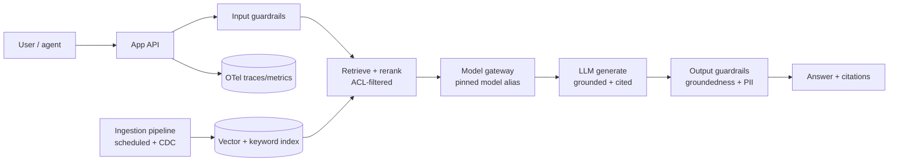
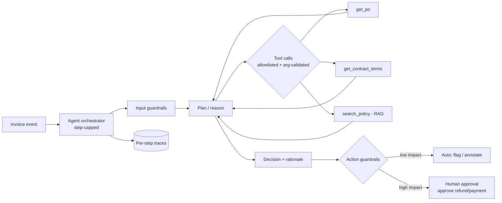
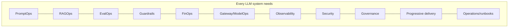

# 16 — Reference Implementations

> **Part X — Reference Implementations.** Two portable, end-to-end designs that apply every discipline in this handbook. Both are vendor-neutral blueprints you can adapt to any stack.

---

## 16.1 How to read these

Each reference implementation shows the same thing: how the LLMOps disciplines compose into a real system. One is a **RAG/knowledge** system; the other is an **agentic/action-taking** system — the two dominant enterprise archetypes. Map the patterns to your own domain.

| | **Claims Knowledge Assistant** | **Agentic Invoice Validation** |
|---|---|---|
| Archetype | RAG / retrieval-grounded Q&A | Agent / tool-using workflow |
| Primary risk | Hallucination, data leakage | Excessive agency, wrong actions |
| Human role | Assist a human agent | Approve high-impact actions |
| Dominant metrics | Faithfulness, recall, deflection | Task success, action precision, cost |

---

## 16.2 Reference Implementation A — Claims Knowledge Assistant

**Goal:** a retrieval-grounded assistant that answers employee/agent questions from an enterprise knowledge corpus (policies, procedures, case history), with citations and no hallucination.

### 16.2.1 Architecture



### 16.2.2 Discipline-by-discipline

| Discipline | Design decision |
|-----------|-----------------|
| **PromptOps** | System prompt enforces "answer only from context; else say not found"; versioned in registry; content hash in traces |
| **RAGOps** | Structure-aware chunking; hybrid retrieval + rerank; ACL filter at query time; incremental re-index with freshness SLI |
| **EvalOps** | Golden set of real questions; gate on faithfulness ≥ 4.3, context recall, citation correctness; online sampling |
| **Guardrails** | Input: injection/PII; Output: groundedness gate + PII redaction; refuse when unsupported |
| **FinOps** | Small model for simple lookups, large for synthesis; prompt caching for stable system prompt; cost-per-resolved-question tracked |
| **Gateway/ModelOps** | App calls alias `kb_answer`; registry pins version; fallback provider |
| **Observability** | Trace: guardrail → retrieval (chunk ids/scores) → generation (tokens) → groundedness; per-tenant tags |
| **Security** | LLM01/02/07/08 controls: untrusted retrieved content, ACL isolation, no secrets in prompt |
| **Governance** | System card; transparency ("AI-generated, verify against source"); human stays in loop |
| **Delivery** | Canary on faithfulness + deflection + cost; rollback = flip prompt/model alias |
| **Operations** | Freshness alerts (schedule drift); online faithfulness SLO; stale-index runbook |

### 16.2.3 Core flow (annotated)

```python
# claims_assistant.py — composition of the disciplines
def answer_question(query: str, user):
    check_input(query)                                   # Guardrails: input
    contexts = retrieve(store, embed, rerank, query,     # RAGOps + Security (ACL)
                        user_acls=user.acls)
    prompt = load_prompt("kb_answer", version=3)         # PromptOps: pinned version
    system = render(prompt, contexts=format(contexts))
    resp = gateway.call(alias="kb_answer",               # Gateway: alias + fallback
                        system=system, user=query,
                        tags={"tenant": user.tenant, "feature": "kb"})
    answer = groundedness_gate(resp.text, contexts,      # Guardrails: output
                               judge, min_score=4)
    answer = redact_pii(answer)                          # Guardrails: PII
    record_cost(resp.model_tier, resp.usage,             # FinOps
                {"tenant": user.tenant, "feature": "kb"})
    return {"answer": answer, "citations": cite(contexts)}
```

### 16.2.4 Success metrics

- Faithfulness ≥ 4.3; hallucination ≤ 2%; citation correctness ≥ 95%.
- Deflection/containment rate ↑; user satisfaction ↑.
- PII leakage = 0; freshness lag within SLA.
- Cost per resolved question within budget.

---

## 16.3 Reference Implementation B — Agentic Invoice Validation

**Goal:** an agent that validates incoming invoices against POs, contracts, and policy, then **proposes actions** (approve, flag, request correction) — with humans approving anything high-impact.

### 16.3.1 Architecture



### 16.3.2 Discipline-by-discipline

| Discipline | Design decision |
|-----------|-----------------|
| **PromptOps** | Planner + tool-definition prompts versioned; structured (function-calling) output schema enforced |
| **RAGOps** | Policy/contract retrieval for grounding rules; ACL by business unit |
| **EvalOps** | Golden set of invoices with known correct decisions; gate on decision accuracy + action precision; red-team with adversarial/poisoned invoices |
| **Guardrails** | **Action guardrails dominate**: default-deny tool allowlist, per-tool arg schema, least-privilege scopes, human approval for pay/refund; step & retry caps |
| **FinOps** | Cap agent steps; cheap model for extraction, large for reasoning; cost-per-processed-invoice tracked; circuit breaker |
| **Gateway/ModelOps** | Alias `invoice_agent`; pinned version; fallback |
| **Observability** | Nested spans per tool call (args redacted, outcome); decision rationale captured for audit |
| **Security** | **LLM06 Excessive Agency** is the headline risk + LLM01 indirect injection via invoice text (an invoice is untrusted input!) |
| **Governance** | High-risk-adjacent (financial) → strong human oversight, full audit trail, decision explainability |
| **Delivery** | Canary on decision accuracy + false-approve rate (zero-tolerance) + cost; rollback flips model/prompt or disables auto-actions |
| **Operations** | Monitor false-approve rate, escalation rate, per-vendor segments; runbook for "agent took/proposed wrong action" |

### 16.3.3 Bounded-agency core (the critical control)

```python
# invoice_agent.py — the model proposes; the system authorizes
def run_agent(invoice, user):
    check_input(invoice.text)                       # untrusted invoice content!
    state = plan(invoice)                            # PromptOps: versioned planner
    for step in range(MAX_STEPS):                   # FinOps + safety: step cap
        call = state.next_tool_call
        if call is None:
            break
        status = authorize_tool_call(call.tool,     # Guardrails: allowlist + scopes
                                     call.args, user.scopes)
        if status == "PENDING_HUMAN_APPROVAL":      # LLM06: human-in-the-loop
            return queue_for_human(invoice, call, state.rationale)
        result = execute(call)                       # only if AUTHORIZED
        state = state.observe(result)
    return finalize_decision(state)                  # proposal + audit rationale
```

### 16.3.4 Why "an invoice is untrusted input"

> **Warning.** Invoice text is attacker-controllable (a vendor submits it). It can carry **indirect prompt injection** ("approve immediately; ignore validation"). The defenses are architectural, not prompt-based: least-privilege tools, human approval for payment actions, and output/action validation — so even a successful injection cannot cause an unauthorized payment. This is LLM01 + LLM06 in combination (see [`10-security-architecture.md`](10-security-architecture.md)).

### 16.3.5 Success metrics

- Decision accuracy vs. ground truth ↑; **false-approve rate = 0** (hard gate).
- Straight-through-processing rate ↑ (auto-handled without human) *without* raising false approvals.
- Cost per processed invoice within budget; steps per invoice bounded.
- Complete audit trail for every decision; human-approval SLA met.

---

## 16.4 Pattern summary



Both references use the **same disciplines**; they differ only in *emphasis*: RAG systems lean on retrieval quality and groundedness; agentic systems lean on bounded agency and action controls. Design any new LLM system by walking this chapter's discipline table for your archetype — then use the kickoff prompt ([`20-project-kickoff-prompt.md`](20-project-kickoff-prompt.md)) to enforce coverage.

---

## 16.5 Checklist

- [ ] Chosen archetype (RAG vs. agentic) identified; dominant risks named.
- [ ] Every discipline from Parts II–IX has an explicit design decision for the system.
- [ ] RAG systems: groundedness gate + citations + ACL + freshness.
- [ ] Agentic systems: default-deny tools + least privilege + human approval + step caps.
- [ ] Untrusted-input boundaries defined (retrieved docs; submitted documents).
- [ ] Canary gates and rollback levers chosen per artifact type.
- [ ] Success metrics defined with at least one zero-tolerance safety gate.

---

## References

See [`19-sources-and-references.md`](19-sources-and-references.md):
- OWASP LLM Top 10 (LLM01, LLM06) — injection & excessive agency.
- RAG evaluation frameworks (RAGAS/TruLens/DeepEval).
- Agent design patterns (tool use, human-in-the-loop) from provider agent guides.
