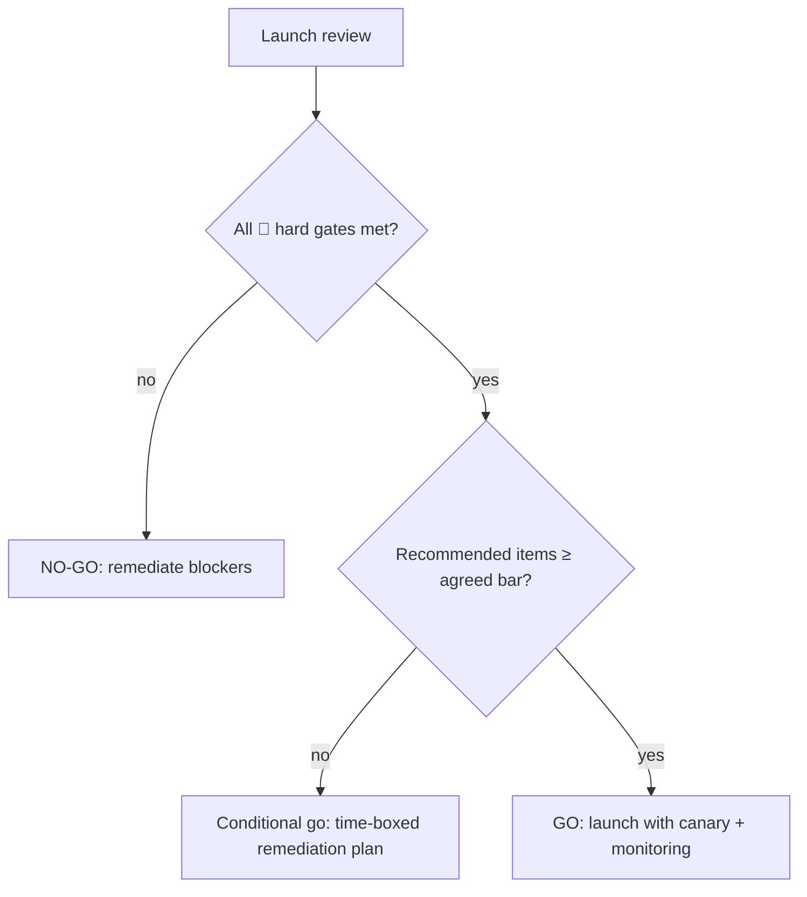

# 17 — Production Readiness Checklist

> **Part XI — Reference.** A consolidated go/no-go checklist for taking an LLM system to production. Every item links to the chapter that explains it. Treat unchecked **hard gates** as blockers.

---

## How to use

Run this checklist before any production launch and at each major release. Items marked 🔴 are **hard gates** (do not ship if unmet); others are strongly recommended. Assign an owner and evidence link to each.

---

## 1. Foundations & artifacts — [`01`](01-foundations.md)

- [ ] Prompts, retrieval config, model versions, and eval sets are version-controlled artifacts.
- [ ] A lifecycle diagram maps each stage to an owner.

## 2. PromptOps — [`02`](02-promptops.md)

- [ ] 🔴 Prompts stored as versioned, schema-validated files (no inline strings).
- [ ] Runtime emits `prompt_id` + `version` + `content_hash` in traces.
- [ ] Prompt unit/contract tests run in CI.
- [ ] Documented prompt rollback path.

## 3. RAGOps — [`03`](03-ragops.md)

- [ ] Chunks have stable IDs, content hashes, source metadata, ACL tags.
- [ ] 🔴 Embedding model version pinned; upgrade = full re-embed migration.
- [ ] Hybrid retrieval + rerank.
- [ ] 🔴 Access control enforced by metadata filters at query time.
- [ ] Retrieved content sanitized/labeled (indirect-injection mitigation).
- [ ] Incremental re-index + tombstones + freshness SLI.

## 4. EvalOps — [`04`](04-evalops.md)

- [ ] 🔴 Versioned golden datasets tagged by capability & risk.
- [ ] 🔴 Offline eval gate blocks releases below threshold.
- [ ] 🔴 Safety/red-team suite runs and gates.
- [ ] Judge model + rubric pinned, versioned, periodically calibrated to humans.
- [ ] Online sampling + feedback feed a quality dashboard and rollback gate.

## 5. Guardrails — [`05`](05-guardrails-ops.md)

- [ ] Input guardrails: PII/secret + injection/jailbreak (regex **and** classifier).
- [ ] Output guardrails: schema validation, PII redaction, safety classifier, groundedness gate.
- [ ] 🔴 Model output never reaches an interpreter (SQL/shell/HTML) unescaped.
- [ ] 🔴 Agent tools default-deny, arg-validated, least-privilege; human approval for high-impact actions.
- [ ] Guardrail policies versioned; events traced; security guardrails fail closed.

## 6. FinOps — [`06`](06-llm-finops.md)

- [ ] Every call meters tokens + cost with attribution tags.
- [ ] Dashboards: cost by feature/tenant/model + cost-per-resolved-request.
- [ ] 🔴 Per-request/per-tenant budgets with alerts and a circuit breaker.
- [ ] 🔴 Agent steps and retries capped.
- [ ] Routing/caching validated against the eval gate.

## 7. Gateway & ModelOps — [`07`](07-model-gateway-and-modelops.md)

- [ ] 🔴 All LLM traffic flows through a gateway/control plane.
- [ ] 🔴 Apps use model **aliases**; registry pins provider versions (never `latest`).
- [ ] Ordered fallback + health checks + circuit breakers.
- [ ] Model upgrades follow register → eval → canary → promote → deprecate.
- [ ] Rollback is a config flip, not a code deploy.

## 8. Observability — [`08`](08-observability-and-opentelemetry.md)

- [ ] 🔴 OpenTelemetry (GenAI semconv) instruments every model call, retrieval, guardrail, agent step.
- [ ] Prompt id/version/hash + token/cost attributes on spans.
- [ ] Content-capture redaction/privacy policy per environment.
- [ ] SLOs for availability, latency, quality, safety, cost with alerts.

## 9. Metrics — [`09`](09-llm-metric-catalog.md)

- [ ] Adopted metrics have documented formula, window, direction, owner.
- [ ] Same definitions feed eval gates, SLOs, canary thresholds, drift alarms.
- [ ] The 10-metric starter set (or superset) is live.

## 10. Security — [`10`](10-security-architecture.md)

- [ ] 🔴 STRIDE + LLM threat model completed; top threats mapped to controls + red-team cases.
- [ ] 🔴 All 10 OWASP LLM risks have an owner and mapped control.
- [ ] Retrieved content and model output both treated as untrusted.
- [ ] 🔴 Authorization enforced in code, not the prompt; agents least-privilege.
- [ ] Per-tenant isolation across store, ACLs, telemetry.
- [ ] Secrets in a manager; no secrets in code/prompts/logs.

## 11. Governance & Compliance — [`11`](11-governance-and-compliance.md)

- [ ] Use case risk-registered and tiered (incl. EU AI Act tier).
- [ ] NIST AI RMF control-mapping matrix maintained.
- [ ] Model/system card, DPIA, risk assessment maintained.
- [ ] 🔴 Transparency (AI disclosure/labeling) and human oversight implemented where required.
- [ ] Automatic logging supports audit; evidence archived per release.
- [ ] Legal/compliance engaged on classification.

## 12. Platform & DevOps — [`12`](12-platform-engineering-foundations.md)

- [ ] Conventional repo layout; prompts/evals/registry co-located with code.
- [ ] One-command reproducible local dev (mock model).
- [ ] 🔴 Secret scanning; no secrets in repo/images/state.
- [ ] 🔴 Non-root, minimal, healthchecked container.
- [ ] All infra is Terraform: remote locked state, isolated per env, modules, policy-as-code, OIDC.
- [ ] dev→staging→prod identical shape; build-once/promote.

## 13. CI/CD & Supply Chain — [`13`](13-cicd-for-llm-apps.md)

- [ ] 🔴 CI: lint → secret scan → tests → prompt tests → dep/SAST → build → image scan → SBOM → sign → eval+safety gate.
- [ ] 🔴 Eval + safety gates block release.
- [ ] 🔴 Image scan fails on HIGH/CRITICAL.
- [ ] SBOM generated and attested; image signed (keyless/OIDC); admission verifies signatures.
- [ ] Evidence archived per release.
- [ ] Actions pinned to SHA; least-privilege `permissions:`; OIDC (no long-lived keys); deploy by digest.
- [ ] Model & data provenance tracked.

## 14. Progressive Delivery — [`14`](14-progressive-delivery.md)

- [ ] 🔴 Canary with automated analysis (Argo Rollouts or Flagger), not native rolling update alone.
- [ ] Helm packages app **and** Rollout/Canary CR; controller does traffic + analysis + rollback.
- [ ] 🔴 Canary gates include LLM-specific quality/safety/cost metrics, baseline-relative.
- [ ] 🔴 Automated rollback on gate breach.
- [ ] Rollback decision tree distinguishes model/prompt/retrieval/code; config-level rollback available.
- [ ] Last-known-good digest/alias/prompt retained.

## 15. Operations — [`15`](15-operations-runbook.md)

- [ ] 🔴 Freshness SLI + ingestion-health alerts (schedule-drift detection).
- [ ] Online quality monitoring with SLOs + trend/anomaly alerts; key segments watched.
- [ ] Model-drift detection.
- [ ] Severity levels, on-call, escalation defined.
- [ ] Runbooks exist per scenario, linked from alerts, and rehearsed.
- [ ] Blameless post-incident reviews feed golden set + monitoring.

---

## Go / No-Go summary

> **Practice.** Record the decision, the evidence links, and any accepted risks with an owner and expiry. A "conditional go" must have a dated remediation plan, not an open-ended exception.

---

## References

See [`19-sources-and-references.md`](19-sources-and-references.md) — this checklist consolidates the per-chapter checklists across the handbook.
