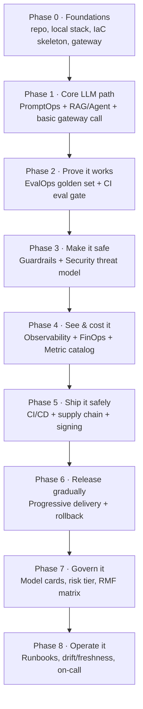
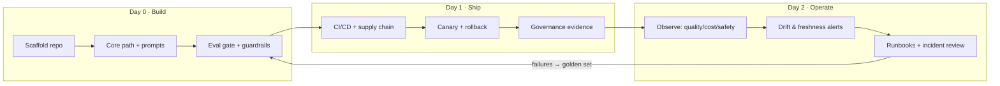

# 21 — Reference Repository Blueprint & Implementation Sequence

> **Part XIII — Build It End-to-End.** The single place that answers: *"What files and folders must exist, where does every discipline live, and in what order do I implement them to ship an enterprise-grade LLM system?"* This chapter consolidates the whole handbook into **one complete reference repository** plus a **phased, gated implementation sequence**.

---

## 21.1 How to use this chapter

Chapters 02–15 each define a discipline in isolation. Chapter 12 §12.2 shows a *foundational skeleton*; Chapter 16 shows *architecture blueprints*. **This chapter is the superset**: a fully-populated monorepo where every artifact from every discipline has a home, plus the order to build them.

- **Architects** — use §21.2 (tree) + §21.3 (traceability matrix) to scope the repo and assign owners.
- **Builders** — use §21.6 (phased sequence) as a day-0→production plan; each phase has an **exit gate** tied to [`17-production-readiness-checklist.md`](17-production-readiness-checklist.md).
- **AI coding agents** — pair this with [`20-project-kickoff-prompt.md`](20-project-kickoff-prompt.md); the prompt enforces coverage, this chapter defines the file layout to generate.

> **Practice.** Treat this tree as the **paved-road template** ([`12-platform-engineering-foundations.md`](12-platform-engineering-foundations.md)). Fork it once per product; delete the folders your archetype doesn't need (e.g. drop `agents/` for pure RAG, drop `ingestion/` if you have no corpus).

---

## 21.2 The complete reference repository

Every top-level directory maps to one or more handbook disciplines. Directories marked **(archetype)** are only needed for RAG or agentic systems respectively.

```text
llm-app/
├── README.md                          # what/why, quickstart, links to docs/
├── AGENTS.md → docs/llmops-brief.md    # filled-in kickoff prompt (ch20) as the living brief
├── CODEOWNERS                         # review gates per path (prompts, evals, security)
├── LICENSE
├── .gitignore  .dockerignore
├── .env.example                       # every env var documented; NO secrets (ch12)
├── Makefile                           # paved-road commands: bootstrap/up/test/eval/lint (ch12)
├── pyproject.toml | package.json      # pinned deps + tool config
├── uv.lock | package-lock.json        # lockfile (reproducible builds)
├── .pre-commit-config.yaml            # format, lint, type, SECRET SCAN (ch12/13)
│
├── src/                               # ── APPLICATION CODE ──
│   ├── app/                           # API/service layer (FastAPI/Express), /healthz /readyz
│   │   ├── main.py                    # entrypoint; wires the request pipeline
│   │   ├── api.py                     # routes; streaming (SSE); request/response schemas
│   │   └── settings.py               # 12-factor config from env
│   ├── gateway/                       # ch07 — model gateway client + routing/fallback
│   │   ├── router.py                  # capability/cost/latency routing + ordered fallback
│   │   ├── middleware.py              # cross-cutting order: ratelimit→guardrail→cache→call→meter
│   │   └── providers/                 # provider adapters behind one interface
│   ├── rag/                           # ch03 (archetype) — retrieval layer
│   │   ├── chunker.py                 # structure-aware chunk + stable IDs + content hash
│   │   ├── index.py                   # upsert with metadata (acl, source, updated_at, embed_model)
│   │   ├── retrieve.py                # hybrid retrieve + rerank + ACL filter at query time
│   │   └── embeddings.py              # PINNED embedding model version
│   ├── agents/                        # (archetype) — agentic orchestration
│   │   ├── orchestrator.py            # plan/act loop, STEP-CAPPED
│   │   ├── tools.py                   # tool definitions + per-tool arg schema
│   │   └── authorize.py               # default-deny allowlist, scopes, HITL (ch05/10)
│   ├── guardrails/                    # ch05 — runtime controls
│   │   ├── input.py                   # PII/secret + injection/jailbreak (regex + classifier)
│   │   ├── output.py                  # schema validate, PII redact, groundedness, escaping
│   │   ├── action.py                  # tool allowlist + arg validation + approval
│   │   └── pipeline.py                # provider-agnostic guardrail chain; fail-closed policy
│   ├── finops/                        # ch06 — cost control
│   │   ├── meter.py                   # token + cost metering with attribution tags
│   │   └── budget.py                  # per-request/tenant budgets + circuit breaker
│   ├── prompts_runtime/               # ch02 — loader
│   │   └── registry.py                # load_prompt(id, version) + content_hash
│   └── observability/                 # ch08 — telemetry setup
│       ├── tracing.py                 # OTel spans w/ gen_ai.* + prompt/version/hash attrs
│       └── metrics.py                 # metric emitters (ch09 catalog)
│
├── prompts/                           # ch02 — PROMPT REGISTRY (versioned artifacts)
│   ├── _schema.json                   # JSON Schema all prompt files must satisfy
│   └── <prompt_id>/
│       ├── v1.yaml  v2.yaml           # id, version, owner, system, output_schema
│       └── CHANGELOG.md
│
├── evals/                             # ch04 — EVALOPS
│   ├── golden/*.jsonl                 # versioned golden datasets, tagged by capability/risk
│   ├── safety/*.jsonl                 # red-team / adversarial suites
│   ├── judges/                        # versioned LLM-as-judge rubrics
│   │   └── faithfulness_v1.txt
│   ├── run_eval.py                    # CI gate script (exit non-zero on regression)
│   └── thresholds.yaml               # metric thresholds + tolerance bands
│
├── models/                            # ch07 — MODELOPS
│   ├── registry.yaml                  # aliases → PINNED provider versions; status/eval_baseline
│   └── finetunes/*.yaml              # (archetype) fine-tune provenance records (§7.7)
│
├── ingestion/                         # ch03/15 (archetype) — DATA PIPELINE
│   ├── connectors/                    # source adapters (CDC/webhook/scheduled)
│   ├── pipeline.py                    # parse→clean→chunk→embed→upsert; delta by content_hash
│   ├── tombstone.py                   # remove deleted docs (compliance + correctness)
│   └── schedule.md                    # ingestion cadence vs. source change rate
│
├── infra/                             # ch12 — INFRASTRUCTURE AS CODE
│   ├── terraform/
│   │   ├── envs/{dev,staging,prod}/   # remote LOCKED state, isolated per env
│   │   └── modules/                   # versioned: network, vector-store, k8s-cluster, secrets
│   └── policy/                        # ch12/13 — policy-as-code (checkov/OPA/Sentinel)
│
├── deploy/                            # ch14 — DELIVERY
│   ├── helm/llm-app/                  # Chart.yaml, values*.yaml, templates/ (deploy, svc, hpa, rollout)
│   ├── rollouts/                      # Argo Rollout + AnalysisTemplate | Flagger Canary + MetricTemplate
│   └── policy/verify-images.yaml      # ch13 — Kyverno/Gatekeeper signature admission
│
├── docker/
│   ├── Dockerfile                     # multi-stage, non-root, minimal, healthchecked (ch12)
│   └── docker-compose.yaml            # local stack: app + vectordb + otel + mock-llm
│
├── monitoring/                        # ch08/09/15 — OBSERVABILITY BACKENDS
│   ├── otel-collector.yaml            # receivers/processors(redact)/exporters
│   ├── prometheus/rules/              # SLO + freshness + ingestion-health alert rules
│   ├── grafana/dashboards/            # cost, quality, latency, safety dashboards (JSON)
│   └── alerts.yaml                    # alert→runbook links
│
├── security/                          # ch10 — SECURITY ARTIFACTS
│   ├── threat-model.md                # STRIDE + LLM lens; OWASP LLM01–10 → control map
│   └── owasp-llm-mapping.md           # every risk → owner + control + red-team case
│
├── docs/                              # ch11/15 — GOVERNANCE + OPERATIONS EVIDENCE
│   ├── llmops-brief.md                # filled kickoff prompt (ch20)
│   ├── adr/                           # architecture decision records
│   ├── model-cards/                   # capabilities, limits, eval results, intended use (ch11)
│   ├── dpia.md                        # data protection impact assessment (if PII)
│   └── runbooks/                      # ch15 — per-scenario, linked from alerts, "last tested"
│       ├── rag-stale.md  cost-spike.md  prompt-injection.md  provider-outage.md  pii-incident.md
│
├── tests/                             # unit + contract + prompt tests (ch02/12)
│   ├── test_prompts.py  test_guardrails.py  test_retrieval.py  test_tools.py
│
└── .github/workflows/                 # ch13 — CI/CD
    ├── ci.yaml                        # lint→secretscan→test→prompt→SAST→build→scan→SBOM→sign→eval gate
    ├── cd.yaml                        # build-by-digest→scan→SBOM→sign+attest→publish evidence
    ├── eval-nightly.yaml              # scheduled full eval + drift check
    └── infra.yaml                     # terraform fmt/validate/plan-on-PR/apply-on-approval (OIDC)
```

> **Note — polyrepo variant.** At scale you may split `infra/` and shared platform modules into their own repos (owned by the platform team) and keep the app + `prompts/` + `evals/` + `models/` together (so one PR changes code+prompt+eval+model as a unit — see [`12-platform-engineering-foundations.md`](12-platform-engineering-foundations.md) §12.2). Keep the **LLM artifacts with the app** regardless.

---

## 21.3 File-to-chapter traceability matrix

Use this to confirm **every discipline has a landing zone** in the repo and to assign an owner per area.

| Discipline | Chapter | Lives in | Must-have artifacts |
|-----------|---------|----------|---------------------|
| Foundations | [01](01-foundations.md) | `README.md`, `docs/adr/` | Lifecycle diagram; artifact inventory |
| PromptOps | [02](02-promptops.md) | `prompts/`, `src/prompts_runtime/` | Versioned prompt files + `_schema.json` + loader + CHANGELOG |
| RAGOps | [03](03-ragops.md) | `src/rag/`, `ingestion/` | Chunker, hybrid retrieve+rerank, ACL filter, freshness SLI |
| EvalOps | [04](04-evalops.md) | `evals/` | Golden + safety sets, judges, `run_eval.py`, `thresholds.yaml` |
| Guardrails | [05](05-guardrails-ops.md) | `src/guardrails/` | Input/output/action guardrails + fail-closed policy |
| FinOps | [06](06-llm-finops.md) | `src/finops/`, `monitoring/grafana/` | Meter, budget/circuit-breaker, cost dashboards |
| Gateway/ModelOps | [07](07-model-gateway-and-modelops.md) | `src/gateway/`, `models/` | `registry.yaml` (aliases→pinned), fallback, fine-tune records |
| Observability | [08](08-observability-and-opentelemetry.md) | `src/observability/`, `monitoring/otel-collector.yaml` | OTel spans w/ `gen_ai.*`, collector w/ redaction |
| Metric catalog | [09](09-llm-metric-catalog.md) | `monitoring/`, `evals/thresholds.yaml` | Defined metrics reused across gates/SLOs/canary |
| Security | [10](10-security-architecture.md) | `security/` | Threat model, OWASP LLM01–10 mapping, red-team cases |
| Governance | [11](11-governance-and-compliance.md) | `docs/model-cards/`, `docs/dpia.md` | Risk tier, RMF control matrix, model/system cards |
| Platform/IaC | [12](12-platform-engineering-foundations.md) | `infra/`, `docker/`, `Makefile` | Terraform (locked state/modules), non-root image, local stack |
| CI/CD & supply chain | [13](13-cicd-for-llm-apps.md) | `.github/workflows/`, `deploy/policy/` | Build→scan→SBOM→sign→eval gate; signature admission |
| Progressive delivery | [14](14-progressive-delivery.md) | `deploy/helm/`, `deploy/rollouts/` | Rollout/Canary CR + analysis on LLM metrics; rollback tree |
| Operations | [15](15-operations-runbook.md) | `docs/runbooks/`, `monitoring/prometheus/rules/` | Freshness + ingestion alerts, rehearsed runbooks |

> **Practice.** Put this matrix in your repo `README.md` with an **Owner** and **Status** column. A discipline with no file and no owner is a discipline you are not actually doing.

---

## 21.4 The non-negotiable minimum set

If you build nothing else, these files make a repo *enterprise-shaped* rather than a prototype. Missing any of them is a red flag in review.

| File | Why it is non-negotiable |
|------|--------------------------|
| `prompts/<id>/vN.yaml` + `_schema.json` | Prompts are versioned artifacts, not string literals (ch02) |
| `evals/run_eval.py` + `evals/golden/*.jsonl` + `thresholds.yaml` | The release gate that makes non-determinism shippable (ch04) |
| `models/registry.yaml` | Alias→pinned version; never `latest`; config-flip rollback (ch07) |
| `src/guardrails/*` | Enforcement OUTSIDE the model; fail-closed security (ch05) |
| `monitoring/otel-collector.yaml` + `src/observability/tracing.py` | You cannot operate what you cannot see (ch08) |
| `security/threat-model.md` + OWASP mapping | Every LLM01–10 risk owned and controlled (ch10) |
| `.github/workflows/ci.yaml` with eval + safety gate | Quality/safety regressions blocked in CI (ch04/13) |
| `deploy/rollouts/*` (Rollout/Canary + analysis) | Canary on LLM metrics + auto-rollback (ch14) |
| `docs/runbooks/*` + `monitoring/prometheus/rules/` | Day-2 survival: drift/freshness/incident response (ch15) |
| `.pre-commit-config.yaml` (secret scan) | Prevent the most common leak (ch12) |
| `.env.example` (no secrets) | Documented config; secrets injected at runtime (ch12) |

**Illustrative `Makefile` paved-road (ties the repo together):**

```makefile
bootstrap:  ## install pinned deps + pre-commit hooks
	uv sync --frozen && pre-commit install
up:         ## local prod-shaped stack (app + vectordb + otel + mock-llm)
	docker compose -f docker/docker-compose.yaml up
test:       ## unit + contract + prompt tests
	uv run pytest tests/ -q
eval-smoke: ## fast eval gate on a golden subset
	uv run python evals/run_eval.py --suite smoke
eval:       ## full eval + safety suite (release gate)
	uv run python evals/run_eval.py --suite full --report eval-report.json
lint:       ## format + lint + type-check + secret scan
	uv run ruff check . && uv run mypy src && gitleaks detect
```

---

## 21.5 Step-by-step implementation sequence (Day-0 → Production)

Build in **dependency order**, not chapter order. Each phase has an **exit gate** — do not start the next phase until the current gate is green. Gates map to the 🔴 hard gates in [`17-production-readiness-checklist.md`](17-production-readiness-checklist.md).



| Phase | Chapters | Key deliverables | 🔴 Exit gate (must be true to proceed) |
|-------|----------|------------------|----------------------------------------|
| **0 — Foundations** | 01, 12 | Repo from §21.2; one-command local stack w/ mock model; Terraform skeleton (locked state); gateway skeleton | `make up` runs the stack locally; secret scanning active; no secrets in repo |
| **1 — Core LLM path** | 02, 03/agents, 07 | Versioned prompts + loader; RAG retrieve or agent loop; calls flow through the **gateway** by alias | End-to-end request returns a grounded/tool-using answer via a **pinned** model alias |
| **2 — Prove it works** | 04, 09 | Golden + safety datasets; `run_eval.py`; thresholds; metrics defined once | **Offline eval + safety gate blocks a deliberately-bad change in CI** |
| **3 — Make it safe** | 05, 10 | Input/output/action guardrails (fail-closed); STRIDE + OWASP LLM01–10 mapping; red-team cases | Output never hits a sink unescaped; agents default-deny least-privilege; all 10 risks owned |
| **4 — See & cost it** | 06, 08, 09 | OTel spans (`gen_ai.*` + prompt hash); collector w/ redaction; token+cost metering; budgets + circuit breaker; dashboards | Every call traced w/ version+cost; budget breach trips the breaker; SLOs defined |
| **5 — Ship it safely** | 12, 13 | Non-root image; CI: lint→secretscan→test→SAST→build→scan→SBOM→sign→**eval gate**; admission verifies signatures | Pipeline green; HIGH/CRITICAL fails build; unsigned images rejected; deploy by **digest** |
| **6 — Release gradually** | 14 | Helm packages app + Rollout/Canary CR; canary gates on **LLM metrics**; rollback decision tree | Bad canary **auto-rolls-back** on a quality/safety/cost breach without a human |
| **7 — Govern it** | 11 | Risk tier (incl. EU AI Act); RMF control matrix; model/system card; DPIA; AI disclosure | Model card + risk registration exist; transparency + human oversight where required |
| **8 — Operate it** | 15 | Freshness + ingestion alerts; online quality monitoring; severity/on-call; rehearsed runbooks | Freshness SLI alerts before users notice; ≥1 runbook rehearsed (game day) |

> **Practice.** Phases 0–2 are the **minimum viable enterprise loop** — a versioned prompt calling a pinned model through a gateway, gated by an eval suite in CI. Everything after hardens that loop. Do not skip Phase 2; an unevaluated LLM system is a prototype no matter how much infra surrounds it.

> **Warning.** The two most common sequencing mistakes: (1) building elaborate CI/CD (Phase 5) before there is an **eval gate** (Phase 2) to run in it — you automate shipping regressions faster; (2) wiring progressive delivery (Phase 6) with only infra metrics because the **LLM metric catalog** (Phase 4) wasn't done — the canary then can't see quality.

---

## 21.6 Day-0 → Day-2 lifecycle at a glance



The loop closes: production failures become golden-set cases (Day 2 → Day 0), which the eval gate then protects against forever.

---

## 21.7 Honest coverage self-check (what this repo does and does not give you)

| Capability | Covered by this handbook? | Where / gap |
|-----------|---------------------------|-------------|
| RAG knowledge assistant, end-to-end | ✅ Fully | Chapters 02–16 + this tree |
| Agentic/tool-using app, end-to-end | ✅ Fully | 05, 07, 10, 16B + `agents/` |
| Build→test→deploy→operate lifecycle | ✅ Fully | §21.5 phases 0–8 |
| Fine-tuning / custom model ops | ✅ Core | §7.7 + `models/finetunes/` |
| **Self-hosted inference serving at scale** | ⚠️ Partial | vLLM/TGI, quantization, KV-cache, GPU autoscaling — *serving depth is an extension point* |
| **Deep agent engineering** | ⚠️ Partial | Planner/executor, multi-agent, agent memory, MCP tool protocol — *pattern depth is an extension point* |
| **Data-engineering orchestration** | ⚠️ Partial | `ingestion/` gives the shape; Airflow/Dagster orchestration + connector catalog are *extension points* |
| **Multi-region / DR / BCP** | ⚠️ Partial | Terraform per-env exists; active-active + failover topology is an *extension point* |
| Multimodal (vision/audio) | ❌ Out of scope | Same disciplines apply; modality specifics not covered |

> **Practice.** The disciplines (eval gate, guardrails, gateway, observability, governance) are **modality- and pattern-agnostic** — they apply unchanged to serving, deeper agents, and multimodal. The extension points above are about *depth of a specific layer*, not missing controls. Add them as `docs/adr/` decisions when your system needs them.

---

## 21.8 Checklist

- [ ] Repo scaffolded from §21.2; each discipline in §21.3 has a folder **and an owner**.
- [ ] The §21.4 non-negotiable minimum set all exists.
- [ ] Implementation follows the §21.5 phase order; each phase's 🔴 exit gate is green before the next starts.
- [ ] Phases 0–2 (versioned prompt → pinned gateway call → CI eval gate) are complete before any infra hardening.
- [ ] Traceability matrix (with Owner/Status) is in the repo `README.md`.
- [ ] Extension points (§21.7) needed by this system are captured as ADRs with owners.
- [ ] The filled kickoff prompt ([`20`](20-project-kickoff-prompt.md)) lives in `docs/llmops-brief.md` and matches the repo.

---

## References

See [`19-sources-and-references.md`](19-sources-and-references.md). This chapter consolidates the repository conventions of [`12-platform-engineering-foundations.md`](12-platform-engineering-foundations.md), the reference designs of [`16-reference-implementations.md`](16-reference-implementations.md), and the gates of [`17-production-readiness-checklist.md`](17-production-readiness-checklist.md) into one buildable blueprint.
