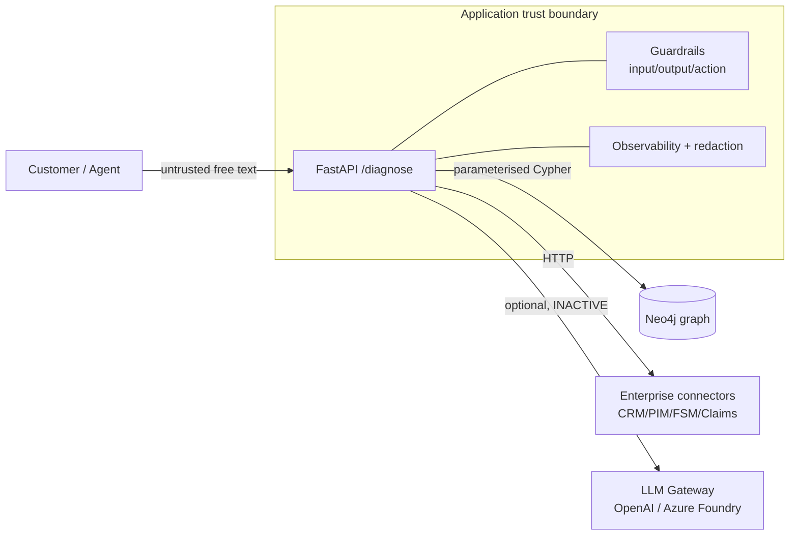

# Threat Model — Remote Diagnostics (STRIDE + LLM lens)

> Kickoff prompt §J, handbook ch10. Trust boundaries: **user input is untrusted**,
> **retrieved graph/enterprise content is untrusted**, **any model output is
> untrusted until validated**. Authorization is enforced in code, never in a prompt.

## 1. System context & trust boundaries

Trust boundaries:
- **B1 client → API**: all `message`, `customer_id`, `asset_id` untrusted → input guardrails + Pydantic caps.
- **B2 API → Neo4j**: injection risk → parameterised queries + `guardrails.input` cypher-token block.
- **B3 API → connectors**: enterprise data untrusted → treat as data, never as instructions.
- **B4 API → LLM (inactive)**: prompt-injection surface when enabled → sandbox + output validation.
- **B5 API → client**: responses may contain PII → output redaction + length cap.

## 2. STRIDE analysis

| Threat | Vector | Control | Status |
|--------|--------|---------|--------|
| **S**poofing | Unauthenticated admin calls | `X-Admin-Token` on `/admin/*`; end-user authN is a gap (demo open) | Partial |
| **T**ampering | Cypher injection via `message` | Parameterised driver + `guardrails.input` token block + safety evals | Done |
| **R**epudiation | No audit of who changed graph | ETL lineage JSONL + SQLite audit cols; sign-off is a gap | Partial |
| **I**nfo disclosure | PII in logs/responses | `observability.redaction` + output guardrail; TLS `bolt+s://` outside demo | Done (TLS opt-in) |
| **D**oS | Request floods | Sliding-window rate limiter on `/diagnose`; per-node only | Partial |
| **E**levation | Side-effecting actions | `guardrails.action` default-deny allowlist + HITL for claims | Done |

## 3. Residual risks & owners

| Risk | Owner | Mitigation plan |
|------|-------|-----------------|
| No end-user authentication (demo open) | Platform | Add OIDC/JWT before external exposure |
| Multi-replica rate limit / cache without Redis | Platform | Set `REDIS_URL` — rate limit, budget, caches, diagnose admission share Redis; empty URL remains single-node memory |
| Unencrypted Neo4j in demo | Platform | `bolt+s://` + cert in staging/prod (see settings) |
| Ingestion approval not enforced | Data Gov | Enforce approval gate in ETL promote step |

## 4. Red-team cases
Adversarial cases live in [`../evals/safety/injection.jsonl`](../evals/safety/injection.jsonl)
and run on every PR via the eval gate. Add a case for every incident.
